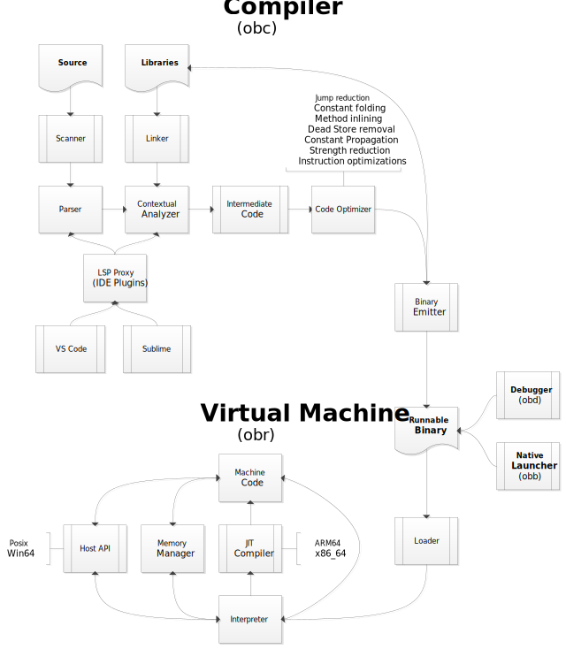

# Objeck

[](https://github.com/objeck/objeck-lang/actions/workflows/c-cpp.yml)
[](https://scan.coverity.com/projects/objeck)
[](https://sourceforge.net/projects/objeck-lang/files/latest/download)

**Latest**: Enhanced [LSP](https://github.com/objeck/objeck-lang-server) support for your favorite IDE (such as VS Code, Sublime, VIM, etc.). 
*  Added method and function renaming to v1.0.2
*  Adding code reformatting for v1.0.3.

---

Objeck is a stable object-oriented programming language with functional features. Objeck emphasizes simplicity, portability and scalability. The programming environment consists of a compiler, virtual machine, command line debugger and plug-ins for various text editors.

```ruby
class Hello {
  function : Main(args : String[]) ~ Nil {
    "Hello World" → PrintLine();
    "Καλημέρα κόσμε" → PrintLine();
    "こんにちは 世界" → PrintLine();
  }
}
```

See more on [Rosetta Code](http://rosettacode.org/wiki/Category:Objeck) and checkout the following [programming tasks](programs/rc).

Notable features:
* Object-oriented with functional features
  * Classes, interfaces and first-class functions
  * Generics with type boxing
  * Anonymous classes 
  * Reflection 
  * Object serialization 
  * Type inference
  * Lambda expressions
  * Closures
* Libraries 
  * [Collections](https://github.com/objeck/objeck-lang/blob/master/core/compiler/lib_src/gen_collect.obs) (vectors, queues, trees, hashes, etc.)
  * [HTTP and HTTPS clients](https://github.com/objeck/objeck-lang/blob/master/core/compiler/lib_src/net.obs)
  * [RegEx](https://github.com/objeck/objeck-lang/blob/master/core/compiler/lib_src/regex.obs)
  * [JSON](https://github.com/objeck/objeck-lang/blob/master/core/compiler/lib_src/json.obs), [XML](https://github.com/objeck/objeck-lang/blob/master/core/compiler/lib_src/xml.obs) and [CSV](https://github.com/objeck/objeck-lang/blob/master/core/compiler/lib_src/csv.obs) parsers
  * Encryption
  * Database access
  * [Query framework](https://github.com/objeck/objeck-lang/blob/master/core/compiler/lib_src/query.obs)
  * [2D Gaming framework](https://github.com/objeck/objeck-lang/blob/master/core/compiler/lib_src/sdl_game.obs)
* Native support for threads, sockets, files, date/time, etc.
* Garbage collection
* JIT support for all targets
* Supported targets
  * x86-64: Windows, macOS and Linux
  * x86: Windows and Linux
  * ARMv7: Linux (Raspberry Pi 3/4)
  * ARM64: macOS (Apple Silicon)

## Documentation
Please refer to the programmer's guide [documentation](https://www.objeck.org/doc/api/index.html) and [online tutorial](https://www.objeck.org/getting_started.html). Also checkout [Rosetta Code](http://rosettacode.org/wiki/Category:Objeck) [examples](programs/rc).

## Design
Components 
*  [Compiler](https://github.com/objeck/objeck-lang/blob/master/core/compiler)
*  [VM](https://github.com/objeck/objeck-lang/blob/master/core/vm)
*  [Debugger](https://github.com/objeck/objeck-lang/blob/master/core/debugger)
*  [Memory manager](https://github.com/objeck/objeck-lang/blob/master/core/vm/arch)
*  [JIT compilers](https://github.com/objeck/objeck-lang/blob/master/core/vm/arch/jit)



Building on Linux and macOS:
*  Install required libraries: <code>sudo apt-get install build-essential git libssl-dev unixodbc-dev libsdl2-dev libsdl2-image-dev libsdl2-ttf-dev libsdl2-mixer-dev libreadline-dev</code>
*  cd to <code>objeck-lang/core/release</code> and run <code>./deploy_posix.sh</code> with the parameter <code>32</code>, <code>64</code> or <code>osx</code> representing the bit version of Linux
*  Build output with binaries and documentation will be located in <code>objeck-lang/core/release/deploy</code>
*  Reference <code>objeck-lang/core/release/deploy/readme.html</code> to set paths and find examples

Building on Windows:
*  With Visual Studio 2019 or later open <code>objeck-lang/care/release/objeck.sln</code>
*  Ensure build completes successfully
*  To build everything, cd to <code>objeck-lang/care/release</code> and run <code>deploy_amd64.cmd deploy</code>
*  Build output with binaries and documentation will be located in <code>objeck-lang/core/release/deploy64</code>
*  Reference <code>objeck-lang/core/release/deploy64/readme.html</code> to set paths and find examples
