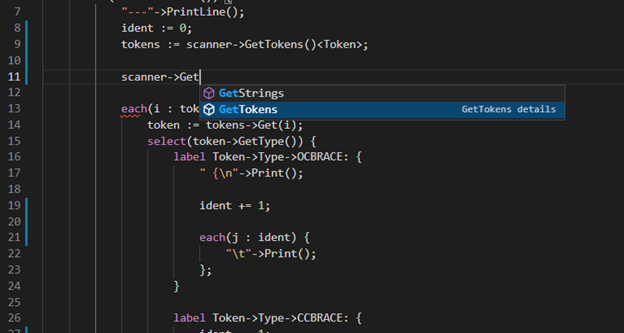
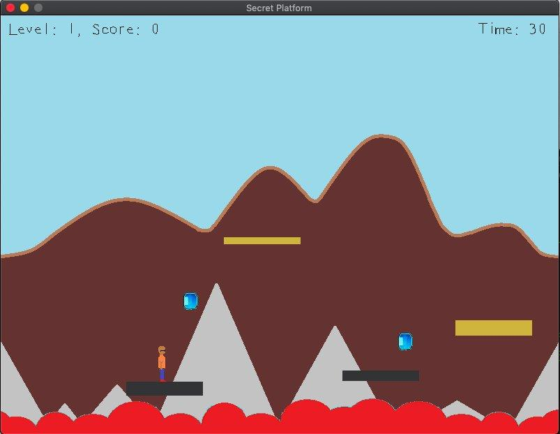

# Objeck

[](https://discord.gg/uPBqjWSW)
[](https://sourceforge.net/projects/objeck-lang/)
[](https://github.com/objeck/objeck-lang/actions/workflows/c-cpp.yml)
[](https://scan.coverity.com/projects/objeck)

Objeck is an object-oriented programming language with functional features. Objeck emphasizes, expression, simplicity, portability, and scalability. The programming environment consists of a compiler, virtual machine, and command line debugger with IDE plugins.

```ruby
class Hello {
  function : Main(args : String[]) ~ Nil {
    "Hello World" → PrintLine();
    "Καλημέρα κόσμε" → PrintLine();
    "こんにちは 世界" → PrintLine();
  }
}
```

See more on [Rosetta Code](http://rosettacode.org/wiki/Category:Objeck) and checkout the following [programming tasks](programs/rc).

__Notable features__
* Object-oriented with functional features
  * Classes, interfaces and first-class functions
  * Generics with type boxing
  * Anonymous classes 
  * Reflection 
  * Object serialization 
  * Type inference
  * Lambda expressions
  * Closures
* Libraries 
  * [Collections](https://github.com/objeck/objeck-lang/blob/master/core/compiler/lib_src/gen_collect.obs) (vectors, queues, trees, hashes, etc.)
  * [HTTP and HTTPS](https://github.com/objeck/objeck-lang/blob/master/core/compiler/lib_src/net.obs) client and SSL server support
  * [RegEx](https://github.com/objeck/objeck-lang/blob/master/core/compiler/lib_src/regex.obs)
  * [JSON](https://github.com/objeck/objeck-lang/blob/master/core/compiler/lib_src/json.obs), [XML](https://github.com/objeck/objeck-lang/blob/master/core/compiler/lib_src/xml.obs) and [CSV](https://github.com/objeck/objeck-lang/blob/master/core/compiler/lib_src/csv.obs) parsers
  * Encryption
  * Database access
  * [Query framework](https://github.com/objeck/objeck-lang/blob/master/core/compiler/lib_src/query.obs)
  * [2D Gaming framework](https://github.com/objeck/objeck-lang/blob/master/core/compiler/lib_src/sdl_game.obs)
* Native support for threads, sockets, files, date/time, etc.
* Garbage collection
* JIT support for all targets
  * arm64: Linux, macOS (Apple silicon)
  * x86-64: Linux, macOS and Windows

## Documentation
Please refer to the programmer's guide [documentation](https://www.objeck.org/doc/api/index.html) and [online tutorial](https://www.objeck.org/getting_started.html). Also checkout [Rosetta Code](http://rosettacode.org/wiki/Category:Objeck) [examples](programs/rc).

## Screenshots
| <sub>[VS Code](https://github.com/objeck/objeck-lsp)</sub> | <sub>[Debugger](https://github.com/objeck/objeck-lang/tree/master/core/debugger)</sub> | <sub>[Dungeon Crawler](https://github.com/objeck/objeck-dungeon-crawler)</sub> | <sub>[Platformer](https://github.com/objeck/objeck-lang/blob/master/programs/deploy/2d_game_13.obs)</sub> | <sub>[Windows Utility](https://github.com/objeck/objeck-lang/tree/master/core/release/WindowsLauncher)</sub> |
| :---: | :----: | :---: | :---: | :---: |
 |  |  |  |  |

## Platform Architecture
* [Compiler](https://github.com/objeck/objeck-lang/blob/master/core/compiler)
* [Virtual Machine](https://github.com/objeck/objeck-lang/blob/master/core/vm)
* [Debugger](https://github.com/objeck/objeck-lang/blob/master/core/debugger)
* [Memory manager](https://github.com/objeck/objeck-lang/blob/master/core/vm/arch)
* [Just-In-Time (JIT) compiler](https://github.com/objeck/objeck-lang/blob/master/core/vm/arch/jit)


__Building on Linux and macOS__
*  Install required libraries: <code>sudo apt-get install build-essential git libssl-dev unixodbc-dev libsdl2-dev libsdl2-image-dev libsdl2-ttf-dev libsdl2-mixer-dev libreadline-dev unzip</code>
*  cd to <code>objeck-lang/core/release</code> and run <code>./deploy_posix.sh</code> with the parameter <code>64</code> or <code>macos</code> for x64 Linux or macOS
*  Build output with binaries and documentation will be located in <code>objeck-lang/core/release/deploy</code>
*  Reference <code>objeck-lang/core/release/deploy/readme.html</code> to set paths and find examples

__Building on Windows__
*  Unzip the OpenSSL Windows libraries in <code>objeck-lang/core/lib/openssl/win/x64</code>
*  Using Visual Studio 2022 or later open <code>objeck-lang/core/release/objeck.sln</code>
*  Ensure the core build completes successfully (in Release mode)
*  To build everything, open a Visual Studio x64 command prompt and go to <code>objeck-lang/core/release</code> directory and run <code>deploy_amd64.cmd</code>
*  Build output with binaries and documentation will be located in <code>objeck-lang/core/release/deploy64</code>
*  Reference <code>objeck-lang/core/release/deploy64/readme.html</code> to learn how to set the environment variables and find code examples

__Building under MSYS2 on Windows__
* Under the UCRT64 shell (best Unicode support)
  * Package dependencies
  * <code>pacman --noconfirm -S mingw-w64-ucrt-x86_64-gcc mingw-w64-ucrt-x86_64-openssl make mingw-w64-ucrt-x86_64-SDL2 unzip mingw-w64-ucrt-x86_64-SDL2_ttf mingw-w64-ucrt-x86_64-SDL2_mixer mingw-w64-ucrt-x86_64-SDL2_image mingw-w64-ucrt-x86_64-unixodbc</code>
  * cd to <code>objeck-lang/core/release</code> and run <code>./deploy_msys2-ucrt.sh</code>
  *  Build output with binaries and documentation will be located in <code>objeck-lang/core/release/deploy-msys2-ucrt</code>
  *  Reference <code>objeck-lang/core/release/deploy-msys2-ucrt/readme.html</code> to set paths and find examples
* Under the Clang64
  * Package dependencies
  * <code>pacman --noconfirm -S mingw-w64-clang-x86_64-gcc mingw-w64-clang-x86_64-openssl make mingw-w64-clang-x86_64-SDL2 unzip mingw-w64-clang-x86_64-SDL2_ttf mingw-w64-clang-x86_64-SDL2_mixer mingw-w64-clang-x86_64-SDL2_image mingw-w64-clang-x86_64-unixodbc</code>
  * cd to <code>objeck-lang/core/release</code> and run <code>./deploy_msys2-clang.sh</code>
  *  Build output with binaries and documentation will be located in <code>objeck-lang/core/release/deploy-msys2-clang</code>
  *  Reference <code>objeck-lang/core/release/deploy-msys2-clang/readme.html</code> to set paths and find examples