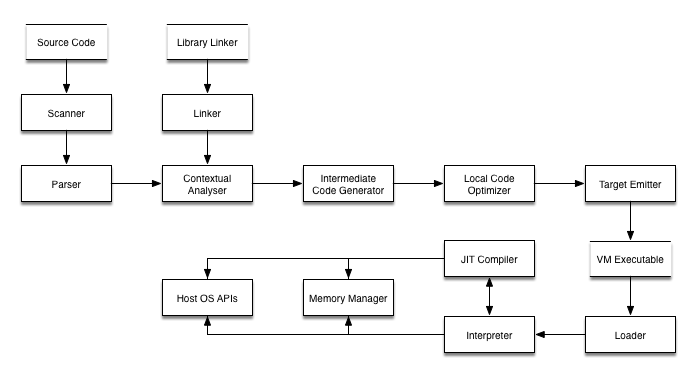

# Objeck
Objeck is an object-oriented computer language with functional features. The language has ties with Java, Scheme and UML. In this language all data types, except for higher-order functions, are treated as objects.



Objeck is a general-purpose programming language with an emphasis placed on simplicity. The programming environment consists of a compiler, virtual machine and command line debugger.

```ruby
class Hello {
  function : Main(args : String[]) ~ Nil {
    "Hello World" → PrintLine();
    "Καλημέρα κόσμε" → PrintLine();
    "こんにちは 世界" → PrintLine();
  }
}
```

See more on [Rosetta Code](http://rosettacode.org/wiki/Category:Objeck) and checkout the following [programming tasks](programs/rc).

Notable features:
* Object-oriented with functional features
  * Classes, interfaces and first-class functions
  * Generics with type boxing
  * Anonymous classes 
  * Reflection 
  * Object serialization 
  * Type inference
  * Lambda expressions
  * Closures
* Supported platforms (with JIT compilation)
  * x86-64: Windows, macOS and Linux
  * x86: Windows and Linux
  * ARMv7: Linux
* Native support for threads, sockets, files, date/time, etc.
* Libraries 
  * Collections (vectors, queues, trees, hashes, etc.)
  * HTTP and HTTPS clients
  * RegEx
  * JSON, XML and CSV parsers
  * Encryption
  * Database access (via ODBC)
  * Query framework
  * 2D Gaming (via SDL2)
* Garbage collection
* JIT support for all supported platforms

## Documentation
Please refer to the programmer's guide [documentation](https://www.objeck.org/documentation/) and [online tutorial](https://www.objeck.org/getting_started.html). Also checkout [Rosetta Code](http://rosettacode.org/wiki/Category:Objeck) [examples](programs/rc).

## Building
Building on Linux:
*  Install required libraries: "sudo apt-get install build-essential git libssl-dev unixodbc-dev libsdl2-dev libsdl2-image-dev libsdl2-ttf-dev libsdl2-mixer-dev"
*  cd to "objeck-lang/core/release" and run "./deploy.sh" with the parameter 32 or 64 representing the bit version of Linux
*  Build output with binaries and documentation will be located in "objeck-lang/core/release/deploy"

## Binaries
Get the latest [binaries](https://sourceforge.net/projects/objeck-lang/).
