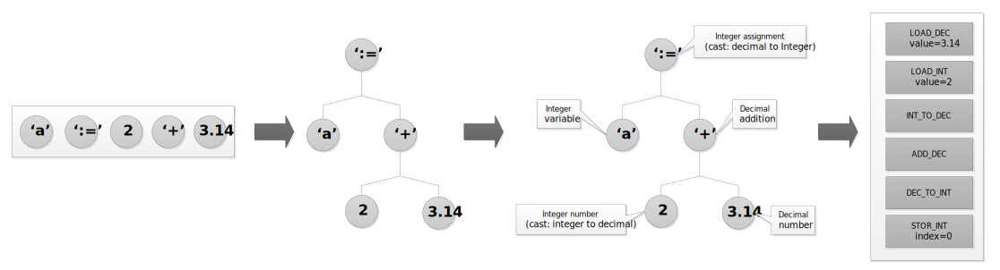

## Compiler
Coverts source code into Objeck executables (.obe) or Objeck libraries (.obl). The compiler produces compressed bytecode for the Objeck VM a stack-based runtime system. The compiler also performs local optimizations including method inlining. Optional debug symbols may be created for the runtime debugger.

### Design
Both the scanner and the parser were handwritten. As such, the parser is implemented using recursive-decent algorithm. The contextual analyzer which implements a few tricks in order to have primitives act as objects. Compiled code link against references to external libraries. As of v5.x, the code was refactored to support generics (via type erasure) and type boxing. The code emitter separates the frontend for the backend of the compiler turning the forest of trees into blocks of bytecode. 

The lists of code blocks are passed to the optimizer which performs to following optimizations in list order:

1. Removal of unneeded jumps and useless instructions
2. Constant folding
3. Inline setters and getters 
4. Inline methods
5. Strength reduction
6. Replace load/store with copy instructions

Code is organized and emitted as a single file and unneeded code and is pruned.

### Implementation
C++ using the STL