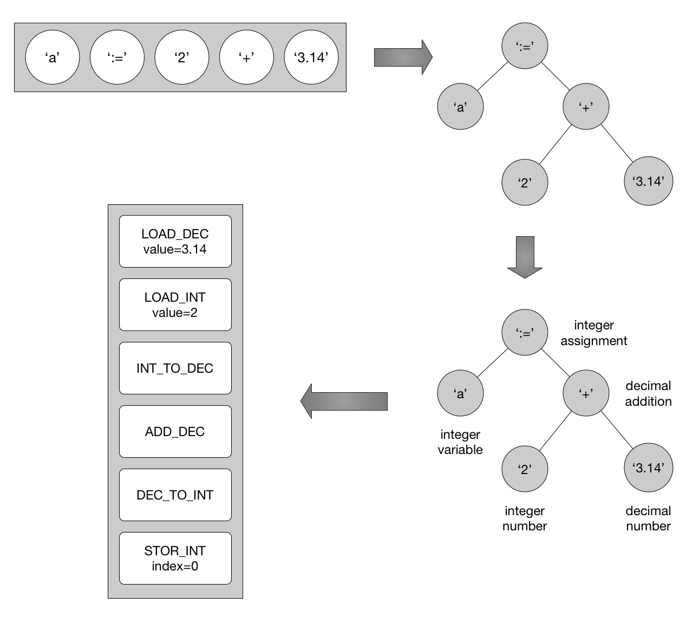

## Compiler
Coverts source code into Objeck executables (.obe) or Objeck libraries (.obl). The compiler produces bytecode for the Objeck VM a stack-based runtime system. The compiler also performs local optimizations including method inlining and optional debug symbols for the debugger.

### Design
Both the *scanner* and the *parser* were handwritten. As such, the *parser* was implemented using recursive-decent algorithm. Some of the more complex code is in the *contextual analyzer* which implements a few tricks in order to have primitives act as objects. This code also links in references to external libraries. As of v5, the code was refactored to support generic programming (via type erasure) and type boxing/unboxing. The code emitter separates the frontend for the backend of the compiler turning the forest of trees into blocks of referenceable code. 

The lists of code blocks are passed to the *optimizer* which performs to following optimizations in list order:

1. Clean up of unneeded jumps and useless instructions
2. Constant folding
3. Inline setters and getters 
4. Inline more complex methods
5. Strength reduction
6. Replace stack stores and loads with copy instructions

Lastly, the code is organized and *emitted* to a single file along with supporting metadata. The resulting *executable* prunes all unnecessary code and is the single file needed by the VM to execute the code.

### Implementation
C++ using the STL