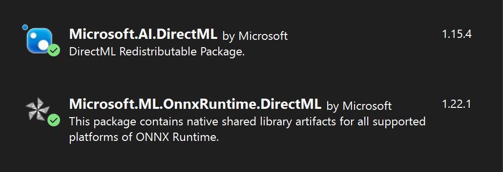

# ONNX and OpenCV Support

##
Build 

### Windows
Building with Visual Studio 2022

1. Enable Onnx support via VS Studio Nuget (Tools -> Package Manager -> Settings)
1. Add local Nuget package and include ``Microsoft.ML.OnnxRuntime.DirectML.1.22.1.nupkg``
1. Got to the project ``Manage Nuget Packages`` and ensure the following packages are enabled

1. Download OpenCV ``https://opencv.org/releases/`` and CMake to build it ``https://cmake.org/download/``
1. Unzip the source and use the CMake GUI to set the source and build directories, and click Configure
1. Change the following configuration options and then click Generate
  - CPU_BASELINE = FP16
  - CPU_DISPATH = FP16
  - NEON_INTRINSICS = checked
  - PNG_ARM_NEON = off
7). Compile the build target (modules -> opencv_world) and build 
8). Go to the build directory and check copy files from ``bin``, ``include``, and ``include`` (from the root source directory)
