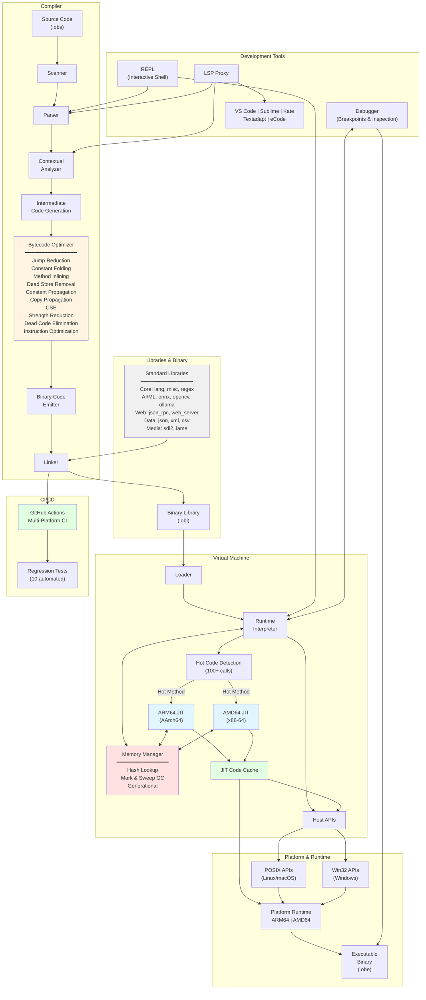

# Objeck Language Core

> **Compiler, Virtual Machine, JIT, and Runtime System**

[](https://github.com/objeck/objeck-lang/actions)

## Table of Contents
- [Architecture Overview](#architecture-overview)
- [Quick Start](#quick-start)
- [Building from Source](#building-from-source)
- [Testing](#testing)
- [Development Workflow](#development-workflow)
- [Troubleshooting](#troubleshooting)
- [Contributing](#contributing)

---

## Architecture Overview


```mermaid
graph TB
    subgraph "Development Tools"
        REPL["REPL<br/>(Interactive Shell)"]
        Debugger["Debugger<br/>(Breakpoints & Inspection)"]
        LSP["LSP Proxy"]
        Editors["VS Code | Sublime | Kate<br/>Textadapt | eCode"]
    end

    subgraph "Compiler"
        Source["Source Code<br/>(.obs)"]
        Scanner["Scanner"]
        Parser["Parser"]
        Analyzer["Contextual<br/>Analyzer"]
        IR["Intermediate<br/>Code Generation"]
        Optimizer["Bytecode Optimizer<br/>━━━━━━━━━━━━━━━━<br/>Jump Reduction<br/>Constant Folding<br/>Method Inlining<br/>Dead Store Removal<br/>Constant Propagation<br/>Copy Propagation<br/>CSE<br/>Strength Reduction<br/>Dead Code Elimination<br/>Instruction Optimization"]
        Emitter["Binary Code<br/>Emitter"]
        Linker["Linker"]
    end

    subgraph "Libraries & Binary"
        StdLib["Standard Libraries<br/>━━━━━━━━━━━━━━━━<br/>Core: lang, misc, regex<br/>AI/ML: onnx, opencv, ollama<br/>Web: json_rpc, web_server<br/>Data: json, xml, csv<br/>Media: sdl2, lame"]
        BinaryLib["Binary Library<br/>(.obl)"]
    end

    subgraph "Virtual Machine"
        Loader["Loader"]
        Interpreter["Runtime<br/>Interpreter"]
        HotCode["Hot Code Detection<br/>(100+ calls)"]
        JIT_ARM["ARM64 JIT<br/>(AArch64)"]
        JIT_AMD["AMD64 JIT<br/>(x86-64)"]
        MemMgr["Memory Manager<br/>━━━━━━━━━━━━━━━━<br/>Hash Lookup<br/>Mark & Sweep GC<br/>Generational"]
        HostAPI["Host APIs"]
        CodeCache["JIT Code Cache"]
    end

    subgraph "Platform & Runtime"
        POSIX["POSIX APIs<br/>(Linux/macOS)"]
        Win32["Win32 APIs<br/>(Windows)"]
        PlatformRT["Platform Runtime<br/>ARM64 | AMD64"]
        ExecBin["Executable<br/>Binary<br/>(.obe)"]
    end

    subgraph "CI/CD"
        GHA["GitHub Actions<br/>Multi-Platform CI"]
        Tests["Regression Tests<br/>(10 automated)"]
    end

    %% Compiler Flow
    Source --> Scanner --> Parser
    Parser --> Analyzer --> IR --> Optimizer --> Emitter
    Emitter --> Linker
    StdLib --> Linker
    Linker --> BinaryLib

    %% VM Flow
    BinaryLib --> Loader
    Loader --> Interpreter
    Interpreter --> HotCode
    HotCode -->|Hot Method| JIT_ARM
    HotCode -->|Hot Method| JIT_AMD
    JIT_ARM --> CodeCache
    JIT_AMD --> CodeCache
    CodeCache --> PlatformRT

    %% Memory & Host APIs
    Interpreter <--> MemMgr
    JIT_ARM <--> MemMgr
    JIT_AMD <--> MemMgr
    Interpreter --> HostAPI
    CodeCache --> HostAPI

    %% Platform
    HostAPI --> POSIX
    HostAPI --> Win32
    POSIX --> PlatformRT
    Win32 --> PlatformRT
    PlatformRT --> ExecBin

    %% Dev Tools Integration
    REPL --> Parser
    REPL --> Interpreter
    Debugger <--> Interpreter
    Debugger --> ExecBin
    LSP --> Parser
    LSP --> Analyzer
    LSP --> Editors

    %% CI/CD
    Linker --> GHA
    GHA --> Tests

    %% Styling
    style Optimizer fill:#fff4e1
    style MemMgr fill:#ffe1e1
    style JIT_ARM fill:#e1f5ff
    style JIT_AMD fill:#e1f5ff
    style CodeCache fill:#e1ffe1
    style StdLib fill:#f0f0f0
    style GHA fill:#e1ffe1
```

**📖 [Detailed Architecture Documentation](../docs/architecture.md)** - Deep technical views with 10+ interactive diagrams covering compiler internals, JIT compilation, memory management, library ecosystem, and more.

**Legacy Diagram:** [design4.png](https://github.com/objeck/objeck-lang/blob/master/docs/images/design4.png) (historical reference)

### Key Subsystems

| Component | Description | Path |
|-----------|-------------|------|
| **Compiler** | Bytecode compiler with optimization passes (s0-s3) | [core/compiler](compiler/) |
| **Virtual Machine** | Stack-based VM with JIT compilation | [core/vm](vm/) |
| **JIT Compiler** | ARM64/x64 native code generation | [core/vm/arch/jit](vm/arch/jit/) |
| **Memory Manager** | Generational GC with O(1) lookups | [core/vm/arch](vm/arch/) |
| **Debugger** | Interactive debugger with breakpoints | [core/debugger](debugger/) |
| **REPL** | Interactive shell with autocomplete | [core/repl](repl/) |

**Tech Stack:** C++17, x64/ARM64 assembly, GNU Make / Visual Studio

---

## Quick Start

### 🐧 Linux (One Command)
```bash
# Install dependencies and build
sudo apt-get install -y build-essential git libmbedtls-dev unixodbc-dev \
  libsdl2-dev libsdl2-image-dev libsdl2-ttf-dev libsdl2-mixer-dev \
  libmp3lame-dev libreadline-dev libeigen3-dev libopencv-dev

cd core/release && ./deploy_posix.sh x64
export PATH=$PATH:$(pwd)/deploy/bin
obc --version
```

### 🍎 macOS (One Command)
```bash
# Install Homebrew dependencies
brew install lame opencv onnxruntime mbedtls sdl2 sdl2_image sdl2_ttf sdl2_mixer

cd core/release && ./deploy_macos_arm64.sh
export PATH=$PATH:$(pwd)/deploy/bin
obc --version
```

### 🪟 Windows (Quick Build)
```cmd
REM Open Visual Studio x64 Command Prompt
cd core\release
deploy_windows.cmd x64

REM Binaries will be in deploy-x64\bin
```

---

## Building from Source

### Bootstrap & Cross-Platform Build Workflow

The Objeck build has **two stages**: a platform-independent bootstrap followed by a platform-specific build. This is required because the compiler is self-hosting (written in Objeck).

#### Stage 1: Bootstrap (WSL/Linux -- mandatory first step)
```bash
cd core/compiler && bash update_version.sh    # Linux x64
# or
cd core/compiler && bash update_version_arm.sh  # ARM64/macOS
```

This script:
1. Builds the bootstrap compiler (`sys_obc`) via `make -f make/Makefile.sys.amd64`
2. Compiles the core runtime library: `./sys_obc -src lib_src/lang.obs -tar lib -opt s2 -dest ../lib/lang.obl`
3. Builds the full compiler (`obc`) via `make -f make/Makefile.amd64`
4. Compiles **all** standard libraries (`gen_collect`, `json`, `xml`, `cipher`, `net`, `regex`, `csv`, `ml`, etc.) into `.obl` files

The resulting `.obl` library files are **platform-independent bytecode** and must be built before any platform-specific build.

#### Stage 2: Platform Build
After bootstrap, build the native toolchain for your target platform:
- **Linux/WSL:** `cd core/release && bash deploy_posix.sh x64` (or `arm64`)
- **macOS:** `cd core/release && bash deploy_macos_arm64.sh`
- **Windows:** Open VS Developer Command Prompt, then `cd core\release && deploy_windows.cmd x64` (or `arm64`)

#### WSL-to-Windows Handoff
For Windows development using WSL for bootstrap:
1. Run bootstrap in WSL: `cd core/compiler && bash update_version.sh`
2. Commit and push the updated compiler and `.obl` files
3. Pull on the Windows side
4. Run the Windows platform build: `deploy_windows.cmd x64`

#### Development Iteration
- **Primary development:** WSL/Linux using POSIX Makefiles (fastest iteration)
- **Final validation:** Windows native build via Visual Studio
- **CI/CD:** GitHub Actions builds on Linux x64, Linux ARM64, macOS ARM64, Windows x64, and Windows ARM64

---

### Linux (x64 / ARM64)

**Supported:** Ubuntu 20.04+, Debian 11+, Fedora 35+

```bash
# 1. Clone repository
git clone https://github.com/objeck/objeck-lang.git
cd objeck-lang/core/release

# 2. Install dependencies
sudo apt-get update && sudo apt-get install -y \
  build-essential git libmbedtls-dev unixodbc-dev \
  libsdl2-dev libsdl2-image-dev libsdl2-ttf-dev libsdl2-mixer-dev \
  libmp3lame-dev libreadline-dev unzip libeigen3-dev libopencv-dev

# 3. Build
./deploy_posix.sh x64    # For x64
./deploy_posix.sh rpi    # For ARM64/Raspberry Pi

# 4. Output
# Binaries: core/release/deploy/bin/{obc,obr,obd,obi}
# Libraries: core/release/deploy/lib/*.obl
```

**What each dependency does:**
- `libmbedtls-dev` - Crypto operations (SHA, AES, TLS)
- `libsdl2-*` - Game development, graphics, audio
- `libopencv-dev` - Computer vision (optional but recommended)
- `libeigen3-dev` - Linear algebra for ML
- `libmp3lame-dev` - MP3 encoding

---

### macOS (Apple Silicon Only)

**Supported:** macOS 15+ (Sequoia or later) - **Apple Silicon (M1/M2/M3/M4) only**

```bash
# 1. Install Xcode Command Line Tools
xcode-select --install

# 2. Install Homebrew
/bin/bash -c "$(curl -fsSL https://raw.githubusercontent.com/Homebrew/install/HEAD/install.sh)"

# 3. Install dependencies
brew install lame opencv onnxruntime mbedtls sdl2 sdl2_image sdl2_ttf sdl2_mixer

# 4. Build
cd core/release
./deploy_macos_arm64.sh

# 5. Output
# Binaries: core/release/deploy/bin/
```

---

### Windows (Visual Studio)

**Supported:** Visual Studio 2022+ with C++ tools

#### x64 Build
```cmd
1. Open "x64 Native Tools Command Prompt for VS 2022"
2. cd core\release
3. deploy_windows.cmd x64
4. Binaries: core\release\deploy-x64\bin\
```

#### ARM64 Build
```cmd
1. Install ARM64 build tools:
   - Open Visual Studio Installer
   - Modify → Individual Components
   - Search "arm64" and install MSVC v143 ARM64 build tools

2. Open "x64_arm64 Cross Tools Command Prompt for VS 2022"
3. cd core\release
4. deploy_windows.cmd arm64
5. Binaries: core\release\deploy-arm64\bin\
```

**Note:** First ARM64 build automatically downloads mbedTLS (5-10 min one-time setup)

---

### Windows (MSYS2)

**Alternative to Visual Studio using GCC/Clang**

#### UCRT64 (Recommended)
```bash
# 1. Install MSYS2 from https://www.msys2.org
# 2. Open "MSYS2 UCRT64" shell

# 3. Install packages
pacman -S --noconfirm mingw-w64-ucrt-x86_64-gcc \
  mingw-w64-ucrt-x86_64-mbedtls mingw-w64-ucrt-x86_64-SDL2 \
  mingw-w64-ucrt-x86_64-SDL2_ttf mingw-w64-ucrt-x86_64-SDL2_mixer \
  mingw-w64-ucrt-x86_64-SDL2_image mingw-w64-ucrt-x86_64-unixodbc \
  mingw-w64-ucrt-x86_64-eigen3 make unzip

# 4. Build
cd core/release
./deploy_msys2-ucrt.sh

# 5. Output: core/release/deploy-msys2-ucrt/
```

#### Clang64 (Alternative)
```bash
# Use deploy_msys2-clang.sh instead
# Replace "ucrt" with "clang" in package names
```

---

## Testing

### Automated Testing (CI)

**GitHub Actions** runs on every commit:
- ✅ Linux x64, macOS x64/ARM64, Windows x64
- ✅ 17 deployment tests + 10 regression tests
- ✅ Multi-platform builds with caching

```bash
# View CI status
# https://github.com/objeck/objeck-lang/actions
```

### Run Tests Locally

#### Regression Suite (10 tests)
```bash
cd programs/regression

# Linux/macOS
./run_regression.sh x64

# Windows
run_regression.cmd x64
```

**Tests cover:**
- Core language features (classes, arrays, control flow)
- ARM64 JIT fixes (char arrays, immediates, bitwise ops)
- Crypto operations (mbedTLS migration)

#### Manual Testing
```bash
cd core/release/deploy/bin

# Compile and run
./obc -src ../../../../programs/deploy/hello_0.obs
./obr ../../../../programs/deploy/hello_0.obe
```

---

## Development Workflow

### Making Changes

```bash
# 1. Create feature branch
git checkout -b feature/my-improvement

# 2. Make changes to compiler/VM/etc.

# 3. Rebuild
cd core/release
./deploy_posix.sh x64  # Or appropriate build script

# 4. Test
cd ../../programs/regression
./run_regression.sh x64

# 5. Commit with descriptive message
git add .
git commit -m "Fix ARM64 JIT: improve register allocation"

# 6. Push and create PR
git push origin feature/my-improvement
```

### Debug Builds

```bash
# Linux/macOS: Edit Makefiles to use -g -O0
cd core/compiler
make clean && make DEBUG=1

# Windows: Use Debug configuration in Visual Studio
# Or: msbuild objeck.sln /p:Configuration=Debug
```

### Common Development Tasks

| Task | Command |
|------|---------|
| Rebuild compiler only | `cd core/compiler && make clean && make` |
| Rebuild VM only | `cd core/vm && make clean && make` |
| Clean all | `cd core/release && make clean` |
| Test single file | `obc -src test.obs && obr test.obe` |
| View bytecode | `obd test.obe` (disassembler) |
| Enable JIT debug | Set `JIT_DEBUG=1` env var |

---

## Troubleshooting

### Build Errors

**Problem:** `mbedtls.h not found`
```bash
# Linux
sudo apt-get install libmbedtls-dev

# macOS
brew install mbedtls

# Windows ARM64
# Automatically downloads on first build
# Or manually: cd core/lib/crypto && build_mbedtls_arm64.cmd
```

**Problem:** `SDL2 not found`
```bash
# Linux
sudo apt-get install libsdl2-dev libsdl2-image-dev libsdl2-ttf-dev

# macOS
brew install sdl2 sdl2_image sdl2_ttf sdl2_mixer
```

**Problem:** `undefined reference to opencv_...`
```bash
# OpenCV is optional for most builds
# If needed:
sudo apt-get install libopencv-dev  # Linux
brew install opencv                  # macOS
```

### Runtime Errors

**Problem:** `Unable to read library: '../lib/lang.obl'`
- **Cause:** Running compiler from wrong directory
- **Fix:** Compiler must run from its `bin/` directory or use absolute paths

**Problem:** Segfault in JIT code
- Set `JIT_DEBUG=1` to see generated assembly
- Check `core/vm/arch/jit/README.md` for debugging tips

**Problem:** Regression tests fail
- Check `programs/regression/results/*.log` for details
- Ensure all dependencies installed
- Try clean rebuild: `make clean && ./deploy_posix.sh x64`

### Performance Issues

**Problem:** Slow compilation
- Use optimization level: `obc -opt s3` (default)
- Enable ccache: `export CC="ccache gcc"`

**Problem:** Slow runtime
- Check if JIT is enabled: `JIT_STATUS=1 obr program.obe`
- Ensure Release build, not Debug

---

## Contributing

### First-Time Contributors

**Good first issues:**
1. Add test cases to regression suite
2. Improve error messages in compiler
3. Document undocumented functions
4. Fix typos in code comments

**Getting help:**
- 📖 [Main README](../README.md)
- 💬 [GitHub Discussions](https://github.com/objeck/objeck-lang/discussions)
- 🐛 [Issue Tracker](https://github.com/objeck/objeck-lang/issues)

### Code Style

- **C++:** Follow existing style (2-space indent, BSD braces)
- **Assembly:** Commented explaining purpose of each section
- **Commit messages:** Descriptive (e.g., "Fix ARM64 JIT: char array STRH encoding")

### Pull Request Checklist

- [ ] Code compiles on Linux/macOS/Windows
- [ ] Regression tests pass: `./run_regression.sh x64`
- [ ] Added test for new feature/bugfix
- [ ] Updated relevant documentation
- [ ] Commit message describes "why" not just "what"

---

## Architecture Deep Dive

### Compiler Pipeline
```
Source (.obs) → Lexer → Parser → AST → Optimizer (s0-s3) → Bytecode (.obe)
```

**Optimization Levels:**
- `s0` - No optimization (fastest compile)
- `s1` - Basic (constant folding, dead code)
- `s2` - Moderate (inline small functions)
- `s3` - Aggressive (all optimizations) ⭐ **default**

### VM Execution Flow
```
Bytecode → Interpreter → Hot Code Detection → JIT → Native Code (ARM64/x64)
```

**JIT Tiering:**
1. First 100 calls: Interpreted
2. After threshold: Compile to native code
3. Optimizations: Register allocation, instruction combining, branch prediction

### Memory Management
```
Stack: Local variables, call frames
Heap: Objects, arrays (managed by GC)
GC: Mark-and-sweep with generational collection
```

**GC Improvements (v2026.2):**
- O(1) object lookups (hash-based)
- In-place sweeping (reduced memory moves)
- Improved ARM64 performance

---

## Useful Links

- 📚 [Language Documentation](https://www.objeck.org)
- 🔧 [Compiler Internals](compiler/README.md)
- ⚡ [JIT Architecture](vm/arch/jit/README.md)
- 🧪 [Regression Tests](../programs/regression/README.md)
- 🌐 [Official Website](https://www.objeck.org)
- 📊 [CI/CD Pipeline](../.github/workflows/c-cpp.yml)

---

## Version Info

**Current:** v2026.2.1
**Released:** February 2026
**License:** BSD 3-Clause

**Recent improvements:**
- ARM64 JIT optimizations (11 fixes)
- Memory manager O(1) lookups
- mbedTLS crypto migration
- Multi-platform CI with caching
- Windows ARM64 support

See [CHANGELOG.md](../CHANGELOG.md) for full history.

