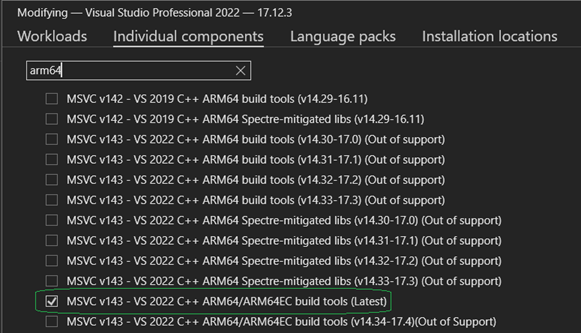

# Architecture  

### Notable Subsystems
* [Compiler](https://github.com/objeck/objeck-lang/blob/master/core/compiler)
* [Virtual Machine](https://github.com/objeck/objeck-lang/blob/master/core/vm)
* [Debugger](https://github.com/objeck/objeck-lang/blob/master/core/debugger)
* [REPL](https://github.com/objeck/objeck-lang/blob/master/core/repl)
* [Memory manager](https://github.com/objeck/objeck-lang/blob/master/core/vm/arch)
* [Just-In-Time (JIT) compilation](https://github.com/objeck/objeck-lang/blob/master/core/vm/arch/jit)

## Working with the Code
Objeck can be built for various targets. The language is implemented in C++ and assembly (i.e., generated machine code) and assisted by code generators for SDL2 and GTK 3/4 bindings.

### Linux (x64, ARM64)
*  For Linux, install required libraries: <code>sudo apt-get install build-essential git libssl-dev unixodbc-dev libsdl2-dev libsdl2-image-dev libsdl2-ttf-dev libsdl2-mixer-dev libmp3lame-dev libreadline-dev unzip libeigen3-dev libopencv-dev</code>
*  cd to <code>objeck-lang/core/release</code> and run <code>./deploy_posix.sh</code> with the parameter <code>64</code> or <code>rpi</code> for x64 or ARM64 Linux
*  Build output with binaries and documentation will be located in <code>objeck-lang/core/release/deploy</code>
*  Reference <code>objeck-lang/core/release/deploy/readme.html</code> to set additional paths and find examples

### macOS (ARM64)
*  Install Xcode with command line tools
*  Open a command shell and go to <code>objeck-lang/core/release</code> and run <code>./deploy_macos_arm64.sh</code>
*  Build output with binaries and documentation will be located in <code>objeck-lang/core/release/deploy</code>
*  Reference <code>objeck-lang/core/release/deploy/readme.html</code> to set additional paths and find examples

### Windows (ARM64, Visual Studio)
*  Install MSVS build tools for arm64 via the Visual Studio Installer. Go to 'Modify', 'Individual Components', and search 'arm64' 
*  Unzip the OpenSSL Windows libraries in <code>objeck-lang/core/lib/openssl/win/arm64</code>
*  Using Visual Studio 2022 or later open <code>objeck-lang/core/release/objeck.sln</code>
*  Ensure the core build completes successfully (in Release mode)
*  To build everything, open a Visual Studio arm64 command prompt and go to <code>objeck-lang/core/release</code> directory and run <code>deploy_windows.cmd arm64</code>
*  Build output with binaries and documentation will be located in <code>objeck-lang/core/release/deploy-arm64</code>
*  Reference <code>objeck-lang/core/release/deploy-arm64/readme.html</code> to learn how to set the environment variables and find code examples

### Windows (x64, Visual Studio)
*  Unzip the OpenSSL Windows libraries in <code>objeck-lang/core/lib/openssl/win/x64</code>
*  Using Visual Studio 2022 or later open <code>objeck-lang/core/release/objeck.sln</code>
*  Ensure the core build completes successfully (in Release mode)
*  To build everything, open a Visual Studio x64 command prompt and go to <code>objeck-lang/core/release</code> directory and run <code>deploy_windows.cmd x64</code>
*  Build output with binaries and documentation will be located in <code>objeck-lang/core/release/deploy-x64</code>
*  Reference <code>objeck-lang/core/release/deploy-x64/readme.html</code> to learn how to set the environment variables and find code examples

### Windows (x64, MSYS2)
* Under the UCRT64 (Unicode shell support)
  * Package dependencies
  * <code>pacman --noconfirm -S mingw-w64-ucrt-x86_64-gcc mingw-w64-ucrt-x86_64-openssl make mingw-w64-ucrt-x86_64-SDL2 unzip mingw-w64-ucrt-x86_64-SDL2_ttf mingw-w64-ucrt-x86_64-SDL2_mixer mingw-w64-ucrt-x86_64-SDL2_image mingw-w64-ucrt-x86_64-unixodbc mingw-w64-ucrt-x86_64-eigen3 mingw-w64-ucrt-x86_64-pkgconf</code>
  * cd to <code>objeck-lang/core/release</code> and run <code>./deploy_msys2-ucrt.sh</code>
  *  Build output with binaries and documentation will be located in <code>objeck-lang/core/release/deploy-msys2-ucrt</code>
  *  Set the path for to the UCRT64 'bin' directory
  *  Reference <code>objeck-lang/core/release/deploy-msys2-ucrt/readme.html</code> to set additional paths and find examples
* Under the Clang64
  * Package dependencies
  * <code>pacman --noconfirm -S mingw-w64-clang-x86_64-gcc mingw-w64-clang-x86_64-openssl make mingw-w64-clang-x86_64-SDL2 unzip mingw-w64-clang-x86_64-SDL2_ttf mingw-w64-clang-x86_64-SDL2_mixer mingw-w64-clang-x86_64-SDL2_image mingw-w64-clang-x86_64-unixodbc mingw-w64-clang-x86_64-eigen3 mingw-w64-clang-x86_64-pkgconf</code>
  * cd to <code>objeck-lang/core/release</code> and run <code>./deploy_msys2-clang.sh</code>
  *  Build output with binaries and documentation will be located in <code>objeck-lang/core/release/deploy-msys2-clang</code>
  *  Set the path for to the Clang64 'bin' directory
  *  Reference <code>objeck-lang/core/release/deploy-msys2-clang/readme.html</code> to set additional paths and find examples
