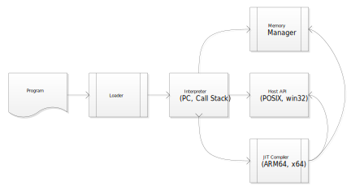

# Objeck Virtual Machine (obr)

The Objeck Virtual Machine is a high-performance stack-based VM with JIT compilation for ARM64 and AMD64 architectures. It features a generational garbage collector and native integration with platform capabilities.



## Features

- **JIT Compilation**: Converts bytecode to native machine code for performance
- **Stack-Based Architecture**: Simple, efficient execution model
- **Garbage Collection**: Generational mark-and-sweep collector with optimization
- **Cross-Platform**: Unified codebase for Windows, Linux, and macOS
- **Multi-Architecture**: Native support for x64 and ARM64
- **Platform Integration**: Direct access to OS capabilities (networking, files, threading)
- **Memory Safety**: Automatic memory management with no manual deallocation
- **Exception Handling**: Built-in exception support with stack unwinding

## Supported Platforms

| Platform | Architecture | Status |
|----------|--------------|--------|
| Windows | x64 (AMD64) | ✅ Supported |
| Linux | x64 (AMD64) | ✅ Supported |
| macOS | x64 (AMD64) | ✅ Supported |
| Linux | ARM64 | ✅ Supported |
| macOS | ARM64 (Apple Silicon) | ✅ Supported |
| Raspberry Pi 3/4/5 | ARM64 | ✅ Supported |

## Usage

```bash
# Run a program
obr myprogram.obe

# Run with command-line arguments
obr myprogram.obe arg1 arg2 arg3

# Run with library path
obr -lib /path/to/libs myprogram.obe

# Display version
obr --version
```

## Architecture

### Major Components

1. **Interpreter**
   - Executes bytecode instructions
   - Manages execution stack
   - Handles method calls and returns
   - Dispatches to JIT-compiled code when available

2. **JIT Compiler**
   - Converts hot bytecode paths to native machine code
   - Architecture-specific code generation (x64, ARM64)
   - Runtime profiling and optimization
   - Inline caching for method calls

3. **Memory Manager**
   - Generational garbage collector
   - Mark-and-sweep algorithm with optimization
   - Automatic memory reclamation
   - Reference counting for certain objects
   - Memory pooling for performance

4. **Platform Abstraction Layer**
   - Unified interface for Windows and POSIX systems
   - Thread management (pthreads/Windows threads)
   - File I/O and networking
   - Dynamic library loading
   - System calls and interrupts

### Execution Flow

```
Bytecode → Interpreter → [Hot Path Detection] → JIT Compiler → Native Code
                ↓                                        ↓
           Stack Management ← Memory Manager ← Garbage Collector
```

### JIT Compilation Strategy

The VM uses tiered compilation:
1. **Interpretation**: Initial execution via bytecode interpreter
2. **Profiling**: Track frequently executed code paths
3. **Compilation**: Convert hot paths to native machine code
4. **Optimization**: Apply platform-specific optimizations
5. **Caching**: Cache compiled code for reuse

## Memory Management

### Garbage Collection

The VM uses a generational mark-and-sweep collector:
- **Young Generation**: Short-lived objects, frequent collection
- **Old Generation**: Long-lived objects, infrequent collection
- **Large Object Heap**: Separate heap for large allocations
- **Incremental Collection**: Reduces pause times

### Object Layout

Objects are laid out in memory with:
- Object header (type information, GC metadata)
- Instance variables
- Array data (for arrays)
- Alignment padding

## Threading Model

- Native OS threads (pthreads on Unix, Windows threads on Windows)
- Thread-local storage for VM state
- Mutex and condition variable support
- Thread-safe garbage collection with stop-the-world pauses

## Performance

### Optimizations
- JIT compilation with register allocation
- Inline caching for method dispatch
- String interning
- Constant pool optimization
- Branch prediction hints
- SIMD instructions (where applicable)

### Benchmarks
Performance is comparable to other JIT-based VMs like JVM and .NET CLR for similar workloads.

## Building the VM

### Windows (Visual Studio)
```bash
cd core/vm/vs
msbuild vm.vcxproj /p:Configuration=Release /p:Platform=x64
```

### Linux/macOS (Make)
```bash
cd core/vm
make -f make/Makefile.amd64       # For x64
make -f make/Makefile.arm64       # For ARM64
```

## Implementation Details

- **Language**: C++ with STL
- **Code Generation**: Custom assembler for x64 and ARM64
- **Line Count**: ~50,000 lines of C++ code
- **External Dependencies**: Platform APIs only (no external libraries required for base VM)

## Debugging

The VM integrates with the Objeck debugger (obd) through:
- Debug symbol support in bytecode
- Breakpoint handling
- Stack trace generation
- Variable inspection
- Step execution

## See Also

- [Main README](../../README.md) - Project overview
- [Compiler](../compiler/README.md) - Bytecode generation
- [Debugger](../debugger/README.md) - Debugging support
- [JIT Architecture](arch/jit/README.md) - JIT compiler internals
- [API Documentation](https://www.objeck.org) - Runtime API reference
