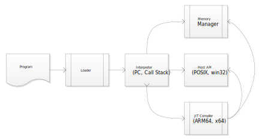

# Objeck Virtual Machine (obr)

The Objeck Virtual Machine is a high-performance stack-based VM with JIT compilation for ARM64 and AMD64 architectures. It features a generational garbage collector and native integration with platform capabilities.



## Features

- **JIT Compilation**: Converts bytecode to native machine code for performance
- **Stack-Based Architecture**: Simple, efficient execution model
- **Garbage Collection**: Generational mark-and-sweep collector with optimization
- **Cross-Platform**: Unified codebase for Windows, Linux, and macOS
- **Multi-Architecture**: Native support for x64 and ARM64
- **Platform Integration**: Direct access to OS capabilities (networking, files, threading)
- **Memory Safety**: Automatic memory management with no manual deallocation
- **Exception Handling**: Built-in exception support with stack unwinding

## Supported Platforms

| Platform | Architecture | Status |
|----------|--------------|--------|
| Windows | x64 (AMD64) | ✅ Supported |
| Linux | x64 (AMD64) | ✅ Supported |
| macOS | x64 (AMD64) | ✅ Supported |
| Linux | ARM64 | ✅ Supported |
| macOS | ARM64 (Apple Silicon) | ✅ Supported |
| Raspberry Pi 3/4/5 | ARM64 | ✅ Supported |

## Usage

```bash
# Run a program
obr myprogram.obe

# Run with command-line arguments
obr myprogram.obe arg1 arg2 arg3

# Run with library path
obr -lib /path/to/libs myprogram.obe

# Display version
obr --version
```

## Architecture

### Major Components

1. **Interpreter**
   - Executes bytecode instructions
   - Manages execution stack
   - Handles method calls and returns
   - Dispatches to JIT-compiled code when available

2. **JIT Compiler**
   - Converts hot methods to native machine code (auto-JIT by call count)
   - Architecture-specific code generation (x64 whitelist, ARM64 blacklist)
   - Local register caching and (x64) method inlining
   - Direct JIT-to-JIT calling via call-site patching (`MTHD_CALL` → `MTHD_CALL_JIT`)
   - See [JIT internals](arch/jit/README.md)

3. **Memory Manager**
   - Generational mark-and-sweep collector
   - Young nursery (bump-allocated objects) + old generation
   - Automatic memory reclamation; old-gen free-list cache
   - Lock-free CAS marking; parallel root scanning
   - See [memory manager internals](arch/README.md)

4. **Platform Abstraction Layer**
   - Unified interface for Windows and POSIX systems
   - Thread management (pthreads/Windows threads)
   - File I/O and networking
   - Dynamic library loading
   - System calls and interrupts

### Execution Flow

```
Bytecode → Interpreter → [Hot Path Detection] → JIT Compiler → Native Code
                ↓                                        ↓
           Stack Management ← Memory Manager ← Garbage Collector
```

### JIT Compilation Strategy

The VM uses call-count-driven auto-JIT (no multi-tier recompilation):
1. **Interpretation**: methods start in the bytecode interpreter
2. **Counting**: each call increments a per-method counter
3. **Compilation**: at the threshold (`OBJECK_JIT_THRESHOLD`, default 10) the method's next entry compiles to native code, after a `CanJitInstruction` pre-scan
4. **Patching**: call sites are rewritten to dispatch straight to native code (`MTHD_CALL` → `MTHD_CALL_JIT`)
5. **Reuse**: compiled native code is cached on the method

Set `OBJECK_JIT_DISABLE=1` to stay fully interpreted. See [JIT internals](arch/jit/README.md) for the full lifecycle and the callback bridge.

## Memory Management

### Garbage Collection

The VM uses a generational mark-and-sweep collector:
- **Young generation (nursery)**: objects are bump-allocated here and most die without ever entering the old-gen set
- **Old generation**: nursery survivors are promoted here; arrays are allocated here directly (they bypass the nursery — see [internals](arch/README.md))
- **Minor vs. major GC**: minor collections scan the remembered set (via a write barrier) + roots and recycle the nursery; major collections sweep both generations
- **Parallel mark**: root scanning fans out across threads with lock-free CAS mark bits. A collection is serialized against other collections (a `trylock` guards re-entry) and runs **cooperative stop-the-world**: other mutator threads park at safepoints (in the dispatch loop, at allocation, and across blocking syscalls such as thread join/sleep and socket I/O) for the duration of the collection

### Object Layout

Objects are laid out in memory with:
- Object header (type/class pointer, packed GC mark/generation/remembered-set bits)
- Instance variables
- Array data (for arrays)
- Alignment padding

## Threading Model

- Native OS threads (pthreads on Unix, Windows threads on Windows)
- Thread-local storage for VM state
- Mutex and condition variable support
- Garbage collection runs **cooperative stop-the-world**: collections are serialized against each other via a `trylock`, and other mutator threads park at safepoints (dispatch loop, allocation, and blocking syscalls) for the duration of a collection

## Performance

### Optimizations
- JIT compilation with local register caching
- Direct JIT-to-JIT calling (no interpreter trampoline) via call-site patching
- Method inlining (x64) and power-of-two division strength reduction
- Young-generation bump allocation (lock-free) for short-lived objects
- Constant pool optimization

### Benchmarks
See [`docs/performance.md`](../../docs/performance.md) for current cross-language and version-over-version numbers.

## Building the VM

### Dependencies

The VM requires the following libraries at build time:

| Library | Purpose | Linux | macOS | Windows VS | MSYS2 |
|---------|---------|-------|-------|------------|-------|
| mbedTLS | TLS, crypto (`TCPSecureSocket`) | `libmbedtls-dev` | `brew install mbedtls` | bundled | `mingw-w64-ucrt-x86_64-mbedtls` |
| nghttp2 | HTTP/2 (`net_h2`) | `libnghttp2-dev` | `brew install nghttp2` | vcpkg `nghttp2:x64-windows` | `mingw-w64-ucrt-x86_64-nghttp2` |
| ngtcp2 | QUIC transport (`net_quic`) | `libngtcp2-dev` | `brew install ngtcp2` | not supported | `mingw-w64-ucrt-x86_64-ngtcp2` |
| ngtcp2-crypto-gnutls | QUIC+TLS 1.3 | `libngtcp2-crypto-gnutls-dev` | (included) | not supported | `mingw-w64-ucrt-x86_64-ngtcp2` |
| nghttp3 | HTTP/3 frames (`net_quic`) | `libnghttp3-dev` | `brew install nghttp3` | not supported | `mingw-w64-ucrt-x86_64-nghttp3` |
| GnuTLS | TLS 1.3 for QUIC | `libgnutls28-dev` | `brew install gnutls` | not supported | `mingw-w64-ucrt-x86_64-gnutls` |

HTTP/3 (`OBJECK_HAS_NGTCP2`) requires Ubuntu 22.04+ or equivalent (ngtcp2 ≥ 0.12).

### Windows (Visual Studio)
```bash
cd core/vm/vs
msbuild vm.vcxproj /p:Configuration=Release /p:Platform=x64
```

### Linux x64 (Make)
```bash
# Install dependencies first (see table above)
sudo apt-get install -y libmbedtls-dev libnghttp2-dev \
  libngtcp2-dev libngtcp2-crypto-gnutls-dev libnghttp3-dev libgnutls28-dev

cd core/vm
make -f make/Makefile.amd64
```

### Linux ARM64 (Make)
```bash
sudo apt-get install -y libmbedtls-dev libnghttp2-dev \
  libngtcp2-dev libngtcp2-crypto-gnutls-dev libnghttp3-dev libgnutls28-dev

cd core/vm
make -f make/Makefile.arm64
```

### macOS (Xcode)
```bash
brew install mbedtls nghttp2 ngtcp2 nghttp3 gnutls
open core/vm/xcode/VM.xcodeproj
# Build → Product → Build (⌘B)
```

## Implementation Details

- **Language**: C++ with STL
- **Code Generation**: Custom assembler for x64 and ARM64
- **Line Count**: ~50,000 lines of C++ code
- **External Dependencies**: mbedTLS (TLS/crypto), nghttp2 (HTTP/2), ngtcp2+nghttp3+GnuTLS (HTTP/3, Linux/macOS only)

## Debugging

The VM integrates with the Objeck debugger (obd) through:
- Debug symbol support in bytecode
- Breakpoint handling
- Stack trace generation
- Variable inspection
- Step execution

## See Also

- [Main README](../../README.md) - Project overview
- [Compiler](../compiler/README.md) - Bytecode generation
- [Debugger](../debugger/README.md) - Debugging support
- [JIT Architecture](arch/jit/README.md) - JIT compiler internals
- [Memory Manager](arch/README.md) - garbage collector internals
- [API Documentation](https://www.objeck.org) - Runtime API reference
