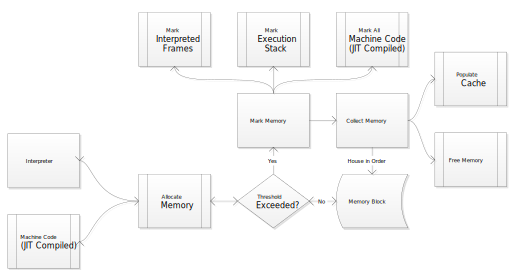

## Memory Manager
Mark and sweep garbage collector.

### Design
Memory is allocated until a threshold is reached, which evokes the garbage collector. The garbage collector scans all "roots," namely the calculation stack, interpreter stack, and processor stack for JIT'ed code. Scanning of roots and associated memory is performed in separate threads. All scanned memory is tagged, and memory not tagged is released cached or freed.

### Implementation
C++ using the STL.
