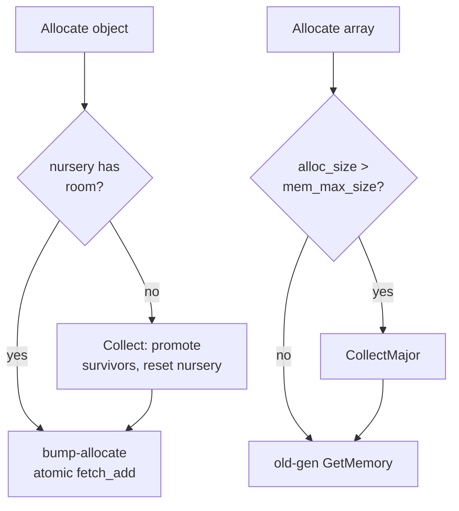
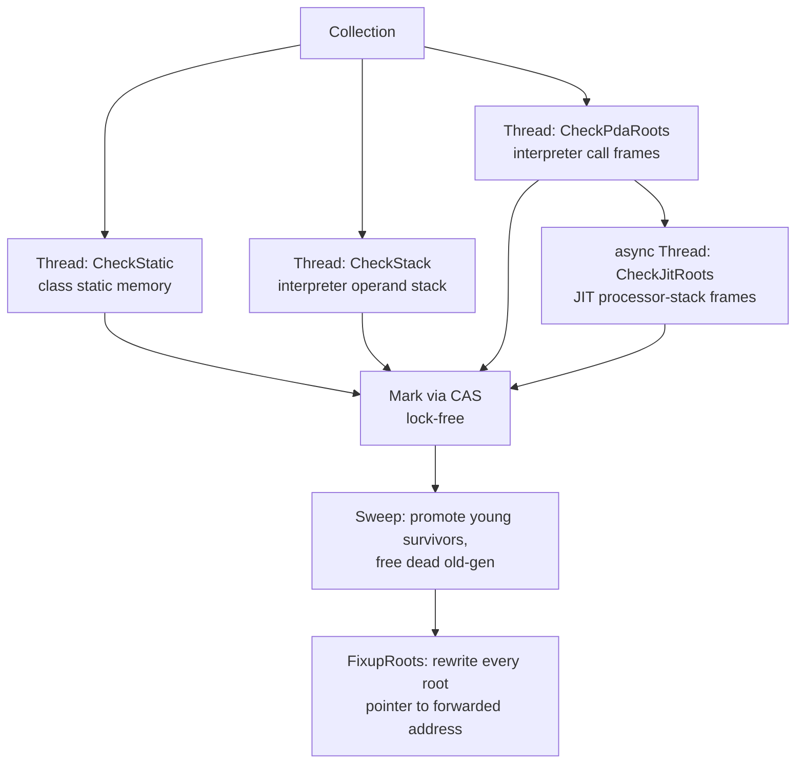

## Memory Manager
A concurrent, **generational mark-and-sweep** garbage collector.

### Design
Memory is allocated until a threshold is reached, which triggers a collection. The collector scans all *roots* — class static memory, the interpreter operand stack, interpreter (PDA) call frames, and the processor stack of JIT'ed code — marks everything reachable, and reclaims the rest. Root scanning runs across **multiple threads**; marking is lock-free.

What's new since the original mark-and-sweep is a **young generation**: short-lived objects are bump-allocated into a nursery and die there cheaply, so the bulk of allocations never touch the old-generation set or its mutex. This is the source of the recent throughput and RSS gains (see [`docs/performance.md`](../../../docs/performance.md) for canonical benchmark numbers).

### Generational layout
```
                 ┌───────────────────────────────────────────────┐
 OBJECTS  ─────► │  YOUNG NURSERY  (contiguous, bump-allocated)   │
                 │  young_offset.fetch_add()  — lock-free          │
                 └───────────────────────────────────────────────┘
                          │ survives a collection
                          ▼  promote + forward
                 ┌───────────────────────────────────────────────┐
 ARRAYS  ──────► │  OLD GENERATION  (old_generation hash set)     │
                 │  GetMemory() + free-list cache, mutex-guarded   │
                 └───────────────────────────────────────────────┘
```

- **Objects** are bump-allocated in the nursery first (`AllocateObject`, `memory.cpp`). A young object carries no `GC_OLD_BIT`, is never inserted into `old_generation`, and takes no allocation mutex — allocation is a single atomic `fetch_add`.
- **Arrays always go straight to old gen** (`AllocateArray`). Array interior pointers can't yet be safely fixed up during promotion, so they skip the nursery by design — see the comment at the top of `AllocateArray`.
- When the nursery fills, a collection promotes the survivors and resets `young_offset` to 0, recycling the whole region.

### Object header
Each allocation is preceded by reserved slots (`EXTRA_BUF_SIZE`). The flag word `mem[MARKED_FLAG]` packs three GC bits:

| Bit | Name | Meaning |
|---|---|---|
| `0x1` | `GC_MARK_BIT` | reachable this cycle |
| `0x2` | `GC_OLD_BIT` | lives in the old generation (0 = young) |
| `0x4` | `GC_RSET_BIT` | in the remembered set (old object holding a young ref) |

### Allocation & collection trigger

```mermaid
flowchart TD
    A[Allocate object] --> B{nursery has<br/>room?}
    B -- yes --> C[bump-allocate<br/>atomic fetch_add]
    B -- no --> D[Collect: promote<br/>survivors, reset nursery]
    D --> C
    A2[Allocate array] --> E{alloc_size ><br/>mem_max_size?}
    E -- yes --> F[CollectMajor]
    E -- no --> G[old-gen GetMemory]
    F --> G
```

The old-gen threshold `mem_max_size` auto-tunes: after several consecutive collections that free nothing it grows (×16); after sustained productive collections it shrinks (×4), so the heap scales to the workload instead of a fixed cap.

### Minor vs. major collection
Both collections now run. The nursery-full path runs a **minor GC**; it falls back to a **major GC** once the old generation grows past the heap threshold (`old_allocation_size > mem_max_size`), since only a major GC reclaims dead old-gen objects. The old-gen allocation path (large objects, arrays) still triggers a major GC directly under memory pressure.
- **Major GC** (`CollectMajor`) — a full mark-and-sweep over both generations: it marks from all roots (recursing through old gen), promotes the surviving nursery objects to old gen, fixes up every pointer to a promoted object, frees dead old-gen objects, and resets the nursery.
- **Minor GC** (`CollectMinor`) — scans only the **remembered set** (old objects that point into the nursery) plus the roots, marks/promotes reachable young objects, fixes up the dirty + promoted objects, and recycles the nursery **without** sweeping old gen. Far cheaper than a major GC when the old generation is large.

The `minor_gc_mode` atomic flag switches `CheckObject` between "stop at old-gen" (minor) and "recurse everywhere" (major). The adaptive heap-size tuning is driven by major GCs only — a minor GC's dead count reflects only dead young objects.

**Stop-the-world (every collection path).** `CollectMinor` runs under the same stop-the-world discipline as `CollectMajor`/`CollectAllMemory`: it sets `stw_active` and waits for every other mutator to park (or, on lock contention, parks itself and waits the peer collection out) **before** touching the remembered set, roots, or nursery, then resumes the world afterward. This is mandatory — a minor GC that ran concurrently with live threads would miss young references held only in a running thread's registers / operand stack (never scanned → freed-while-live) or let a thread bump-allocate into the nursery being recycled. It was a real, intermittent corruption (`core_thread_gc_stress`) caught the first time `CollectMinor` shipped without STW; any new collection entry point must replicate this discipline.

### Write barrier (remembered set)
Storing a young reference into an old object is invisible to a minor GC (which doesn't walk all of old gen). `WriteBarrier()` (in `memory.h`) catches these: on a store into an old, not-yet-tracked object it sets `GC_RSET_BIT` and appends the object to a **lock-free dirty list** via an atomic counter; on overflow the rset bits are cleared by a full old-gen scan. The barrier is emitted on **every** path that can deposit a young reference into an old object: the **interpreter** (`interpreter.cpp`, `common.cpp`, including bulk `CPY_INT_ARY`) and **both JIT backends** — `JitAmd64::EmitWriteBarrier` / `JitArm64::EmitWriteBarrier` on instance-field stores (`STOR`/`COPY_CLS_INST_INT_VAR`, `STOR_FUNC_VAR`) and `STOR_INT_ARY_ELM`. The JIT inlines the fast-path test (skip when the holder is young or already tracked) and calls `MemoryManager::JitWriteBarrier` only for the rare first young-ref store into a given old object. Static class memory (no GC header) is excluded.

### Concurrent mark, lock-free bits
Root scanning fans out across threads; the mark bit itself is set with a lock-free CAS (`MarkMemory`, `InterlockedCompareExchange64` / `__sync_bool_compare_and_swap`), so multiple mark threads never contend on a lock — the old `marked_lock` mutex was removed.


```mermaid
flowchart TD
    GC[Collection] --> T0[Thread: CheckStatic<br/>class static memory]
    GC --> T1[Thread: CheckStack<br/>interpreter operand stack]
    GC --> T2[Thread: CheckPdaRoots<br/>interpreter call frames]
    T2 --> TJ[async Thread: CheckJitRoots<br/>JIT processor-stack frames]
    T0 --> M[Mark via CAS<br/>lock-free]
    T1 --> M
    T2 --> M
    TJ --> M
    M --> S[Sweep: promote young survivors,<br/>free dead old-gen]
    S --> FX[FixupRoots: rewrite every root<br/>pointer to forwarded address]
```

### Promotion & pointer fixup
A surviving young object is copied into a fresh old-gen allocation; a **forwarding pointer** to the new address is written back into the old young slot. After promotion, `FixupRoots` rewrites *every* live pointer that referenced the moved object — across the GC thread's operand stack, **other threads'** operand stacks (tracked via `StackFrameMonitor`), class statics, interpreter (PDA) frame locals + `self`, and **JIT frame** locals/temps. This last part is architecture-sensitive: AMD64 walks JIT locals one direction and ARM64 the other (and the temp "lookback" slots are indexed positively vs. negatively), because the two back-ends lay out their stack frames differently. Acquire/release fences pair with the interpreter's `PushFrame`/`PopFrame` so frame pointers are visible before the GC reads them.

> Note: arrays never move (they're allocated directly in old gen), which is precisely why array fixup isn't required today — and why enabling array bump-allocation is gated on completing interior-pointer fixup coverage.

> **ARM64 note (resolved).** The nursery's first on-device validation hit a SIGSEGV when a JIT-compiled closure captured in a collection was invoked (surfaced by the `jit_closure_gc_fixup` regression). It *looked* like a promotion/fixup defect but was **not** a GC bug. The ARM64 JIT's memory encoders only emitted a scaled **unsigned** `LDR`, so a **negative** displacement — e.g. the second word of a 2-word func-ref loaded at `op_stack[pos-1]` — was `abs()`'d and read the slot *above* the base, handing the lambda a garbage `self`. The fix routes every ARM64 load/store through one signed-offset helper that emits `LDUR`/`STUR` for negative offsets (PRs #560, #561); amd64's displacements were already signed, so x64 was never affected. The GC's own promotion and pointer-fixup logic (including the closure-capture fixup that makes mark and fixup symmetric, PR #558) was correct. Independent of the JIT, this is also why the GC's *own* conservative reads of JIT-frame temps must validate a candidate as a genuine forwarded old-gen object before relocating it, rather than trusting a raw young-range hit.

### Implementation
C++ using the STL. Core sources: `memory.h`, `memory.cpp`. Platform shims under `posix/` and `win32/`.
