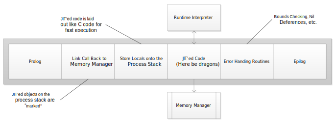

## JIT Compilers
Translates bytecode to executable machine code. 

### Design
JIT compilers favor translation speed vs. code optimization. 

JIT compilers iterate over bytecode instructions managing states using a stack and metadata associated with each translation. Method/function variables are stored in the processor stack eliminating the need for push/pop based operations. Design uses an accumulator model thus reducing the number of registers required for calculations. 

Compilers eliminates redundant move instructions, fold constant expressions and optimizes loops. Target features such as 'cmov' for x86_64 and ARM64 specific instructions are used where appropriate. Machine code is generated for general runtime error checking such as Nil de-references and array bounds checks. 

JIT'ed code can callback to interpreted code as needed.

### Code Layout

### Implementation
C++ using the STL.
