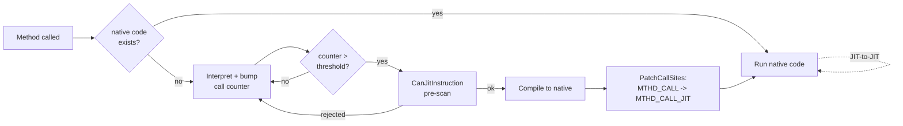
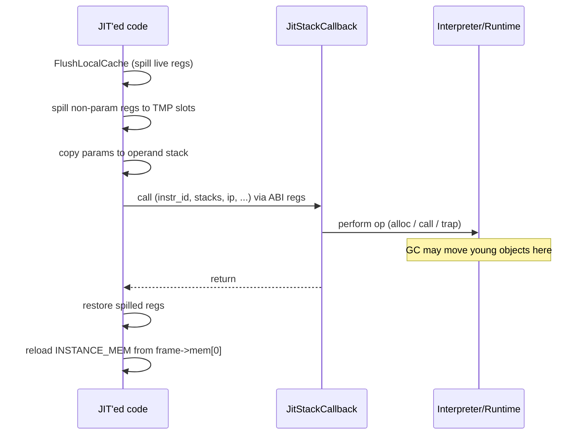
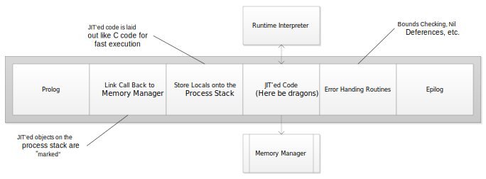

## JIT Compilers
Translates VM bytecode into native machine code at runtime.

### Design
The JIT favors translation *speed* over deep code optimization — the goal is to get hot methods running natively with minimal compile latency, not to rival an ahead-of-time optimizer.

Each compiler iterates over a method's bytecode once, tracking state with a working stack of `RegInstr` values plus per-translation metadata. Method/function locals live directly in **processor stack slots** (addressed off `RBP` on AMD64, `SP` on ARM64), so there are no push/pop sequences for variable access. The design follows an **accumulator model**: intermediate values flow through a small set of registers, which keeps register pressure low and the allocator simple.

Beyond the straight translation, the compiler eliminates redundant moves, folds constant expressions, applies strength reduction (power-of-two `/` and `%` become shifts + bias), and uses target-specific instructions (`cmov` on x86_64, conditional/`csel`-style forms on ARM64). Machine code is emitted inline for runtime safety checks — `Nil` dereferences, array-bounds checks, and divide-by-zero — so the common path never re-enters the interpreter just to validate.

JIT'ed code can call back into interpreted code whenever it hits an operation it doesn't natively handle (see **Callback Bridge** below).

### Two front-ends, one strategy
There are two independent back-ends sharing the common driver in `jit_common.{h,cpp}`:

| | AMD64 (`amd64/jit_amd_lp64.cpp`) | ARM64 (`arm64/jit_arm_a64.cpp`) |
|---|---|---|
| Instruction gating | **whitelist** — `CanJitInstruction()` opts each opcode in | **blacklist** pre-scan — rejects known-unsupported opcodes |
| Local register cache | yes | yes |
| Direct JIT→JIT calls | yes | yes |
| Method inlining | yes | no (all `MTHD_CALL` go through the callback) |
| Division strength reduction | yes | no |
| Loop detection (backward-jump scan) | yes | no |
| `JMP_TABLE` native codegen | yes (RIP-LEA + indirect `JMP`) | yes (`ADR` + `BR`) |

Both back-ends share the safety pre-scans: **frame-dependent-trap rejection** and **operand-kind compile guards** (below).

### Auto-JIT lifecycle
Methods start interpreted. Every call increments a counter; once it crosses `JIT_AUTO_THRESHOLD` (default **10**, see `jit_common.h`) the method is compiled on its next entry. After a successful compile, every `MTHD_CALL` site that targets it is patched to `MTHD_CALL_JIT` (`PatchCallSites()`), so the interpreter's fast path — and other JIT'ed callers — dispatch straight to native code.

```mermaid
flowchart LR
    A[Method called] --> B{native code<br/>exists?}
    B -- yes --> NAT[Run native code]
    B -- no --> C[Interpret + bump<br/>call counter]
    C --> D{counter ><br/>threshold?}
    D -- no --> C
    D -- yes --> E[CanJitInstruction<br/>pre-scan]
    E -- rejected --> C
    E -- ok --> F[Compile to native]
    F --> G[PatchCallSites:<br/>MTHD_CALL -> MTHD_CALL_JIT]
    G --> NAT
    NAT -.JIT-to-JIT.-> NAT
```

**Tunables** (read once in `GetJitAutoThreshold()`):
- `OBJECK_JIT_DISABLE=1` — turn auto-JIT off entirely (threshold → `LONG_MAX`).
- `OBJECK_JIT_THRESHOLD=N` — custom positive call-count threshold. LSP/long-lived hosts set this very high to avoid compiling transient code.

### Key gains
- **Local variable register cache** — values stored to a local are kept live in their register (`local_reg_cache` / `local_xreg_cache`); a later load of the same slot reuses the register instead of reloading from the stack. The cache is flushed at control flow and before any callback (`FlushLocalCache()`), since the callee may mutate memory.
- **Direct JIT→JIT calling** — when a JIT'ed method calls another method that already has native code, it executes it directly via `JitRuntime::Execute()` instead of trampolining through the interpreter. The callee's `StackFrame` is still registered on the call stack so the GC can see it. Negative return status surfaces a diagnosable error (`-1` nil deref, `-2/-3` bounds, `-4` div-by-zero) instead of a silent crash.
- **Method inlining (AMD64)** — small (≤ 20 instr), non-virtual, non-recursive, control-flow-free, trap-free callees are expanded into the caller. `INSTANCE_MEM` is saved/restored around inlined instance methods; the callee's locals are remapped onto reserved caller slots; parameters are read straight off the working stack. See `CanInlineMethod()` / `ProcessInlineMethod()`.
- **`JMP_TABLE` native codegen** — `select` jump tables run entirely in native code (computed indirect branch into a slot table) with no interpreter fallback.

### Safety pre-scans (both architectures)
- **Frame-dependent-trap rejection** (`HasFrameDependentTrap()` in `jit_common.h`) — the callback passes `nullptr` for the interpreter frame and keeps locals in native stack slots, so any trap that reads/writes `frame->mem` (e.g. `SERL_*`, `SYS_TIME`, `GMT_TIME`, `FILE_*_TIME`, `LOAD_CLS_BY_INST`) would dereference null. Methods containing such traps are rejected from compilation and stay interpreted.
- **Operand-kind compile guards** — if operand-stack tracking diverges from the expected kind (e.g. a float reaches an integer compare due to a front-end mismatch), the compile *fails cleanly* and the method falls back to the interpreter rather than emitting bad code.

### Callback Bridge (`ProcessStackCallback` → `JitStackCallback`)
For operations the back-end doesn't emit natively (allocation, non-JIT calls, traps, conversions, threading) the JIT'ed code calls back into the interpreter:

```mermaid
sequenceDiagram
    participant J as JIT'ed code
    participant C as JitStackCallback
    participant I as Interpreter/Runtime
    J->>J: FlushLocalCache (spill live regs)
    J->>J: spill non-param regs to TMP slots
    J->>J: copy params to operand stack
    J->>C: call (instr_id, stacks, ip, ...) via ABI regs
    C->>I: perform op (alloc / call / trap)
    Note over I: GC may move young objects here
    C-->>J: return
    J->>J: restore spilled regs
    J->>J: reload INSTANCE_MEM from frame->mem[0]
```

The reload of `INSTANCE_MEM` after the callback is essential: a callback can trigger GC, which may relocate (promote) young-generation objects, so the cached `self` pointer must be re-read from the frame. The number of params a callback consumes from the working stack is per-opcode — getting it wrong corrupts the stack (e.g. `RAND_FLOAT` consumes 0).

### Code Layout

### Implementation
C++ using the STL. Back-end sources: `amd64/jit_amd_lp64.{h,cpp}`, `arm64/jit_arm_a64.{h,cpp}`; shared driver and tunables in `jit_common.{h,cpp}`. Canonical benchmark numbers live in [`docs/performance.md`](../../../../docs/performance.md).
