# Objeck Language Architecture

> **Comprehensive technical architecture with interactive diagrams**

This document provides detailed architectural views of the Objeck programming language implementation, including the compiler, virtual machine, JIT compilation, and development tools.

---

## Table of Contents

1. [Complete System Overview](#1-complete-system-overview)
2. [Compiler Pipeline](#2-compiler-pipeline)
3. [Virtual Machine Runtime](#3-virtual-machine-runtime)
4. [JIT Compilation Architecture](#4-jit-compilation-architecture)
5. [Library Ecosystem](#5-library-ecosystem)
6. [Development Tools](#6-development-tools)
7. [CI/CD Pipeline](#7-cicd-pipeline)
8. [Memory Management](#8-memory-management)
9. [Platform Abstraction](#9-platform-abstraction)
10. [Runtime Errors](#10-runtime-errors)

---

## 1. Complete System Overview

High-level view of the entire Objeck language system from source code to execution.

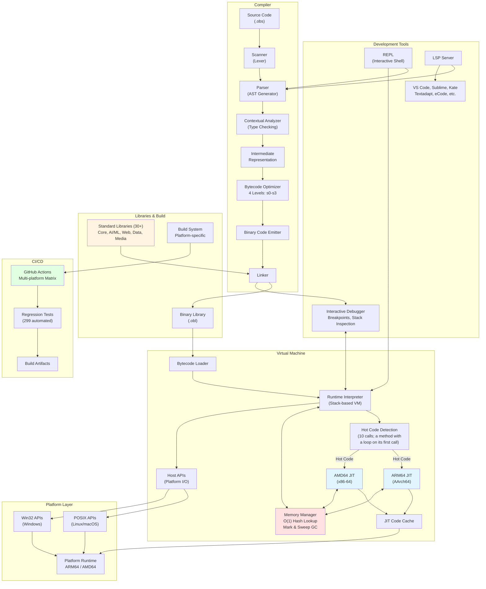
```mermaid
graph TB
    subgraph "Development Tools"
        REPL["REPL<br/>(Interactive Shell)"]
        Debugger["Interactive Debugger<br/>Breakpoints, Stack Inspection"]
        LSP["LSP Server"]
        Editors["VS Code, Sublime, Kate<br/>Textadapt, eCode, etc."]
    end

    subgraph "Compiler"
        Source["Source Code<br/>(.obs)"]
        Scanner["Scanner<br/>(Lexer)"]
        Parser["Parser<br/>(AST Generator)"]
        Analyzer["Contextual Analyzer<br/>(Type Checking)"]
        IR["Intermediate<br/>Representation"]
        Optimizer["Bytecode Optimizer<br/>4 Levels: s0-s3"]
        Emitter["Binary Code Emitter"]
        Linker["Linker"]
    end

    subgraph "Libraries & Build"
        StdLib["Standard Libraries (30+)<br/>Core, AI/ML, Web, Data, Media"]
        BinaryLib["Binary Library<br/>(.obl)"]
        BuildSys["Build System<br/>Platform-specific"]
    end

    subgraph "Virtual Machine"
        Loader["Bytecode Loader"]
        Interpreter["Runtime Interpreter<br/>(Stack-based VM)"]
        HotCode["Hot Code Detection<br/>(10 calls; a method with<br/>a loop on its first call)"]
        JIT_ARM["ARM64 JIT<br/>(AArch64)"]
        JIT_AMD["AMD64 JIT<br/>(x86-64)"]
        CodeCache["JIT Code Cache"]
        MemMgr["Memory Manager<br/>O(1) Hash Lookup<br/>Mark & Sweep GC"]
        HostAPI["Host APIs<br/>(Platform I/O)"]
    end

    subgraph "Platform Layer"
        POSIX["POSIX APIs<br/>(Linux/macOS)"]
        Win32["Win32 APIs<br/>(Windows)"]
        Runtime["Platform Runtime<br/>ARM64 / AMD64"]
    end

    subgraph "CI/CD"
        GHA["GitHub Actions<br/>Multi-platform Matrix"]
        Tests["Regression Tests<br/>(299 automated)"]
        Artifacts["Build Artifacts"]
    end

    %% Connections
    Source --> Scanner --> Parser --> Analyzer --> IR --> Optimizer
    Optimizer --> Emitter --> Linker
    StdLib --> Linker
    Linker --> BinaryLib
    BinaryLib --> Loader

    Loader --> Interpreter
    Interpreter --> HotCode
    HotCode -->|"Hot Code"| JIT_ARM
    HotCode -->|"Hot Code"| JIT_AMD
    JIT_ARM --> CodeCache
    JIT_AMD --> CodeCache
    CodeCache --> Runtime

    Interpreter <--> MemMgr
    JIT_ARM <--> MemMgr
    JIT_AMD <--> MemMgr

    Interpreter --> HostAPI
    HostAPI --> POSIX
    HostAPI --> Win32
    POSIX --> Runtime
    Win32 --> Runtime

    REPL --> Parser
    REPL --> Interpreter
    Debugger <--> Interpreter
    LSP --> Parser
    LSP --> Editors

    BuildSys --> GHA
    GHA --> Tests
    Tests --> Artifacts

    Linker --> Debugger

    style JIT_ARM fill:#e1f5ff
    style JIT_AMD fill:#e1f5ff
    style MemMgr fill:#ffe1e1
    style StdLib fill:#fff4e1
    style GHA fill:#e1ffe1
```

**Key Components:**
- **Compiler:** Multi-pass with 4 optimization levels (s0-s3)
- **VM:** Dual execution (Interpreter + JIT)
- **JIT:** Platform-specific (ARM64 AArch64, AMD64 x86-64)
- **Memory:** Generational GC with O(1) hash lookups
- **Libraries:** 30+ including AI/ML, web servers, graphics
- **CI/CD:** Automated testing across 5 platform legs

---

## 2. Compiler Pipeline

Detailed compilation flow from source to bytecode with optimization stages.

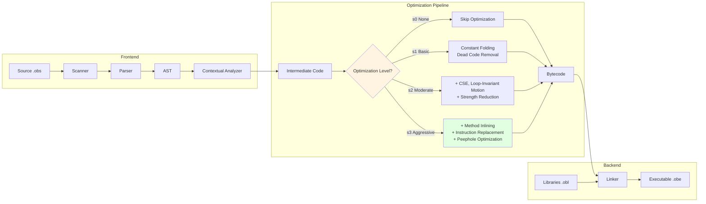
```mermaid
flowchart LR
    subgraph "Frontend"
        A[Source .obs] --> B[Scanner]
        B --> C[Parser]
        C --> D[AST]
        D --> E[Contextual Analyzer]
    end

    subgraph "Optimization Pipeline"
        E --> F[Intermediate Code]
        F --> G{Optimization Level?}

        G -->|s0 None| H[Skip Optimization]
        G -->|s1 Basic| I[Constant Folding<br/>Dead Code Removal]
        G -->|s2 Moderate| J[+ CSE, Loop-Invariant Motion<br/>+ Strength Reduction]
        G -->|s3 Aggressive| K[+ Method Inlining<br/>+ Instruction Replacement<br/>+ Peephole Optimization]

        H --> L[Bytecode]
        I --> L
        J --> L
        K --> L
    end

    subgraph "Backend"
        L --> M[Linker]
        N[Libraries .obl] --> M
        M --> O[Executable .obe]
    end

    style G fill:#fff4e1
    style K fill:#e1ffe1
```

### Optimization Levels

| Level | Name | Optimizations | Use Case |
|-------|------|---------------|----------|
| **s0** | None | No optimization | Fast compilation, debugging |
| **s1** | Basic | Constant folding, dead code elimination | Development builds |
| **s2** | Moderate | + Common-subexpression elimination, loop-invariant code motion, strength reduction | Testing |
| **s3** | Aggressive | + Method inlining (not in libraries), instruction replacement, peephole optimization | **Production (default)** |

### Optimization Passes (s3)

In the order `ItermediateOptimizer` runs them on each method, once each; the method inliner
runs last, after every method of the class has been through the rest.

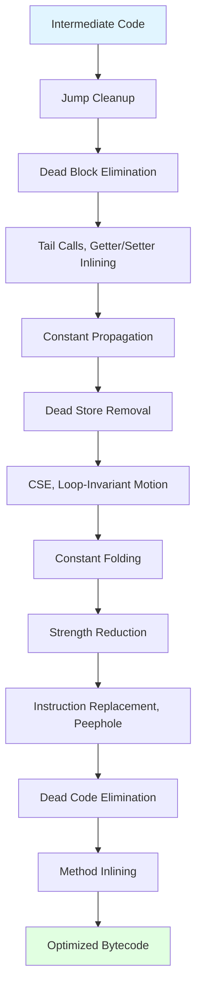
```mermaid
graph TD
    A[Intermediate Code] --> B[Jump Cleanup]
    B --> C[Dead Block Elimination]
    C --> D[Tail Calls, Getter/Setter Inlining]
    D --> E[Constant Propagation]
    E --> F[Dead Store Removal]
    F --> G[CSE, Loop-Invariant Motion]
    G --> H[Constant Folding]
    H --> I[Strength Reduction]
    I --> J[Instruction Replacement, Peephole]
    J --> K[Dead Code Elimination]
    K --> L[Method Inlining]
    L --> M[Optimized Bytecode]

    style A fill:#e1f5ff
    style M fill:#e1ffe1
```

**Performance Impact:**
- s0 → s3: ~30-40% faster execution
- s0 → s3: ~10-15% smaller bytecode
- Compilation time: s0 = 1x, s3 = 1.5x

**Source Files:**
- `core/compiler/optimization.h/cpp` - Optimization engine
- `core/compiler/intermediate.h/cpp` - IR generation
- `core/compiler/emit.h/cpp` - Bytecode emission

---

## 3. Virtual Machine Runtime

Execution model with interpreter and JIT compilation.

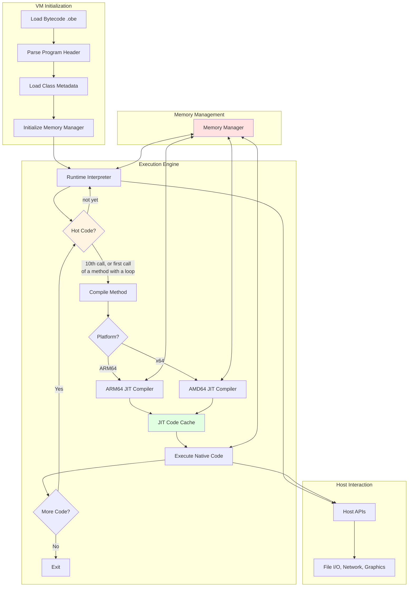
```mermaid
flowchart TB
    subgraph "VM Initialization"
        A[Load Bytecode .obe] --> B[Parse Program Header]
        B --> C[Load Class Metadata]
        C --> D[Initialize Memory Manager]
    end

    subgraph "Execution Engine"
        D --> E[Runtime Interpreter]
        E --> F{Hot Code?}

        F -->|"not yet"| E
        F -->|"10th call, or first call<br/>of a method with a loop"| G[Compile Method]

        G --> H{Platform?}
        H -->|ARM64| I[ARM64 JIT Compiler]
        H -->|x64| J[AMD64 JIT Compiler]

        I --> K[JIT Code Cache]
        J --> K

        K --> L[Execute Native Code]
        L --> M{More Code?}
        M -->|Yes| F
        M -->|No| N[Exit]
    end

    subgraph "Memory Management"
        O[Memory Manager]
        O <--> E
        O <--> I
        O <--> J
        O <--> L
    end

    subgraph "Host Interaction"
        P[Host APIs]
        E --> P
        L --> P
        P --> Q[File I/O, Network, Graphics]
    end

    style F fill:#fff4e1
    style K fill:#e1ffe1
    style O fill:#ffe1e1
```

### Execution Modes

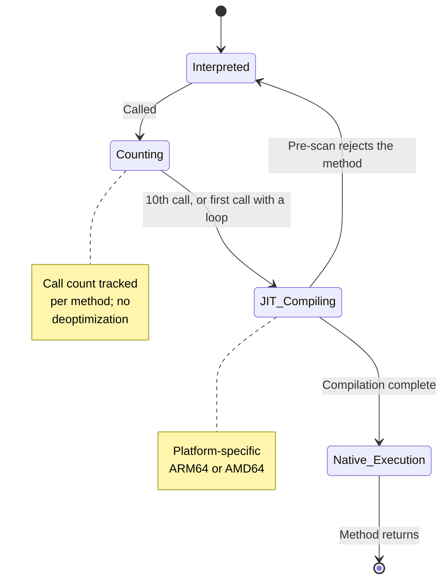
```mermaid
stateDiagram-v2
    [*] --> Interpreted
    Interpreted --> Counting: Called
    Counting --> JIT_Compiling: 10th call, or first call with a loop
    JIT_Compiling --> Interpreted: Pre-scan rejects the method
    JIT_Compiling --> Native_Execution: Compilation complete
    Native_Execution --> [*]: Method returns

    note right of Counting
        Call count tracked
        per method; no
        deoptimization
    end note

    note right of JIT_Compiling
        Platform-specific
        ARM64 or AMD64
    end note
```

### Memory Layout

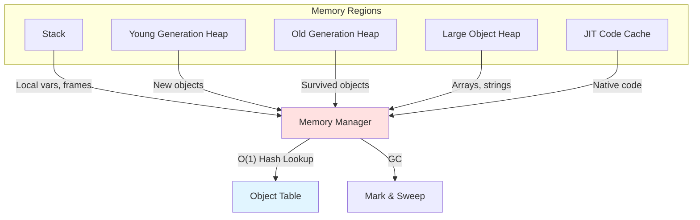
```mermaid
graph TB
    subgraph "Memory Regions"
        A[Stack]
        B[Young Generation Heap]
        C[Old Generation Heap]
        D[Large Object Heap]
        E[JIT Code Cache]
    end

    A -->|Local vars, frames| F[Memory Manager]
    B -->|New objects| F
    C -->|Survived objects| F
    D -->|Arrays, strings| F
    E -->|Native code| F

    F -->|"O(1) Hash Lookup"| G[Object Table]
    F -->|GC| H[Mark & Sweep]

    style F fill:#ffe1e1
    style G fill:#e1f5ff
```

**Key Features:**
- **Tiered Execution:** Interpreter → call counting → JIT
- **Hot Code Detection:** Automatic at 10 calls (default; configurable via `--jit=<calls>` or `OBJECK_JIT_THRESHOLD`). A method with a loop is compiled on its first call instead, which is how `Main` gets compiled, and a thread's `Run` with a loop on entry; see `docs/JIT_ENTRY_COMPILE_DESIGN.md`
- **Platform-Specific JIT:** Separate compilers for ARM64/x64
- **Efficient Memory:** O(1) object lookups, generational GC

**Source Files:**
- `core/vm/interpreter.h/cpp` - Bytecode interpreter
- `core/vm/arch/jit/jit_common.h/cpp` - JIT infrastructure
- `core/vm/arch/memory.h/cpp` - Memory management

---

## 4. JIT Compilation Architecture

Platform-specific native code generation for ARM64 and AMD64.

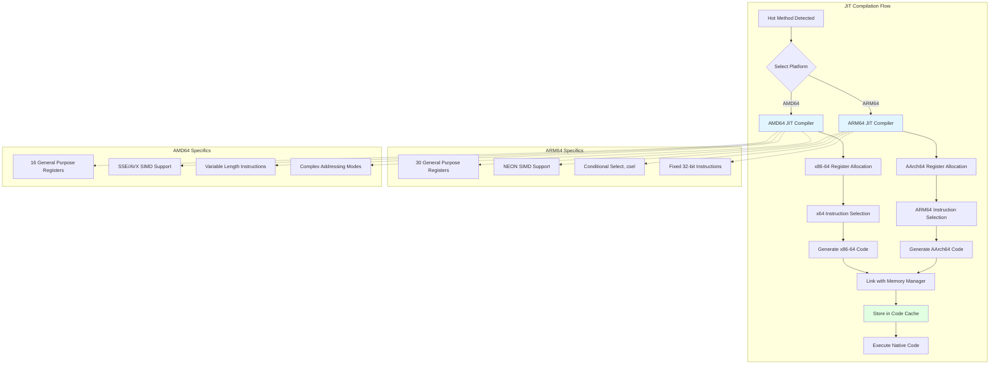
```mermaid
graph TB
    subgraph "JIT Compilation Flow"
        A[Hot Method Detected] --> B{Select Platform}

        B -->|ARM64| C1[ARM64 JIT Compiler]
        B -->|AMD64| C2[AMD64 JIT Compiler]

        C1 --> D1[AArch64 Register Allocation]
        C2 --> D2[x86-64 Register Allocation]

        D1 --> E1[ARM64 Instruction Selection]
        D2 --> E2[x64 Instruction Selection]

        E1 --> F1[Generate AArch64 Code]
        E2 --> F2[Generate x86-64 Code]

        F1 --> G[Link with Memory Manager]
        F2 --> G

        G --> H[Store in Code Cache]
        H --> I[Execute Native Code]
    end

    subgraph "ARM64 Specifics"
        J1[30 General Purpose Registers]
        J2[NEON SIMD Support]
        J3[Conditional Select, csel]
        J4[Fixed 32-bit Instructions]
    end

    subgraph "AMD64 Specifics"
        K1[16 General Purpose Registers]
        K2[SSE/AVX SIMD Support]
        K3[Variable Length Instructions]
        K4[Complex Addressing Modes]
    end

    C1 -.-> J1 & J2 & J3 & J4
    C2 -.-> K1 & K2 & K3 & K4

    style C1 fill:#e1f5ff
    style C2 fill:#e1f5ff
    style H fill:#e1ffe1
```

**Calls between compiled methods.** Since v2026.9.1 a compiled caller enters a
compiled callee's *native entry* directly — arguments in the caller's outgoing
area, the frame record built in the callee's own frame, the result in `XMM0`
(`D0` on ARM64) — with an inline cache at `virtual` and func-ref sites. The C++
callback bridge remains the slow path (a callee not yet compiled, a full call
stack, a `Nil` receiver, a megamorphic site) and the only path for allocation,
traps and conversions. A bound call costs 5.5 ns rather than 26.5 ns as a result.
The call path is drawn in `core/vm/arch/jit/README.md`; the design and its
measurements are in `docs/JIT_CALLING_CONVENTION_DESIGN.md`.


### JIT Frame Structure

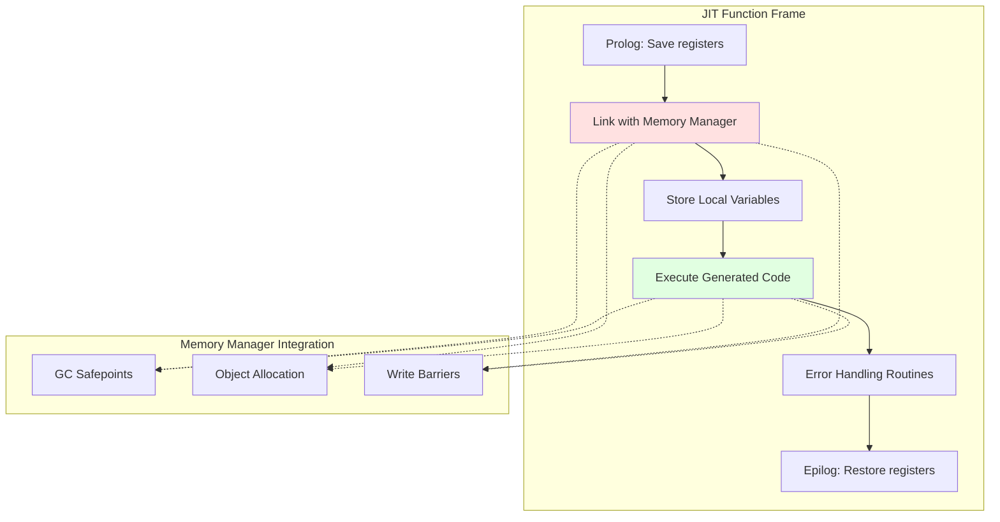
```mermaid
graph TD
    subgraph "JIT Function Frame"
        A[Prolog: Save registers]
        B[Link with Memory Manager]
        C[Store Local Variables]
        D[Execute Generated Code]
        E[Error Handling Routines]
        F[Epilog: Restore registers]

        A --> B --> C --> D --> E --> F
    end

    subgraph "Memory Manager Integration"
        G[GC Safepoints]
        H[Object Allocation]
        I[Write Barriers]
    end

    B -.-> G & H & I
    D -.-> G & H & I

    style B fill:#ffe1e1
    style D fill:#e1ffe1
```

### Register Allocation Strategy

The registers each backend's allocator hands out; neither spills, so an expression that needs
more falls back to the interpreter whole.

| Platform | General Purpose | Float/Vector | Reserved |
|----------|----------------|--------------|----------|
| **ARM64** | x0-x7, x12-x15 (12 regs) | d0-d15 (16 regs) | x9-x11 (scratch), x19 (safepoint flag's address), x29 (FP), x30 (LR) |
| **AMD64** | rax, rbx, rcx, rdx, r8-r11 (8 regs; Windows adds rsi, rdi) | xmm10-xmm15 (6 regs) | r12 (safepoint flag's address), r13-r15 (pinned loop locals), rsp (SP), rbp (BP) |

### Recent ARM64 Optimizations (v2026.2.1)

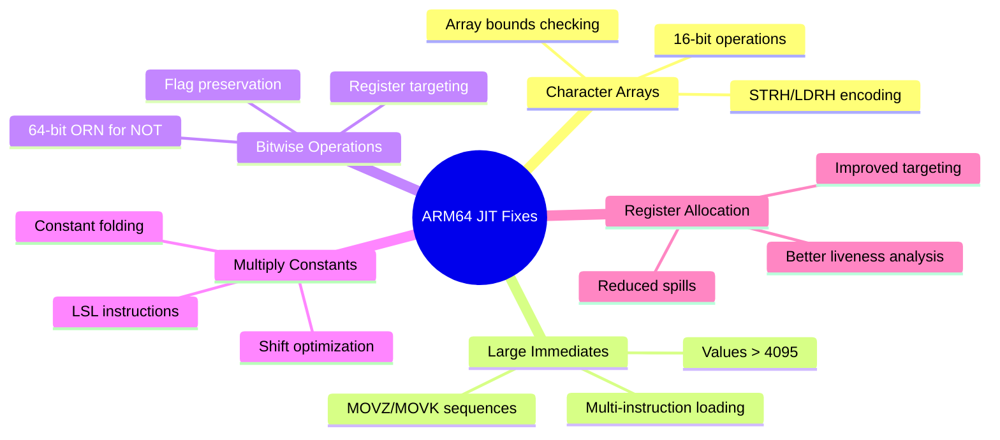
```mermaid
mindmap
    root((ARM64 JIT Fixes))
        Character Arrays
            STRH/LDRH encoding
            16-bit operations
            Array bounds checking
        Large Immediates
            Values > 4095
            Multi-instruction loading
            MOVZ/MOVK sequences
        Bitwise Operations
            64-bit ORN for NOT
            Register targeting
            Flag preservation
        Multiply Constants
            Constant folding
            Shift optimization
            LSL instructions
        Register Allocation
            Improved targeting
            Reduced spills
            Better liveness analysis
```

**Performance Improvements:**
- Character array operations: **3x faster**
- Large immediate handling: **2x faster**
- Overall ARM64 performance: **25-30% improvement**

**Source Files:**
- `core/vm/arch/jit/arm64/jit_arm_a64.h/cpp` - ARM64 JIT
- `core/vm/arch/jit/amd64/jit_amd_lp64.h/cpp` - AMD64 JIT
- `core/vm/arch/jit/jit_common.h/cpp` - Shared JIT infrastructure

---

## 5. Library Ecosystem

30+ standard libraries providing comprehensive functionality.

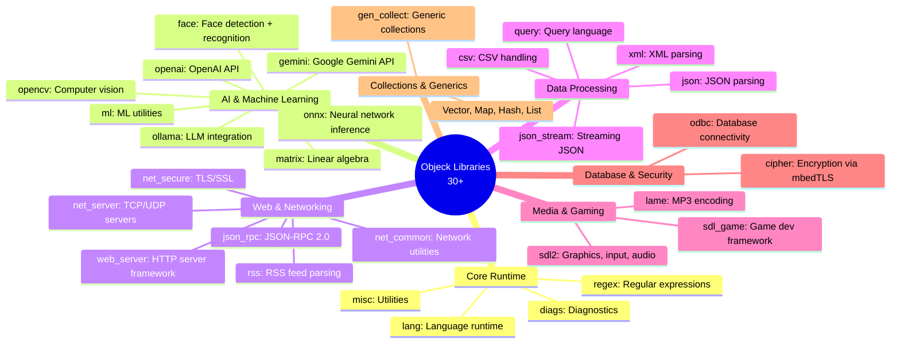
```mermaid
mindmap
    root((Objeck Libraries
    30+))
        Core Runtime
            lang: Language runtime
            misc: Utilities
            regex: Regular expressions
            diags: Diagnostics
        AI & Machine Learning
            onnx: Neural network inference
            ollama: LLM integration
            openai: OpenAI API
            gemini: Google Gemini API
            ml: ML utilities
            opencv: Computer vision
            face: Face detection + recognition
            matrix: Linear algebra
        Web & Networking
            web_server: HTTP server framework
            json_rpc: JSON-RPC 2.0
            net_server: TCP/UDP servers
            net_secure: TLS/SSL
            net_common: Network utilities
            rss: RSS feed parsing
        Data Processing
            json: JSON parsing
            xml: XML parsing
            csv: CSV handling
            query: Query language
            json_stream: Streaming JSON
        Media & Gaming
            sdl2: Graphics, input, audio
            sdl_game: Game dev framework
            lame: MP3 encoding
        Database & Security
            odbc: Database connectivity
            cipher: Encryption via mbedTLS
        Collections & Generics
            gen_collect: Generic collections
            Vector, Map, Hash, List
```

### Library Dependencies

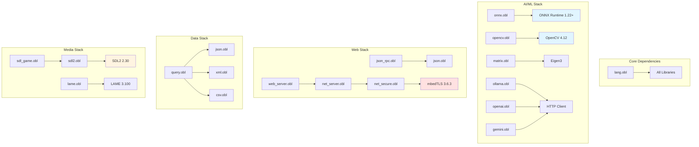
```mermaid
graph TB
    subgraph "Core Dependencies"
        A[lang.obl] --> B[All Libraries]
    end

    subgraph "AI/ML Stack"
        C[onnx.obl] --> D[ONNX Runtime 1.22+]
        E[opencv.obl] --> F[OpenCV 4.12]
        G[matrix.obl] --> H[Eigen3]
        I[ollama.obl] --> J[HTTP Client]
        K[openai.obl] --> J
        L[gemini.obl] --> J
    end

    subgraph "Web Stack"
        M[web_server.obl] --> N[net_server.obl]
        O[json_rpc.obl] --> P[json.obl]
        N --> Q[net_secure.obl]
        Q --> R[mbedTLS 3.6.3]
    end

    subgraph "Data Stack"
        S[json.obl]
        T[xml.obl]
        U[csv.obl]
        V[query.obl] --> S & T & U
    end

    subgraph "Media Stack"
        W[sdl2.obl] --> X[SDL2 2.30]
        Y[sdl_game.obl] --> W
        Z[lame.obl] --> AA[LAME 3.100]
    end

    style D fill:#e1f5ff
    style F fill:#e1f5ff
    style R fill:#ffe1e1
    style X fill:#fff4e1
```

### External Dependencies

| Category | Library | Version | Purpose |
|----------|---------|---------|---------|
| **Crypto** | mbedTLS | 3.6.3 | TLS, hashing, encryption |
| **ML/AI** | ONNX Runtime | 1.22+ | Neural network inference |
| **Vision** | OpenCV | 4.12+ | Computer vision, image processing |
| **Math** | Eigen3 | 3.4+ | Linear algebra, matrices |
| **Graphics** | SDL2 | 2.30+ | Cross-platform graphics/input |
| **Audio** | LAME | 3.100+ | MP3 encoding |
| **Database** | ODBC | System | Database connectivity |

### Modern Web Server Example

```objeck
use Web;

class SimpleServer {
  function : Main(args : String[]) ~ Nil {
    # Create HTTP server on port 8080
    server := HttpServer->New(8080);

    # Register JSON-RPC endpoint
    server->AddEndpoint("/api", JsonRpcHandler->New());

    # Start server
    server->Start();
  }
}
```

### Face Recognition Example

```objeck
use API.OpenCV, API.Onnx;

class FaceDemo {
  function : Main(args : String[]) ~ Nil {
    session := FaceSession->New("det_10g.onnx", "w600k_r50.onnx");

    img1 := Image->Load("person_a.jpg")->Convert(Image->Format->JPEG);
    img2 := Image->Load("person_b.jpg")->Convert(Image->Format->JPEG);

    r1 := session->Recognize(img1, 0.5);
    r2 := session->Recognize(img2, 0.5);

    faces1 := r1->GetResults();
    faces2 := r2->GetResults();
    sim := FaceSession->Compare(faces1[0]->GetEmbedding(), faces2[0]->GetEmbedding());
    "Similarity: {$sim}"->PrintLine();   # >0.35 = same person
    session->Close();
  }
}
```

Uses SCRFD 10G-KPS detector + ArcFace R50 recognizer from InsightFace buffalo_l. Runs on DirectML (Windows), CPU/CUDA (Linux), CoreML (macOS).

**Source Files:**
- `core/compiler/lib_src/*.obs` - Library source code (43 files)
- `core/release/deploy/lib/*.obl` - Compiled libraries

---

## 6. Development Tools

Interactive development environment with REPL, debugger, and LSP support.

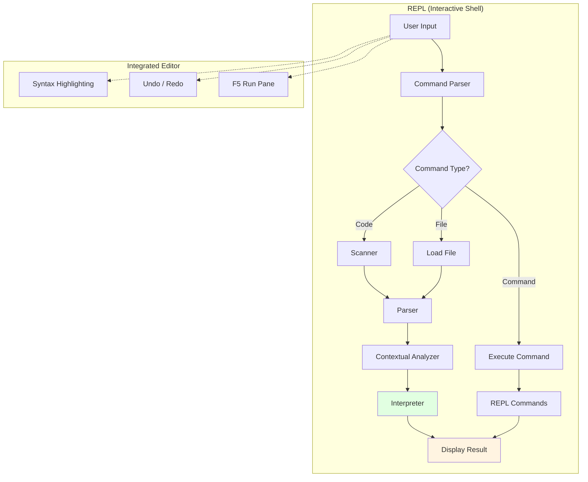
```mermaid
graph TB
    subgraph "REPL (Interactive Shell)"
        A[User Input] --> B[Command Parser]
        B --> C{Command Type?}

        C -->|Code| D[Scanner]
        C -->|File| E[Load File]
        C -->|Command| F[Execute Command]

        D --> G[Parser]
        E --> G
        G --> H[Contextual Analyzer]
        H --> I[Interpreter]
        I --> J[Display Result]

        F --> K[REPL Commands]
        K --> J
    end

    subgraph "Integrated Editor"
        L[Syntax Highlighting]
        M[Undo / Redo]
        N[F5 Run Pane]
    end

    A -.-> L & M & N

    style I fill:#e1ffe1
    style J fill:#fff4e1
```

### Debugger Architecture

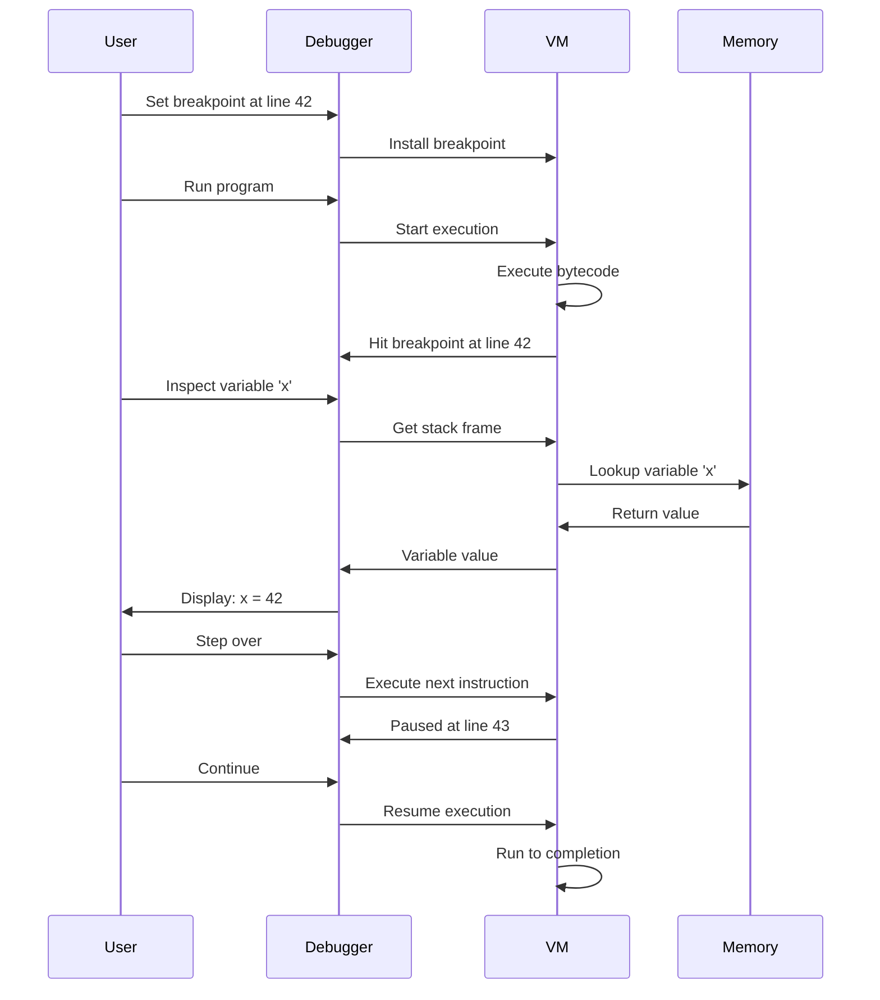
```mermaid
sequenceDiagram
    participant User
    participant Debugger
    participant VM
    participant Memory

    User->>Debugger: Set breakpoint at line 42
    Debugger->>VM: Install breakpoint

    User->>Debugger: Run program
    Debugger->>VM: Start execution

    VM->>VM: Execute bytecode
    VM->>Debugger: Hit breakpoint at line 42

    User->>Debugger: Inspect variable 'x'
    Debugger->>VM: Get stack frame
    VM->>Memory: Lookup variable 'x'
    Memory->>VM: Return value
    VM->>Debugger: Variable value
    Debugger->>User: Display: x = 42

    User->>Debugger: Step over
    Debugger->>VM: Execute next instruction
    VM->>Debugger: Paused at line 43

    User->>Debugger: Continue
    Debugger->>VM: Resume execution
    VM->>VM: Run to completion
```

### LSP Server Integration

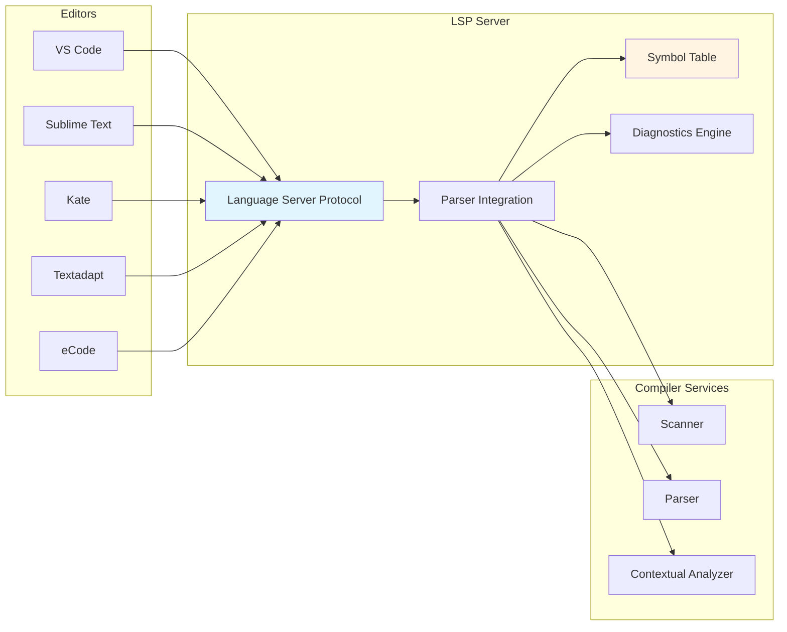
```mermaid
graph LR
    subgraph "Editors"
        A1[VS Code]
        A2[Sublime Text]
        A3[Kate]
        A4[Textadapt]
        A5[eCode]
    end

    subgraph "LSP Server"
        B[Language Server Protocol]
        C[Parser Integration]
        D[Symbol Table]
        E[Diagnostics Engine]
    end

    subgraph "Compiler Services"
        F[Scanner]
        G[Parser]
        H[Contextual Analyzer]
    end

    A1 & A2 & A3 & A4 & A5 --> B
    B --> C --> F & G & H
    C --> D
    C --> E

    style B fill:#e1f5ff
    style D fill:#fff4e1
```

### REPL Features

- **Interactive Evaluation:** Execute code line-by-line
- **Syntax Highlighting:** In the full-screen editor (`/e`); the line prompt colors only its prompt, status and errors
- **No history or completion yet:** the line prompt is plain line entry
- **File Loading:** Execute entire files
- **Inline/File Modes:** Switch between modes

### Full-Screen Editor (`/e`)

A terminal editor over the REPL buffer, header-only (`core/repl/{term,screen,keymap,tui_editor,highlight,child_run}.h`) so it adds no build-system changes on any platform. Raw-mode input and damage-diffed rendering work identically on Windows (VT console) and POSIX (termios), with display-width handling for CJK/wide characters.

- **Editing:** movement, selection (Shift+arrows), undo/redo with coalesced typing, an internal clipboard (Ctrl+C/X/V)
- **Run pane (F5):** compiles the buffer with `obc` and runs it with `obr` as child processes, started from an argument vector with no shell, and streams their merged output into a pane; **Esc** cancels a run, **F8** jumps the cursor through compile errors. The in-process VM cannot run off the main thread, which is why the run is a child
- **Binding profiles:** a notepad-style default and an opt-in `vi` profile (F2) — a second binding table plus a mode field over the same actions, not a second editor
- **Read-only shell:** the REPL's class/function frame is dimmed and protected at both the view and model level

### Software Updater (`obu`)

`core/utils/updater/obu.cpp` — in-place version upgrades without reinstalling. `obu check` compares the installed version against GitHub releases; `obu update`/`rollback` download the platform archive, **verify a SHA-256 digest against the release's `SHA256SUMS` before touching disk**, then perform an all-or-nothing staged swap with an `obc -v` post-install check and automatic rollback. No shell is used anywhere — curl/tar/obc run via argument vectors (`fork`/`execvp` on POSIX, `CreateProcess` on Windows), including the release-JSON fetch behind `obu check`. The flow is covered by an offline CI test (`test_update.py`) that runs on both Linux and Windows: `check` is exercised on every platform against fake releases, and the update/rollback swap plus a command-injection PoC wherever the swap is implemented. The Windows swap needs no re-exec dance: Windows forbids deleting a running image but allows renaming one, so the running `obu.exe` moves into `.previous` and keeps executing. Still outstanding (`docs/UPDATER_DESIGN.md`): signature verification, reconciling an MSI-managed install's registry entries, and elevation against a real `Program Files` tree.

### Debugger Features

- **Breakpoints:** Set/remove at any line
- **Step Execution:** Step over, step into, step out
- **Stack Inspection:** View call stack at any depth
- **Variable Viewing:** Inspect locals and instance variables
- **Expression Evaluation:** Evaluate expressions in context
- **Memory Inspection:** View heap objects

**Source Files:**
- `core/repl/repl.h/cpp` - REPL implementation
- `core/repl/editor.h/cpp` - Integrated line editor
- `core/repl/{term,screen,keymap,tui_editor,highlight,child_run}.h` - full-screen editor
- `core/debugger/debugger.h/cpp` - Debugger core
- `core/debugger/obj_layout.h` - shared object/collection layout (CLI + DAP)
- `core/debugger/parser.h/cpp` - Debug command parser
- `core/utils/updater/obu.cpp` - software updater

---

## 7. CI/CD Pipeline

Automated multi-platform testing and build system.

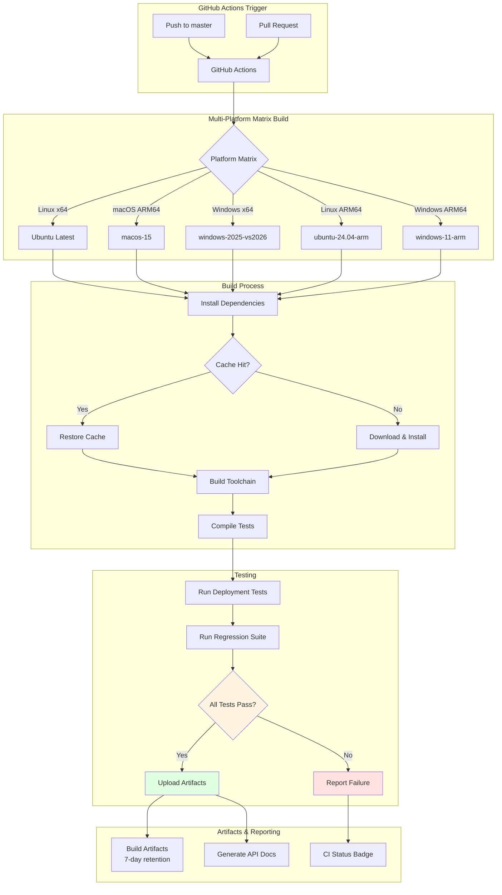
```mermaid
graph TB
    subgraph "GitHub Actions Trigger"
        A[Push to master] --> B[GitHub Actions]
        C[Pull Request] --> B
    end

    subgraph "Multi-Platform Matrix Build"
        B --> D{Platform Matrix}

        D -->|Linux x64| E1[Ubuntu Latest]
        D -->|Linux ARM64| E4[ubuntu-24.04-arm]
        D -->|macOS ARM64| E2[macos-15]
        D -->|Windows x64| E3[windows-2025-vs2026]
        D -->|Windows ARM64| E5[windows-11-arm]
    end

    subgraph "Build Process"
        E1 & E2 & E3 & E4 & E5 --> F[Install Dependencies]

        F --> G{Cache Hit?}
        G -->|Yes| H[Restore Cache]
        G -->|No| I[Download & Install]

        H & I --> J[Build Toolchain]
        J --> K[Compile Tests]
    end

    subgraph "Testing"
        K --> L[Run Deployment Tests]
        L --> M[Run Regression Suite]
        M --> N{All Tests Pass?}

        N -->|Yes| O[Upload Artifacts]
        N -->|No| P[Report Failure]
    end

    subgraph "Artifacts & Reporting"
        O --> Q[Build Artifacts<br/>7-day retention]
        O --> R[Generate API Docs]
        P --> S[CI Status Badge]
    end

    style N fill:#fff4e1
    style O fill:#e1ffe1
    style P fill:#ffe1e1
```

### Platform Matrix

| Platform | Runner | Architecture | Compiler | Tests |
|----------|--------|--------------|----------|-------|
| **Linux** | `ubuntu-latest` | x64 | GCC | 299 regression |
| **Linux** | `ubuntu-24.04-arm` | ARM64 | GCC | 299 regression |
| **macOS** | `macos-15` | ARM64 (Apple silicon) | Clang | 299 regression |
| **Windows** | `windows-2025-vs2026` | x64 | MSVC (v145) | 299 regression |
| **Windows** | `windows-11-arm` | ARM64 | MSVC (v143) | 299 regression |

Every leg builds natively and runs what it builds: the regression suite twice, at the default
JIT threshold and with every method compiled on its first call (`OBJECK_JIT_THRESHOLD=1`), then
the debugger, DAP and VM-flag tests. The Windows ARM64 leg used to be **cross-compiled on an x64
host, which cannot execute what it builds**, so its tests were skipped. That blind spot is how
an ARM64-only miscompile reached six releases before anyone noticed. The release build still
cross-compiles Windows ARM64 on the x64 image; CI's native leg is what tests it.

### Caching Strategy

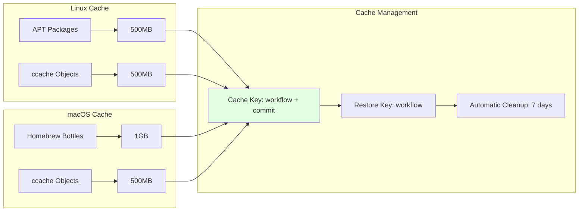
```mermaid
graph LR
    subgraph "Linux Cache"
        A1[APT Packages] --> B1[500MB]
        A2[ccache Objects] --> B2[500MB]
    end

    subgraph "macOS Cache"
        C1[Homebrew Bottles] --> D1[1GB]
        C2[ccache Objects] --> D2[500MB]
    end

    subgraph "Cache Management"
        E[Cache Key: workflow + commit]
        F[Restore Key: workflow]
        G[Automatic Cleanup: 7 days]
    end

    B1 & B2 & D1 & D2 --> E
    E --> F --> G

    style E fill:#e1ffe1
```

### Regression Test Suite

299 tests under `programs/regression/`, grouped by the prefix on each filename.
Counts are the file count per prefix, not a sample.

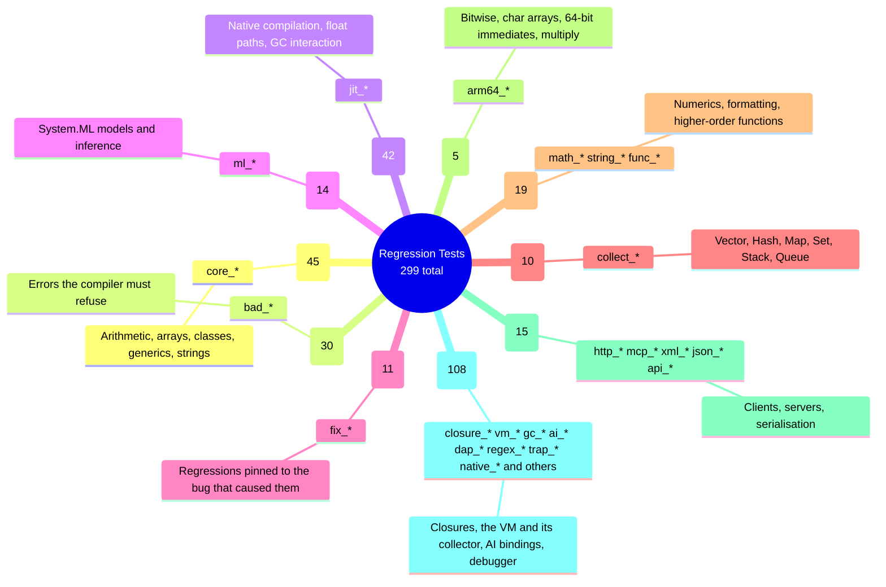
```mermaid
mindmap
    root((Regression Tests
    299 total))
        Language core (45)
            core_*
                Arithmetic, arrays, classes, generics, strings
        Rejected programs (30)
            bad_*
                Errors the compiler must refuse
        JIT (42)
            jit_*
                Native compilation, float paths, GC interaction
        Machine learning (14)
            ml_*
                System.ML models and inference
        Fixed defects (11)
            fix_*
                Regressions pinned to the bug that caused them
        Collections (10)
            collect_*
                Vector, Hash, Map, Set, Stack, Queue
        Math and strings (19)
            math_* string_* func_*
                Numerics, formatting, higher-order functions
        ARM64 specific (5)
            arm64_*
                Bitwise, char arrays, 64-bit immediates, multiply
        Networking and web (15)
            http_* mcp_* xml_* json_* api_*
                Clients, servers, serialisation
        Remainder (108)
            closure_* vm_* gc_* ai_* dap_* regex_* trap_* native_* and others
                Closures, the VM and its collector, AI bindings, debugger
```

---

## 8. Memory Management

### Multithreaded Collection (Cooperative Stop-the-World)

With multiple threads running, a collection cannot begin until every other
thread has reached a known-safe point. Objeck uses a **cooperative**
stop-the-world scheme rather than OS thread suspension:

- **Safepoints.** Each mutator polls a safepoint in the interpreter dispatch
  loop and again on each allocation. When a collection is requested, threads
  observe the request at their next safepoint and **park** until it completes.
  The AMD64 and ARM64 JITs emit the same safepoint poll at every label so
  JIT-compiled code parks just as promptly as interpreted code.
- **Blocking calls.** A thread about to block in a syscall (thread `Join`/sleep,
  socket I/O) brackets the call with *begin/end-blocking* markers so it counts as
  already parked — a collection never waits on a thread stuck in a blocking read.
- **Root scanning.** Once all threads are parked, the collector marks from every
  thread's roots: static fields, each thread's full call stack **including the
  currently-executing top-level frame**, and each thread's operand stack. The set
  of roots scanned by the mark phase is exactly the set the fixup phase rewrites,
  so a live object can never be reclaimed while a reference to it survives in a
  parked thread's frame or operand stack.

The collector remains generational and non-OS-suspending; correctness comes from
complete root coverage at the safepoint, not from freezing threads mid-instruction.

### Hash-Based O(1) Lookup

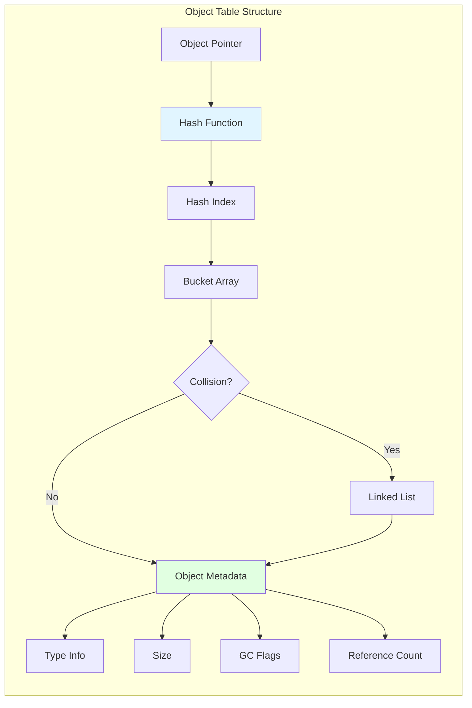
```mermaid
graph LR
    subgraph "Object Table Structure"
        A[Object Pointer] --> B[Hash Function]
        B --> C[Hash Index]
        C --> D[Bucket Array]
        D --> E{Collision?}

        E -->|No| F[Object Metadata]
        E -->|Yes| G[Linked List]
        G --> F

        F --> H[Type Info]
        F --> I[Size]
        F --> J[GC Flags]
        F --> K[Reference Count]
    end

    style B fill:#e1f5ff
    style F fill:#e1ffe1
```

### GC Algorithm Flow

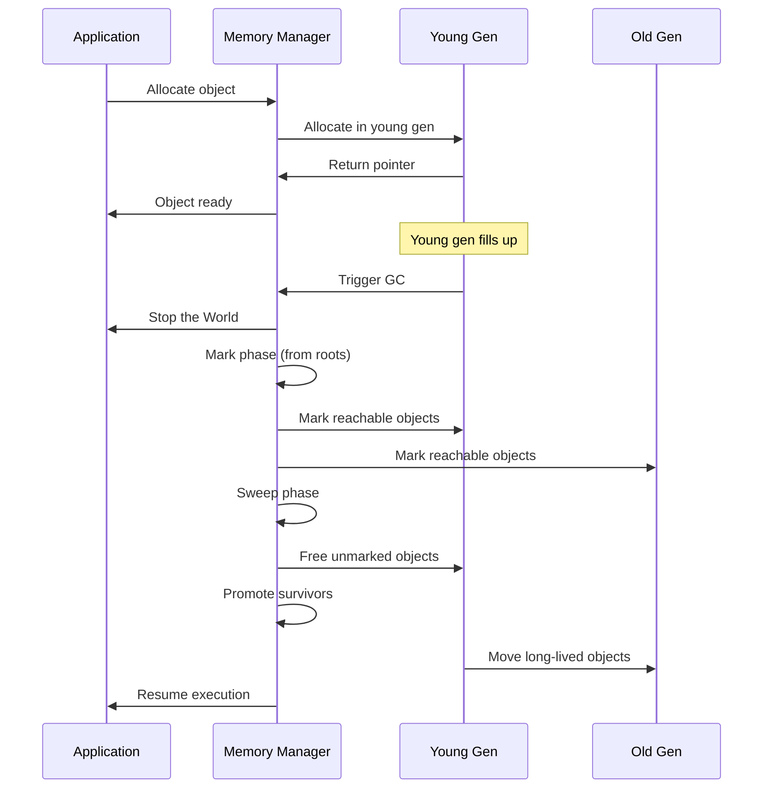
```mermaid
sequenceDiagram
    participant App as Application
    participant MM as Memory Manager
    participant YG as Young Gen
    participant OG as Old Gen

    App->>MM: Allocate object
    MM->>YG: Allocate in young gen
    YG->>MM: Return pointer
    MM->>App: Object ready

    Note over YG: Young gen fills up

    YG->>MM: Trigger GC
    MM->>App: Stop the World

    MM->>MM: Mark phase (from roots)
    MM->>YG: Mark reachable objects
    MM->>OG: Mark reachable objects

    MM->>MM: Sweep phase
    MM->>YG: Free unmarked objects

    MM->>MM: Promote survivors
    YG->>OG: Move long-lived objects

    MM->>App: Resume execution
```

### Memory Manager Improvements (v2026.2.1)

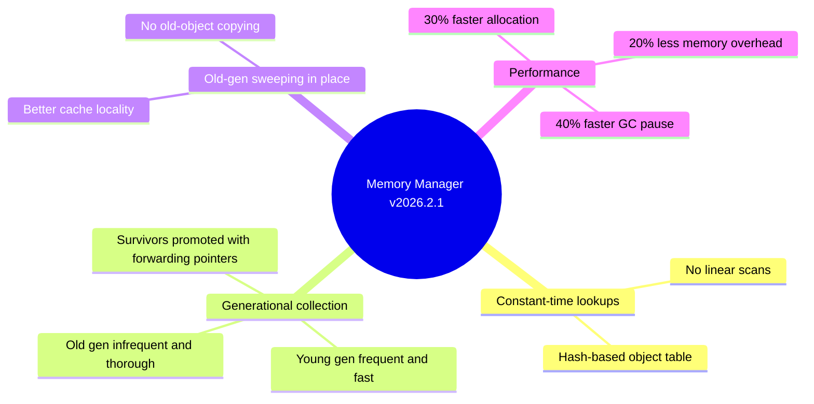
```mermaid
mindmap
    root((Memory Manager v2026.2.1))
        Constant-time lookups
            Hash-based object table
            No linear scans
        Generational collection
            Young gen frequent and fast
            Old gen infrequent and thorough
            Survivors promoted with forwarding pointers
        Old-gen sweeping in place
            No old-object copying
            Better cache locality
        Performance
            30% faster allocation
            40% faster GC pause
            20% less memory overhead
```

### Memory Layout Example

```
|-------|---------------|---------------|-----------|-----------|
| Stack | Young Gen     | Old Gen       | LOH       | JIT Cache |
|-------|---------------|---------------|-----------|-----------|
| 1MB   | 16MB          | 64MB          | 128MB     | 32MB      |
|-------|---------------|---------------|-----------|-----------|
  Grows    Minor GC       Major GC       No GC       Code only
  down     frequent       occasional     direct      eviction
```

**Key Characteristics:**
- **O(1) Object Lookup:** Hash-based, no linear scans
- **Generational:** Separate young/old generations
- **Mark & Sweep:** Young generation moves survivors (promote-and-forward with pointer fixup); old generation is swept in place
- **Large Objects:** Separate heap for > 85KB objects
- **Stop-the-World:** Brief pauses for GC
- **Promotion:** Long-lived objects moved to old gen

**Source Files:**
- `core/vm/arch/memory.h/cpp` - Memory manager core
- `core/vm/arch/mem_gc.cpp` - Garbage collection
- `core/vm/arch/mem_alloc.cpp` - Object allocation

---

## 9. Platform Abstraction

Cross-platform system call abstraction for POSIX and Win32.

```mermaid
graph TB
    subgraph "Application Layer"
        A[Objeck Program]
    end

    subgraph "VM & Libraries"
        B[Runtime Interpreter]
        C[JIT Compiled Code]
        D[Standard Libraries]
    end

    subgraph "Host API Layer"
        E[Host APIs<br/>Platform Abstraction]
    end

    subgraph "Platform Implementations"
        F1[POSIX APIs]
        F2[Win32 APIs]

        G1[File I/O]
        G2[Networking]
        G3[Threading]
        G4[Dynamic Loading]
        G5[System Calls]

        F1 --> G1 & G2 & G3 & G4 & G5
        F2 --> G1 & G2 & G3 & G4 & G5
    end

    subgraph "Operating Systems"
        H1[Linux]
        H2[macOS]
        H3[Windows]
    end

    A --> B & C & D
    B & C & D --> E
    E --> F1 & F2
    G1 & G2 & G3 & G4 & G5 --> H1 & H2 & H3

    style E fill:#fff4e1
    style F1 fill:#e1f5ff
    style F2 fill:#e1f5ff
```

### Platform-Specific Implementations

```mermaid
graph LR
    subgraph "File I/O"
        A1[open/read/write] -->|POSIX| B1[open/read/write syscalls]
        A1 -->|Win32| B2[CreateFile/ReadFile/WriteFile]
    end

    subgraph "Threading"
        A2[Thread Create] -->|POSIX| C1[pthread_create]
        A2 -->|Win32| C2[CreateThread]

        A3[Mutex] -->|POSIX| C3[pthread_mutex_*]
        A3 -->|Win32| C4[CreateMutex/WaitForSingleObject]
    end

    subgraph "Networking"
        A4[Socket] -->|POSIX| D1[socket/bind/listen]
        A4 -->|Win32| D2[WSASocket/bind/listen]
        A6[HTTP/2] --> D3[nghttp2 + mbedTLS/OpenSSL]
        A7[HTTP/3] -->|POSIX| D4[ngtcp2 + nghttp3 + AWS-LC, static]
        A7 -->|Win32| D5[WinHTTP over MsQuic]
    end

    subgraph "Dynamic Loading"
        A5[Load Library] -->|POSIX| E1[dlopen/dlsym]
        A5 -->|Win32| E2[LoadLibrary/GetProcAddress]
    end

    style A1 fill:#fff4e1
    style A2 fill:#fff4e1
    style A4 fill:#fff4e1
    style A6 fill:#fff4e1
    style A7 fill:#fff4e1
    style A5 fill:#fff4e1
```

### HTTP Protocol Stack

Three protocols, and they do **not** share a serialization path — which is the
single most important thing to know before touching this code.

| Protocol | Where the request is built | Engine |
| --- | --- | --- |
| HTTP/1.1, HTTPS | **Objeck** (`net.obs`, `net_secure.obs`) — assembled as text | sockets + mbedTLS/OpenSSL |
| HTTP/2 | **Native** (`common.cpp`) | nghttp2, all platforms |
| HTTP/3 | **Native** (`common.cpp`) | ngtcp2 + nghttp3 + AWS-LC on POSIX, linked statically (`tools/deps/build_quic_deps.sh`); **WinHTTP over MsQuic** on Windows 11 / Server 2022+ |

Consequences that have each produced a real bug:

- **Request headers.** HTTP/1.1 serializes headers in Objeck, so `AddHeader`
  worked there from the start. HTTP/2 and HTTP/3 hand off to a trap, and for a
  long time that trap had no headers argument — so `AddHeader` stored values
  that were silently dropped. They now travel as a `String[]` of alternating
  key/value through `HTTP2_REQUEST_HDRS` / `HTTP3_REQUEST_HDRS`.

- **Header validation lives in Objeck** (`Web.HTTP.HeaderCheck`), not in the
  trap, precisely because HTTP/1.1 never reaches native code. A trap-side check
  could not have covered the line-oriented protocol where injection is worst.
  The native validators are defence in depth for the two protocols that do
  cross into C++.

- **HTTP/3 on Windows must assert the negotiated protocol.** WinHTTP treats
  HTTP/3 as a *preference* and falls back to HTTP/2 or HTTP/1.1 transparently,
  so a 200 proves nothing. Every request checks
  `WINHTTP_OPTION_HTTP_PROTOCOL_USED` and fails unless HTTP/3 was really used.
  (Also non-obvious: `WINHTTP_OPTION_ENABLE_HTTP_PROTOCOL` must be set on the
  **session** handle before the request is created; setting it later is
  accepted and silently ignored.)

- **Capability is reportable.** The traps compile unconditionally, so the
  presence of `Http3Client` proves nothing about whether an engine is behind
  it. `Runtime->GetProperty("runtime.feature.http3")` (and `.http2`) returns
  `"1"` only when one is compiled in — which is how a caller, or a test, tells
  *unsupported* apart from *the network failed*. The msys2 Windows builds have
  no HTTP/3 engine and correctly report `"0"`.


### Threading Model

```mermaid
sequenceDiagram
    participant Main as Main Thread
    participant VM as VM Thread Manager
    participant T1 as Worker Thread 1
    participant T2 as Worker Thread 2
    participant GC as GC Thread

    Main->>VM: Create thread
    VM->>T1: Start execution

    Main->>VM: Create thread
    VM->>T2: Start execution

    T1->>T1: Execute bytecode
    T2->>T2: Execute bytecode

    Note over T1,T2: GC triggered

    VM->>GC: Start GC
    GC->>T1: Suspend (safepoint)
    GC->>T2: Suspend (safepoint)

    GC->>GC: Mark & Sweep

    GC->>T1: Resume
    GC->>T2: Resume

    T1->>VM: Thread complete
    T2->>VM: Thread complete
```

### Platform Detection

| Platform | Macro | Compiler | ABI |
|----------|-------|----------|-----|
| **Linux x64** | `__linux__` && `__x86_64__` | GCC/Clang | System V AMD64 |
| **Linux ARM64** | `__linux__` && `__aarch64__` | GCC | ARM64 AAPCS |
| **macOS ARM64** | `__APPLE__` && `__aarch64__` | Clang | ARM64 AAPCS |
| **Windows x64** | `_WIN32` && `_WIN64` | MSVC | Microsoft x64 |
| **Windows ARM64** | `_WIN32` && `_M_ARM64` | MSVC | Microsoft ARM64 |

**Source Files:**
- `core/vm/arch/posix/posix.h` - POSIX abstractions
- `core/vm/arch/win32/win32.h/cpp` - Win32 abstractions
- `core/shared/sys.h/cpp` - Cross-platform utilities

---

## 10. Runtime Errors

Objeck has no exceptions: there is no `throw`, `catch` or `finally`, and no exception classes. A
runtime error ends the program unless a `Try()` region is active, and then the chain it guards
yields `Nil`.

```mermaid
flowchart TB
    A["Runtime error<br/>Nil dereference, index out of bounds,<br/>divide or modulus by zero"] --> B{"Try() handler<br/>on the handler stack?"}
    B -->|yes| C["TryErrorRecovery: pop frames back to<br/>the handler's, restore the operand stack"]
    C --> D["Resume at the handler:<br/>the guarded chain yields Nil"]
    D --> E["Otherwise() or ?? may supply a default"]
    B -->|no| F["Message on stderr,<br/>then the methods on the call stack"]
    F --> G["Exit with status 1<br/>(obd halts instead)"]

    style D fill:#e1ffe1
    style G fill:#ffe1e1
```

- **Fatal unless guarded.** The interpreter prints one `>>> ... <<<` line, such as
  `>>> Attempting to dereference a 'Nil' memory instance <<<`, `>>> Index out of bounds: <index>,<size> <<<`
  or `>>> Divide by zero <<<`, then lists the methods on the call stack (`StackErrorUnwind`) and
  exits with status 1. An invalid cast (`>>> Invalid object cast ... <<<`) and a call-stack
  overflow are fatal even inside a `Try()`.
- **`Try()` and `?->`.** `a?->b()` is `a->Try()->b()`. The compiler brackets the rest of the
  chain with `TRY_START` and `TRY_END` (`EmitTryIntrinsic`); `TRY_START` pushes a handler, with the
  operand-stack position and call-stack depth to return to, on the interpreter's handler stack
  (16 deep). On a `Nil` dereference, a bad index or a zero divisor, `TryErrorRecovery` pops frames
  back to that depth, restores the operand stack and resumes at the handler, which stores `Nil`
  as the chain's value. A compiled callee that returns one of those errors as its status is
  recovered the same way.
- **`Otherwise()` and `??`.** `a ?? b` is `a->Otherwise(b)`: a `Nil` test, not a handler, so `b`
  is evaluated only when `a` is `Nil`.
- **The JIT leaves try regions alone.** `TRY_START` and `TRY_END` are in neither backend's
  whitelist, so a method that holds one stays interpreted: recovery needs the interpreter's
  handler stack.
- **Under the debugger** (`obd`, built with `_NO_HALT`) an unguarded error halts the program
  instead of exiting, and DAP "uncaught" exception breakpoints stop there first
  (`Debugger::OnRuntimeError`).
- **Faults in the VM itself**, a C++ exception such as `std::bad_alloc`, are caught at the top
  of `Execute`, or by the JIT bridge under compiled code, and reported as
  `>>> virtual machine: ... <<<`.

**Source Files:**
- `core/compiler/intermediate.cpp` - `EmitTryIntrinsic`, `EmitOtherwiseIntrinsic`
- `core/vm/interpreter.h` - the handler stack (`PushTryHandler`, `TryErrorRecovery`)
- `core/vm/dispatch.cpp` - `TRY_START`, `TRY_END`
- `core/vm/interpreter.cpp` - error messages and `StackErrorUnwind`

---

## Summary

This architecture demonstrates a modern, multi-platform language implementation with:

✅ **Multi-tiered Execution:** Interpreter → call counting → JIT compilation
✅ **Platform-Specific JIT:** Optimized ARM64 and x64 code generation
✅ **Efficient Memory Management:** O(1) lookups, generational GC
✅ **Rich Library Ecosystem:** 32 libraries including AI/ML, web servers
✅ **Modern Development Tools:** REPL, debugger, LSP support
✅ **Automated CI/CD:** Multi-platform testing with caching
✅ **Cross-Platform:** Linux x64/ARM64, macOS ARM64 (Apple silicon), Windows x64/ARM64
✅ **Full Unicode:** Emoji and supplementary plane characters on all platforms including Windows console

**For More Information:**
- [Core Implementation README](../core/readme.md)
- [Compiler Details](../core/compiler/README.md)
- [VM Architecture](../core/vm/README.md)
- [JIT Compilation](../core/vm/arch/jit/README.md)
- [Regression Tests](../programs/regression/README.md)

**Contributing:**
See [CONTRIBUTING.md](../CONTRIBUTING.md) for guidelines on improving this architecture.

---

*Last updated: September 2026 | Version: 2026.9.5*
