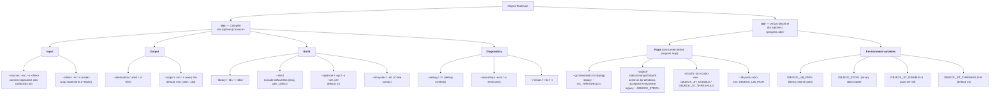

# Objeck CLI Options

> Command-line options for the two core tools: the compiler **`obc`** and the
> virtual machine **`obr`**.

```mermaid
graph TD
    OBJECK["Objeck Toolchain"]

    OBJECK --> OBC["<b>obc</b> — Compiler<br/>obc [options] &lt;source&gt;"]
    OBJECK --> OBR["<b>obr</b> — Virtual Machine<br/>obr [options] &lt;program.obe&gt;"]

    %% ---- Compiler ----
    OBC --> C_IN["<b>Input</b>"]
    C_IN --> C_src["--source / -src / -s &lt;files&gt;<br/>comma-separated .obs (wildcards ok)"]
    C_IN --> C_inline["--inline / -in / -i &lt;code&gt;<br/>wrap statements in Main()"]

    OBC --> C_OUT["<b>Output</b>"]
    C_OUT --> C_dest["--destination / -dest / -d &lt;file&gt;"]
    C_OUT --> C_tar["--target / -tar / -t  &lt;exe | lib&gt;<br/>default: exe (.obe / .obl)"]

    OBC --> C_BUILD["<b>Build</b>"]
    C_BUILD --> C_lib["--library / -lib / -l &lt;libs&gt;"]
    C_BUILD --> C_strict["--strict<br/>exclude default libs (lang, gen_collect)"]
    C_BUILD --> C_opt["--optimize / -opt / -o &lt;s0..s3&gt;<br/>default: s3"]
    C_BUILD --> C_alt["--alt-syntax / -alt  (C-like syntax)"]

    OBC --> C_DIAG["<b>Diagnostics</b>"]
    C_DIAG --> C_dbg["--debug / -D  (debug symbols)"]
    C_DIAG --> C_asm["--assembly / -asm / -a  (emit asm)"]
    C_DIAG --> C_ver["--version / -ver / -v"]

    %% ---- VM ----
    OBR --> V_FLAGS["<b>Flags</b> (consumed before program args)"]
    V_FLAGS --> V_gc["--gc-threshold=&lt;n&gt;(k|m|g)<br/>legacy: --GC_THRESHOLD="]
    V_FLAGS --> V_stdio["--objeck-stdio=binary|utf16|utf8<br/>acted on by Windows; accepted everywhere<br/>legacy: --OBJECK_STDIO="]
    V_FLAGS --> V_jit["--jit=off | --jit=&lt;calls&gt;<br/>env: OBJECK_JIT_DISABLE / OBJECK_JIT_THRESHOLD"]
    V_FLAGS --> V_lib["--lib-path=&lt;dir&gt;<br/>env: OBJECK_LIB_PATH"]

    OBR --> V_ENV["<b>Environment variables</b>"]
    V_ENV --> E_lib["OBJECK_LIB_PATH  (library search path)"]
    V_ENV --> E_stdio["OBJECK_STDIO  (binary stdio mode)"]
    V_ENV --> E_jitd["OBJECK_JIT_DISABLE=1  (auto-JIT off)"]
    V_ENV --> E_jitt["OBJECK_JIT_THRESHOLD=N  (default 10)"]
```

## Compiler — `obc`

| Option | Aliases | Description |
|--------|---------|-------------|
| `--source` | `-src`, `-s` | Source files, comma-separated `.obs` (wildcards supported) |
| `--inline` | `-in`, `-i` | Inline code statements (wrapped in a generated `Main()`) |
| `--destination` | `-dest`, `-d` | Output file name |
| `--target` | `-tar`, `-t` | `exe` or `lib` (default: `exe`; produces `.obe` / `.obl`) |
| `--library` | `-lib`, `-l` | Linked libraries, comma-separated |
| `--strict` | | Exclude default libraries (`lang`, `gen_collect`) |
| `--optimize` | `-opt`, `-o` | Optimization level `s0`–`s3` (default: `s3`) |
| `--alt-syntax` | `-alt` | Use the alternative C-like syntax |
| `--debug` | `-D` | Include debug symbols |
| `--assembly` | `-asm`, `-a` | Emit an assembly file |
| `--version` | `-ver`, `-v` | Show version |

See [optimization_pipeline.md](optimization_pipeline.md) for what each `-opt` level enables.

## Virtual machine — `obr`

| Option | Legacy form | Description |
|--------|-------------|-------------|
| `--gc-threshold=<n>(k\|m\|g)` | `--GC_THRESHOLD=` | Initial garbage-collection threshold, e.g. `512k`, `2m`, `1g` |
| `--jit=off` / `--jit=<calls>` | env `OBJECK_JIT_DISABLE=1` / `OBJECK_JIT_THRESHOLD=N` | `off` runs the interpreter only; a positive number is how many calls a method makes before it is compiled (default `10`) |
| `--lib-path=<dir>` | env `OBJECK_LIB_PATH` | The Objeck `lib` root. `obc` reads the `.obl` files from it; `obr` loads the native libraries from `<dir>/native/` (`libobjk_*.dll|.so|.dylib`), reads `<dir>/cacert.pem` for TLS, and reports it as the `lib_dir` runtime property. On Windows the third-party runtime DLLs those libraries import (SDL2, onnxruntime, opencv, lame, the VC runtime) are resolved from `obr.exe`'s own directory, so `bin/` keeps them wherever `lib/` is |
| `--objeck-stdio=binary\|utf16\|utf8` | `--OBJECK_STDIO=` | Console I/O mode. Acted on by **Windows**; accepted and ignored elsewhere so one script works on every platform |

Any other value for any of these is an error that names what was expected — `--objeck-stdio=1`
used to be accepted and silently do nothing.

### Environment variables

| Variable | Effect |
|----------|--------|
| `OBJECK_LIB_PATH` | Library search path |
| `OBJECK_STDIO` | Binary STDIO mode |
| `OBJECK_JIT_DISABLE=1` | Turn auto-JIT off entirely |
| `OBJECK_JIT_THRESHOLD=N` | Call count before a method is auto-JIT'd (default `10`) |

## Notes

- **VM flag parsing is positional** — `obr` consumes its own options before the
  program path, so VM options must come *before* the `.obe` and any program arguments.
- **`--objeck-stdio` only has an effect on Windows.** Every platform accepts and
  consumes it, so a shared script does not have to know which one is running.
- **`--jit=off` is the first thing to try on a crash or a wrong answer** — it asks
  whether the bug lives in the JIT or in the interpreter. The environment variables
  still work and the flag wins when both are set.
- A `g` suffix on `--gc-threshold` is 2³⁰. Before v2026.9.1 it was 2⁴⁰, so `1g`
  asked for a terabyte.
- Combining `--library` with `--strict` drops the implicit `lang,gen_collect` defaults.

## Source

- Compiler option parsing: `core/compiler/compiler.cpp`, usage string in `core/compiler/posix_main.cpp`
- VM option parsing: `core/vm/win_main.cpp`, `core/vm/posix_main.cpp`
- JIT threshold tunables: `core/vm/arch/jit/jit_common.h`
