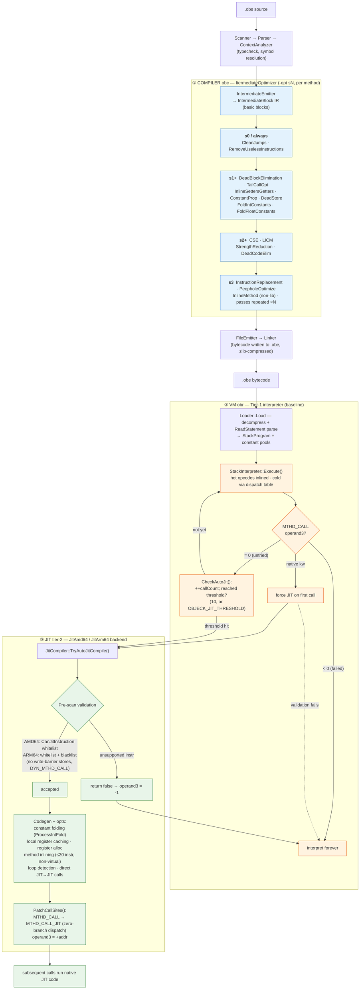

# Objeck Optimization Pipeline

> How Objeck optimizes code across three tiers: the **compiler** (ahead-of-time),
> the **VM interpreter** (baseline), and the **JIT** backends (hot-method tier-2).

Optimization in Objeck is not a single stage — it is split across three layers,
each working on a different representation and at a different point in time.

## How the three tiers divide the work

| Layer | When | Optimizes on | Key idea |
|-------|------|-------------|----------|
| **① Compiler (`obc`)** | Ahead-of-time, once | `IntermediateBlock` IR, per method, gated by `-opt s0..s3` | Classic basic-block passes. `s3` runs the whole pass list **multiple iterations** and adds peephole + method inlining (skipped for libraries). |
| **② VM interpreter** | Every run; all code starts here | `StackInstr` bytecode | Baseline tier. ~20 hot opcodes inlined in `Execute()`; the rest go through a dispatch table. Counts calls per method. |
| **③ JIT (tier-2)** | After **10 calls** (or `native` → immediately) | One method's bytecode → machine code | Validates first (AMD64 **whitelist** / ARM64 whitelist + blacklist), then does its *own* opt pass: constant folding, register caching, inlining (≤20 instrs), loop detection, JIT→JIT direct calls. |

## Two details worth knowing

- **The `operand3` field is the hinge between tiers 2 and 3.** `0` = not yet attempted,
  `> 0` = JIT'd (the call site is rewritten to `MTHD_CALL_JIT` for zero-branch dispatch),
  `< 0` = JIT rejected, interpret forever. A method that fails validation is never retried.
- **Constant folding happens in both the compiler and the JIT.** The compiler folds in the
  IR (`FoldIntConstants`); the JIT folds again at codegen (`ProcessIntFold`), because `s3`
  inlining and JIT-time inlining can expose *new* constant operands the other tier could not see.

## The optimization levels (`-opt`)

| Level | Adds (cumulative) |
|-------|-------------------|
| `s0` | `CleanJumps`, `RemoveUselessInstructions` (always run) |
| `s1` | `DeadBlockElimination`, `TailCallOpt`, getter/setter inlining, constant propagation, dead-store removal, int/float constant folding |
| `s2` | common-subexpression elimination (CSE), loop-invariant code motion (LICM), strength reduction, dead-code elimination |
| `s3` | instruction replacement, peephole optimization, method inlining; the full pass list is repeated for additional iterations |

## Tunables (environment variables)

| Variable | Effect |
|----------|--------|
| `OBJECK_JIT_THRESHOLD=N` | Call count before a method is auto-JIT'd (default `10`) |
| `OBJECK_JIT_DISABLE=1` | Disable auto-JIT entirely (interpret everything) |

## Source map

| Stage | File(s) |
|-------|---------|
| Compiler optimizer | `core/compiler/optimization.{h,cpp}` (`ItermediateOptimizer`) |
| IR + emitter | `core/compiler/intermediate.{h,cpp}`, `core/compiler/emit.{h,cpp}` |
| Bytecode loader | `core/vm/loader.cpp` |
| Interpreter | `core/vm/interpreter.cpp` (`StackInterpreter::Execute`, `CheckAutoJit`) |
| JIT common / threshold | `core/vm/arch/jit/jit_common.{h,cpp}` |
| AMD64 JIT | `core/vm/arch/jit/amd64/jit_amd_lp64.cpp` |
| ARM64 JIT | `core/vm/arch/jit/arm64/jit_arm_a64.cpp` |
