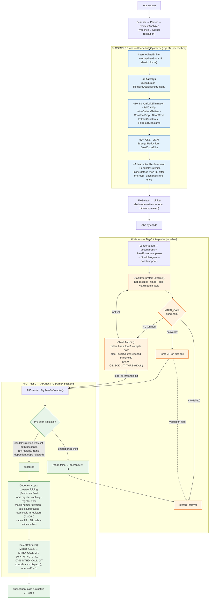

# Objeck Optimization Pipeline

> How Objeck optimizes code across three tiers: the **compiler** (ahead-of-time),
> the **VM interpreter** (baseline), and the **JIT** backends (hot-method tier-2).

Optimization in Objeck is not a single stage — it is split across three layers,
each working on a different representation and at a different point in time.

```mermaid
flowchart TD
    SRC[".obs source"] --> SCAN["Scanner → Parser → ContextAnalyzer<br/>(typecheck, symbol resolution)"]
    SCAN --> EMIT["IntermediateEmitter<br/>→ IntermediateBlock IR (basic blocks)"]

    %% ============ COMPILER (AOT) ============
    subgraph COMPILER["① COMPILER  obc   —  ItermediateOptimizer (-opt sN, per method)"]
        direction TB
        EMIT --> S0
        S0["<b>s0 / always</b><br/>CleanJumps · RemoveUselessInstructions"]
        S0 --> S1["<b>s1+</b>  DeadBlockElimination · TailCallOpt<br/>InlineSettersGetters · ConstantProp · DeadStore<br/>FoldIntConstants · FoldFloatConstants"]
        S1 --> S2["<b>s2+</b>  CSE · LICM<br/>StrengthReduction · DeadCodeElim"]
        S2 --> S3["<b>s3</b>  InstructionReplacement · PeepholeOptimize<br/>InlineMethod (non-lib, after the rest) · each pass runs once"]
    end

    S3 --> FE["FileEmitter → Linker<br/>(bytecode written to .obe, zlib-compressed)"]
    FE --> OBE[".obe bytecode"]

    %% ============ VM TIER-1 ============
    OBE --> LOAD["Loader::Load — decompress + ReadStatement parse<br/>→ StackProgram + constant pools"]
    subgraph VM["② VM  obr   —  Tier-1 interpreter (baseline)"]
        direction TB
        LOAD --> EXEC["StackInterpreter::Execute()<br/>hot opcodes inlined · cold via dispatch table"]
        EXEC --> CALL{"MTHD_CALL<br/>operand3?"}
        CALL -->|"native kw"| FORCE["force JIT on first call"]
        CALL -->|"= 0 (untried)"| COUNT["CheckAutoJit():<br/>callee has a loop? compile now<br/>else ++callCount; reached threshold?<br/>(10, or OBJECK_JIT_THRESHOLD)"]
        CALL -->|"< 0 (failed)"| INTERP["interpret forever"]
        COUNT -->|"not yet"| EXEC
    end

    %% ============ JIT TIER-2 ============
    FORCE --> TRY
    COUNT -->|"loop, or threshold hit"| TRY["JitCompiler::TryAutoJitCompile()"]
    subgraph JIT["③ JIT  tier-2   —  JitAmd64 / JitArm64 backend"]
        direction TB
        TRY --> SCANV{"Pre-scan validation"}
        SCANV -->|"CanJitInstruction whitelist, both backends<br/>(try regions, frame-dependent traps rejected)"| OK
        SCANV -->|"unsupported instr"| FAIL["return false → operand3 = -1"]
        OK["accepted"] --> GEN["Codegen + opts:<br/>constant folding (ProcessIntFold)<br/>local register caching · register alloc<br/>magic-number division · select jump tables<br/>loop locals in registers (AMD64)<br/>native JIT→JIT calls + inline caches"]
        GEN --> PATCH["PatchCallSites():<br/>MTHD_CALL → MTHD_CALL_JIT, DYN_MTHD_CALL → DYN_MTHD_CALL_JIT<br/>(zero-branch dispatch); operand3 = 1"]
    end

    PATCH --> JITRUN["subsequent calls run native JIT code"]
    FAIL --> INTERP
    FORCE -.->|"validation fails"| INTERP

    classDef comp fill:#e3f2fd,stroke:#1565c0;
    classDef vm fill:#fff3e0,stroke:#e65100;
    classDef jit fill:#e8f5e9,stroke:#2e7d32;
    class S0,S1,S2,S3,EMIT comp;
    class EXEC,CALL,COUNT,INTERP,FORCE vm;
    class SCANV,OK,GEN,PATCH,FAIL,JITRUN jit;
```

## How the three tiers divide the work

| Layer | When | Optimizes on | Key idea |
|-------|------|-------------|----------|
| **① Compiler (`obc`)** | Ahead-of-time, once | `IntermediateBlock` IR, per method, gated by `-opt s0..s3` | Classic basic-block passes, each run **once** per method (`num_iterations = 1`). `s3` adds instruction replacement, peephole and method inlining (skipped for libraries). |
| **② VM interpreter** | Every run; all code starts here | `StackInstr` bytecode | Baseline tier. ~30 hot opcodes inlined in `Execute()`; the rest go through a dispatch table. Counts calls per method. |
| **③ JIT (tier-2)** | A method with a loop on its **first call** (a thread's `Run` on entry); any other after **10 calls**; `native` immediately | One method's bytecode → machine code | Validates first (each backend's `CanJitInstruction` **whitelist**), then does its *own* opt pass: constant folding, register caching, magic-number division, `select` jump tables, loop locals in registers (AMD64), native JIT→JIT calls. It does not inline methods. |

## Two details worth knowing

- **The `operand3` field is the hinge between tiers 2 and 3.** `0` = not yet attempted,
  `> 0` = JIT'd (the call site is rewritten to `MTHD_CALL_JIT` for zero-branch dispatch),
  `< 0` = JIT rejected, interpret forever. A method that fails validation is never retried.
- **Constant folding happens in both the compiler and the JIT.** The compiler folds in the
  IR (`FoldIntConstants`); the JIT folds again at codegen (`ProcessIntFold`), because `s3`
  inlining runs after the compiler's folding and can expose *new* constant operands it never
  saw, and library code is never folded by the compiler at all (below).

## What the JIT adds

The docs in the last column, all under `docs/`, record what was built and what it measured.

| Optimization | AMD64 | ARM64 | Design |
|---|---|---|---|
| Division by a constant becomes a multiply by a magic number (`EmitMagicDivision`, F2b); AMD64 turns a power of two into a biased shift | yes | yes | `JIT_CODEGEN_ASSESSMENT_2026_09.md` |
| Loop locals in registers (F3): the hottest `Int`/`Char` locals of each loop in `R13`-`R15`, and `Float` locals in `XMM6`-`XMM9` on Windows | yes | not yet | `JIT_LOOP_LOCALS_DESIGN.md` |
| A dense `select` becomes a jump table (F8) | yes | yes | `JIT_SELECT_TABLES_DESIGN.md` |
| A compiled caller enters a compiled callee's native entry directly, with inline caches at `virtual` and func-ref sites (F7); the C++ bridge is the slow path | yes | yes | `JIT_CALLING_CONVENTION_DESIGN.md` |
| A method with a loop compiles on its first call or entry, not its tenth | yes | yes | `JIT_ENTRY_COMPILE_DESIGN.md` |
| Method inlining | no: `ProcessInlineMethod` exists but is never called | no | |

## The optimization levels (`-opt`)

| Level | Adds (cumulative) |
|-------|-------------------|
| `s0` | `CleanJumps`, `RemoveUselessInstructions` (always run) |
| `s1` | `DeadBlockElimination`, `TailCallOpt`, getter/setter inlining, constant propagation, dead-store removal, int/float constant folding |
| `s2` | common-subexpression elimination (CSE), loop-invariant code motion (LICM), strength reduction, dead-code elimination |
| `s3` | instruction replacement, peephole optimization, method inlining (after every other pass has run on the class's methods) |

Libraries (`-tar lib`) stop after `DeadBlockElimination`: none of the later passes in this
table, method inlining included, run on library code at any level.

## Tunables (environment variables)

| Variable | Effect |
|----------|--------|
| `OBJECK_JIT_THRESHOLD=N` | Call count before a method is auto-JIT'd (default `10`). At `10` or below, a method with a loop is compiled on its first call instead. `--jit=<calls>` does the same and wins |
| `OBJECK_JIT_DISABLE=1` | Disable auto-JIT entirely (interpret everything but `native` methods); `--jit=off` does the same |
| `OBJECK_JIT_REPORT=1` | Name every method the JIT compiles, and every one it hands back to the interpreter with the reason |
| `OBJECK_JIT_PIN_MAX=n`, `OBJECK_JIT_PIN_SKIP=<substring>` | AMD64: cap the loop locals pinned per loop (`0` turns pinning off), or exempt matching methods |

## Source map

| Stage | File(s) |
|-------|---------|
| Compiler optimizer | `core/compiler/optimization.{h,cpp}` (`ItermediateOptimizer`) |
| IR + emitter | `core/compiler/intermediate.{h,cpp}`, `core/compiler/emit.{h,cpp}` |
| Bytecode loader | `core/vm/loader.cpp` |
| Interpreter | `core/vm/interpreter.cpp` (`StackInterpreter::Execute`, `CheckAutoJit`) |
| JIT common / threshold | `core/vm/arch/jit/jit_common.{h,cpp}` |
| AMD64 JIT | `core/vm/arch/jit/amd64/jit_amd_lp64.cpp` |
| ARM64 JIT | `core/vm/arch/jit/arm64/jit_arm_a64.cpp` |
