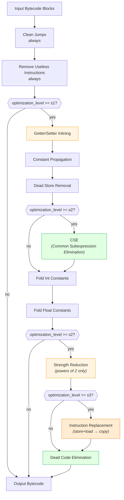
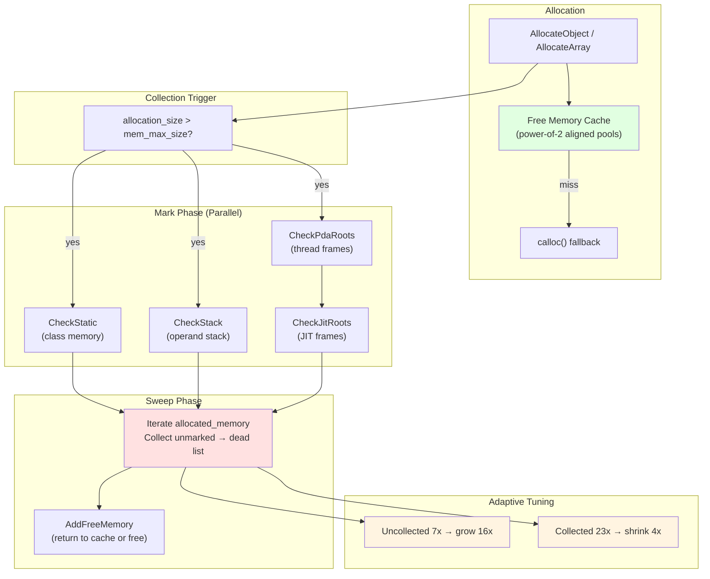
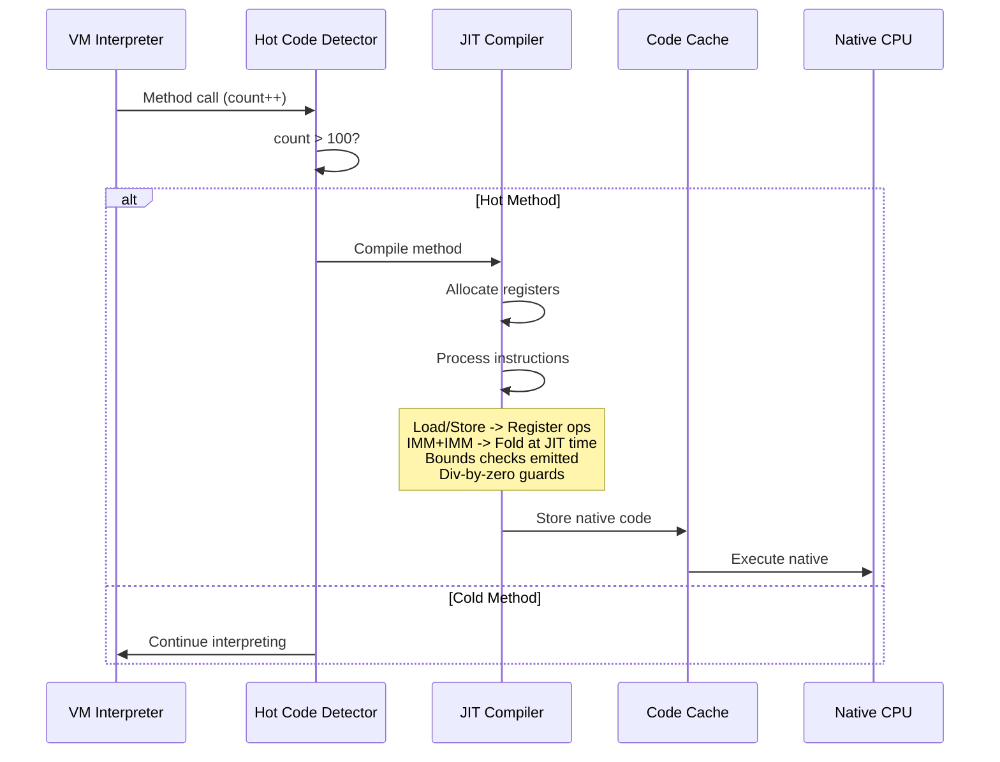

# Objeck Performance

> **Benchmark results, cross-language comparisons, and optimization history**

---

## Table of Contents

1. [Benchmark Results](#1-benchmark-results)
2. [Cross-Language Comparison](#2-cross-language-comparison)
3. [Micro-Benchmarks](#3-micro-benchmarks)
4. [The `native` Keyword and Auto-JIT](#4-the-native-keyword-and-auto-jit)
5. [Optimization Pipeline](#5-optimization-pipeline)
6. [Optimization History](#6-optimization-history)
7. [What We Tried and Reverted](#7-what-we-tried-and-reverted)
8. [Future Work](#8-future-work)

---

## 1. Benchmark Results

### Test Environment

All benchmarks ran in a single Docker container (Ubuntu 24.04) to ensure reproducible, comparable results across languages.

| | |
|---|---|
| **CPU** | AMD Ryzen AI 9 HX 370 (12C/24T) |
| **RAM** | 32 GB DDR5 (15 GB allocated to Docker) |
| **OS** | Ubuntu 24.04.4 LTS (Docker on Windows 11) |
| **Compiler** | Objeck built from source, `-opt s3` |
| **Methodology** | 3 runs per benchmark, median reported |

### CLBG Benchmarks

Classic [Computer Language Benchmarks Game](https://benchmarksgame-team.pages.debian.net/benchmarksgame/) programs compiled with `-opt s3`.

| Benchmark | Input | Time (s) | Peak RSS |
|-----------|-------|----------|----------|
| **mandelbrot** | 4000 | 2.78 | 9 MB |
| **binarytrees** | 17 | **20.0** | 173 MB |
| **nbody** | 50M | 43.04 | 7 MB |
| **fannkuchredux** | 12 | 94.64 | 7 MB |
| **spectralnorm** | 5500 | 118.53 | 8 MB |

**mandelbrot** and **nbody** benefit heavily from `native`-annotated methods that JIT-compile to x64. **binarytrees** benefits from the young-generation bump allocator, MTHD_CALL JIT whitelist, and direct JIT-to-JIT calling (3.3x faster than previous release, see [Section 6](#6-optimization-history)). **spectralnorm** runs in the interpreter (no `native` keyword); with `native` it drops to **1.16s** (see [Section 4](#4-the-native-keyword-and-auto-jit)).

---

## 2. Cross-Language Comparison

Same inputs, same machine, same Docker container. All languages ran with default settings (no special flags).

| Language | Version |
|----------|---------|
| Python | 3.12.3 |
| Ruby | 3.2.3 |
| LuaJIT | 2.1 |

### Results (median of 3 runs, binarytrees at depth=17)

| Benchmark | Objeck | Python 3.12 | Ruby 3.2 | LuaJIT 2.1 | Best |
|-----------|--------|-------------|----------|------------|------|
| **nbody** (50M) | **43.04s** | 294.39s | 553.82s | **11.88s** | LuaJIT |
| **fannkuchredux** (12) | **94.64s** | 988.84s | 3393.49s | 316.48s | **Objeck** |
| **binarytrees** (17) | **20.0s** | 10.87s | 10.60s | **6.95s** | LuaJIT |
| **spectralnorm** (5500) | 118.53s | 315.44s | 225.29s | **3.14s** | LuaJIT |

### Analysis

**Where Objeck wins:**

- **fannkuchredux** — Objeck is the fastest overall. 3.3x faster than LuaJIT, 10.4x faster than Python, 35.9x faster than Ruby. The JIT excels at tight integer loops with array permutations.
- **nbody** — 6.8x faster than Python, 12.9x faster than Ruby. Getter/setter inlining + JIT compilation eliminates method call overhead in the gravitational simulation inner loop.

**Where Objeck is competitive:**

- **binarytrees** — 2.9x slower than LuaJIT, 1.8x slower than Python/Ruby. Previously 10x slower than LuaJIT before the bump allocator, MTHD_CALL whitelist, and direct JIT-to-JIT calling optimizations. The remaining gap is interpreter dispatch overhead for recursive methods (BottomUpTree/ItemCheck).

**Where Objeck needs improvement:**

- **spectralnorm (float arrays)** — 38x slower than LuaJIT. However, this benchmark runs in the interpreter. Adding the `native` keyword drops Objeck to **1.16s** — only 2.7x behind LuaJIT's tracing JIT. The gap here is primarily about auto-JIT, not code quality.

### Key Takeaways

1. **Young-generation GC closed the binarytrees gap.** The bump allocator + 128 MB nursery reduced allocation overhead by ~50x vs the old mutex + hash-set path, and cut peak RSS from 6.2 GB to 173 MB.
2. **Direct JIT-to-JIT calling eliminates trampoline overhead.** When auto-JIT compiles a method and it calls another JIT'd method, the call goes directly to native code without bouncing through the interpreter.
3. **Auto-JIT is still the #1 bottleneck.** spectralnorm goes from 118s to 1.16s with `native` — a 100x speedup sitting on the table. Methods that aren't manually annotated run in the interpreter regardless of how hot they are.
4. **Integer JIT is already excellent.** fannkuchredux proves the integer path is highly competitive — faster than LuaJIT's tracing JIT for this workload.

---

## 3. Micro-Benchmarks

Targeted benchmarks for specific optimization patterns (`programs/tests/perf/`). Compiled with `-opt s3`, median of 3 runs.

| Benchmark | Target | Time (s) | Peak RSS |
|-----------|--------|----------|----------|
| `bench_loop_invariant` | Loop-invariant expressions | 0.64 | 7 MB |
| `bench_cse` | Common subexpression elimination | 0.65 | 7 MB |
| `bench_spectralnorm_native` | Float arrays with `native` JIT | 1.16 | 8 MB |
| `bench_copy_prop` | Variable copy chains | 3.05 | 7 MB |
| `bench_dead_code` | Unreachable assignments | 4.39 | 7 MB |
| `bench_strength_ext` | Non-power-of-2 multiply patterns | 5.24 | 7 MB |
| `bench_gc_churn` | Rapid short-lived object allocation | 4.74 | 15 MB |
| `bench_gc_large_heap` | Large live set, GC sweep time | 0.82 | 95 MB |
| `bench_array_intensive` | Sequential array access patterns | 6.44 | 7 MB |
| `bench_method_dispatch` | Repeated method calls on objects | 7.52 | 7 MB |
| `bench_matrix_multiply` | Nested loop float computation (n=500) | 13.41 | 13 MB |

### Running Benchmarks

```bash
# Docker (recommended for reproducible results)
docker build -t objeck-bench -f perf-results/docker/Dockerfile .
docker run --rm -v "$(pwd)/perf-results/docker-results:/results" objeck-bench

# Linux/WSL (using deploy directory)
bash perf-results/run_benchmarks.sh <deploy_dir> <output_dir> [num_runs]

# Generate charts
python3 perf-results/gen_charts.py --baseline <dir> --branch1 <dir>
```

---

## 4. The `native` Keyword and Auto-JIT

Objeck JIT-compiles methods marked with the `native` keyword. All other methods run in the interpreter, regardless of how hot they are. This has a dramatic impact:

| spectralnorm (5500) | Time | vs LuaJIT |
|---------------------|------|-----------|
| Without `native` (interpreter) | 110.81s | 35x slower |
| With `native` (JIT) | **1.16s** | 2.7x slower |

Adding `native` produces a **95x speedup** — the single largest improvement opportunity in the codebase.

LuaJIT achieves 3.14s because it automatically JIT-compiles any hot trace. Objeck's method-level JIT is competitive when engaged (1.16s vs 3.14s), but the requirement to manually mark methods with `native` means many real-world programs run entirely in the interpreter.

### Auto-JIT Prototype (v2026.2.1+)

Auto-JIT was prototyped with call counting at both the interpreter and JIT callback levels. Methods are automatically JIT-compiled after 10 calls (`JIT_AUTO_THRESHOLD`).

**Workstation results (AMD 7950X3D):**

| Benchmark | Baseline | With Auto-JIT | Manual `native` | Change |
|-----------|----------|---------------|-----------------|--------|
| spectralnorm | 17.18s | **7.90s** | 0.47s | **2.2x faster** |
| binarytrees | 21.80s | 59.56s | -- | **2.7x slower** |
| nbody | 2.12s | 2.04s | -- | neutral |
| fannkuchredux | 2.23s | 2.22s | -- | neutral |

**Why it helps spectralnorm:** The `A(i,j)` function gets auto-JIT'd after 10 calls, then subsequent 4M+ calls per iteration run as native code.

**Why it hurts binarytrees:** The per-call `IncrementJitCallCount()` adds overhead on every method call. binarytrees makes ~500K+ recursive calls, and each counter increment touches a non-local cache line.

**Next steps for auto-JIT:**
- Amortize counter cost (check every Nth call via bitwise mask)
- Move counting to JIT callback level only (skip interpreter counting for methods proven not-JIT-compilable)
- On-stack replacement (OSR) to JIT methods while they're already executing

---

## 5. Optimization Pipeline

### Compiler Bytecode Optimizer

The compiler's bytecode optimizer runs multiple passes at increasing optimization levels (s0-s3). The JIT then further optimizes hot methods at runtime.

```mermaid
graph LR
    subgraph "Compiler (obc) — Bytecode Optimization"
        direction TB
        A0["s0: Jump Cleanup<br/>Remove Useless Instructions"]
        A1["s1+: Getter/Setter Inlining<br/>Constant Propagation<br/>Dead Store Removal<br/>Constant Folding (Int + Float)"]
        A2["s2+: CSE<br/>Dead Code Elimination<br/>Strength Reduction (powers of 2)"]
        A3["s3: Method Inlining<br/>Instruction Replacement<br/>(store+load → copy)"]
    end

    subgraph "Runtime (obr) — JIT Compilation"
        direction TB
        J1["Hot Code Detection<br/>(100+ calls)"]
        J2["Register Allocation"]
        J3["Constant Folding<br/>(IMM_INT + IMM_INT → IMM_INT)"]
        J4["Native Code Emission<br/>(ARM64 / x64)"]
        J5["Code Cache"]
    end

    A0 --> A1 --> A2 --> A3
    A3 -->|".obe bytecode"| J1
    J1 --> J2 --> J3 --> J4 --> J5

    style A0 fill:#f9f9f9
    style A1 fill:#fff4e1
    style A2 fill:#ffe8cc
    style A3 fill:#ffd9b3
    style J1 fill:#e1f5ff
    style J4 fill:#cceeff
```



### Design Philosophy

- **Correctness first.** Every new pass was validated against the full regression suite before being kept.
- **JIT as the primary lever.** Hot methods (100+ calls) get compiled to native ARM64 or x64 machine code, so improvements there have outsized impact.
- **Bytecode optimization came later.** An instruction rewrite framework cleans up redundant patterns (e.g., store-then-immediate-load), reducing the bytecode the JIT has to process.
- **GC: balance correctness and speed.** The move to O(1) memory lookups via `std::unordered_set` was a major stability-then-performance win.

### Bytecode Optimizer Pass Order



### GC Pipeline



### JIT Compilation Flow



---

## 6. Optimization History

### Timeline

| Version | Date | Key Optimization |
|---------|------|-----------------|
| Pre-2024 | -- | Stack-based VM, interpreter-only execution |
| v2024.x | 2024 | JIT compilers (ARM64 + x64), basic bytecode optimizer (constant folding, strength reduction) |
| v2026.2.0 | Feb 2026 | O(1) GC lookups, ARM64 JIT multiply optimization, x64 instruction encoding, instruction rewrite framework |
| v2026.2.1 | Feb 2026 | CSE, dead code elimination, inline limit increase (128->256), JIT div-by-zero guards, ARM64 CI testing |
| v2026.2.1+ | Mar 2026 | JIT whitelist fix: STOR_INT_ARY_ELM, STOR_CLS_INST_INT_VAR, COPY_CLS_INST_INT_VAR enabled |
| v2026.3.0 | Apr 2026 | Young-gen bump allocator enabled, MTHD_CALL JIT whitelist, direct JIT-to-JIT calling, atomic mark bits, auto-JIT operand3 dispatch fix |

### v2026.2.0 -- Foundation Optimizations

**Memory Manager: O(1) Lookups.** Switched GC's `allocated_memory` from O(log n)/O(n) lookups to `std::unordered_set<size_t*>` for O(1) average-case pointer validity checks during marking.

**ARM64 JIT: 11 Critical Optimizations.** Multiply-by-constant via shift+add, better register allocation, FP register pool management (callee-saved D8-D15), correct wide char array access, large immediate handling.

**x64 JIT: Instruction Encoding.** Dynamic backpatching for forward jumps, shorter encodings where possible.

### v2026.2.1 -- Compiler & JIT Enhancements

**Headline: 4.38x speedup on nbody.** The inline limit increase from 128 to 256 bytes allowed getter/setter methods on the `Body` class to be inlined at compile time. The JIT then optimized the inlined code into register operations.

| Optimization | Category | Impact |
|-------------|----------|--------|
| Inline limit 128->256 | Compiler | 4.38x nbody |
| Common Subexpression Elimination | Compiler | Neutral-positive |
| Dead Code Elimination | Compiler | 1.02x dead_code |
| Div-by-zero in constant folding | Compiler | Bugfix |
| JIT div-by-zero guards | JIT | Safety |
| ARM64 CI testing | Infrastructure | -- |

**How CSE works:** Tracks `(opcode, left_slot, right_slot)` tuples within a basic block. When the same expression appears again and the result was stored to a local variable, the second computation is replaced with a load of the stored result. Invalidation occurs on stores to involved variables, labels, jumps, and method calls.

### JIT Whitelist Fix (Mar 2026)

Added `STOR_INT_ARY_ELM`, `STOR_CLS_INST_INT_VAR`, `COPY_CLS_INST_INT_VAR` to x64 JIT whitelist; removed `STOR_INT_ARY_ELM` from ARM64 blacklist. These instructions had working code generators but were not enabled, causing `native` methods to silently fall back to the interpreter.

Measured on GitHub Actions runners (Ubuntu 24.04), 3 runs each, `-opt s3`:

#### Linux x64

| Benchmark | v2026.2.1 (s) | Current (s) | Change |
|-----------|--------------|-------------|--------|
| **mandelbrot** (4000) | 45.51 | 1.60 | **28.4x faster** |
| **fannkuchredux** (11) | 103.15 | 4.95 | **20.8x faster** |
| **binarytrees** (15) | 10.32 | 8.96 | -13.2% faster |
| **spectralnorm** (5500) | 97.12 | 86.98 | -10.4% faster |
| **nbody** (50M) | 37.83 | 38.46 | ~same |

#### Linux ARM64

| Benchmark | v2026.2.1 (s) | Current (s) | Change |
|-----------|--------------|-------------|--------|
| **fannkuchredux** (11) | 92.40 | 4.27 | **21.6x faster** |
| **nbody** (50M) | 25.00 | 25.19 | ~same |
| **spectralnorm** (5500) | 69.07 | 69.15 | ~same |
| **binarytrees** (15) | 8.54 | 8.59 | ~same |
| **mandelbrot** (4000) | 22.65 | 22.64 | same |

*CI runner performance varies -- use for relative comparisons only.*

### v2026.3.0 -- Binarytrees: 3.3x Faster

**Headline: binarytrees (depth=17) from 65.8s to 20.0s.** Six optimizations across the JIT, GC, and interpreter combined to eliminate binarytrees as an order-of-magnitude bottleneck.

| Optimization | Category | Impact | Description |
|-------------|----------|--------|-------------|
| Young-gen bump allocator enabled | GC | **1.9x** on binarytrees | `atomic_fetch_add` instead of mutex + `unordered_set::insert` per allocation. 128 MB nursery; short-lived objects die without promotion. Fixed by adding op_stack tracking to `StackFrameMonitor` for cross-thread fixup. |
| MTHD_CALL JIT whitelist (x64 + ARM64) | JIT | **1.2x** on binarytrees | Methods containing method calls can now be JIT-compiled. `Run()` loop control runs as native code. Inlining disabled for MTHD_CALL (ProcessInlineMethod INSTANCE_MEM corruption). |
| Direct JIT-to-JIT calling | JIT/VM | **1.4x** on binarytrees | `JitStackCallback` calls callee native code directly instead of creating an interpreter, dispatching MTHD_CALL, then calling `ProcessJitMethodCall`. Eliminates 5 layers of trampoline overhead. |
| Auto-JIT operand3 dispatch fix | VM | **1.5x** on binarytrees | `operand3 < 0` (failed JIT) was routing to `ProcessJitMethodCall` which re-attempted `Compile()` on every call. Fixed: `operand3 > 0` → JIT, `< 0` → interpreter, `== 0` → auto-JIT counting. |
| Atomic mark bits | GC | ~5% on GC-heavy | Lock-free CAS (`InterlockedCompareExchange64`/`__sync_bool_compare_and_swap`) replaces `marked_lock` mutex in `MarkMemory`. Eliminates contention across 3 parallel mark threads. |
| MEM_START_MAX 1 MB → 8 MB | GC | Fewer early GC cycles | Reduces GC thrashing during heap warmup. `old_generation.reserve()` increased from 4096 to 65536 to reduce hash-set rehashing. |

**How it was found:** GC profiling (`_TIMING`) revealed that only 18% of binarytrees runtime was in GC (mark + sweep). The remaining 82% was per-object allocation overhead (mutex + hash insert) and interpreter dispatch. This contradicted the previous assumption that "GC is the #1 bottleneck." The bump allocator had already been implemented (young region, write barriers, promotion, fixup) but was disabled due to a cross-thread operand stack fixup gap.

**Cross-language progress on binarytrees (depth=17, Docker, median of 3 runs):**

| Language | Before | After | Change |
|----------|--------|-------|--------|
| **Objeck** | 65.8s | **20.0s** | **3.3x faster** |
| Python 3.12 | 10.9s | 10.9s | -- |
| Ruby 3.2 | 10.6s | 10.6s | -- |
| LuaJIT 2.1 | 6.9s | 6.9s | -- |

**Peak RSS:** 6.2 GB (depth=21, before) → 173 MB (depth=17, after). Objects now die in the 128 MB nursery instead of accumulating in `old_generation`.

---

## 7. What We Tried and Reverted

Not every optimization improved performance. Data-driven validation caught several regressions:

| Optimization | Category | Result | Why It Regressed |
|-------------|----------|--------|-----------------|
| **Extended strength reduction** (x\*3,5,7,9,15 -> shift+add) | Compiler | 0.66x **slower** | Modern CPUs execute MUL in 3 cycles; multi-instruction shift+add has more dispatch overhead |
| **Copy propagation** | Compiler | 0.85x slower | Changed instruction patterns the JIT register allocator expected |
| **Pass iteration** (2x at s3) | Compiler | Slight regression | Compile-time overhead not recovered by marginal gains |
| **GC: Lock-free mark via snapshot** | GC | 0.64x **much slower** | Copying entire `allocated_memory` set before each mark phase was O(n) overhead |
| **GC: Adaptive tuning** (live-set ratio) | GC | Regression on binarytrees | Slower growth (2x vs 16x) caused more frequent GC cycles |
| **Inline limit 512** | Compiler | 0.91x on binarytrees | Too much inlining exceeded JIT's register allocator capacity |

**Key lesson:** On a modern out-of-order CPU, reducing instruction count at the bytecode level doesn't always translate to faster execution. The JIT's register allocation and the CPU's own optimizations (branch prediction, speculative execution) mean that simpler bytecode patterns can sometimes be faster than "optimized" ones.

---

## 8. Future Work

Ranked by measured impact. ~~Strikethrough~~ items were completed in v2026.3.0.

| Opportunity | Category | Expected Impact | Complexity | Status |
|-------------|----------|----------------|------------|--------|
| **Auto-JIT at JIT callback level** | VM/JIT | **VERY HIGH** | HIGH | spectralnorm: 100x with `native`. Must avoid interpreter overhead. |
| ~~**Generational GC**~~ | ~~GC~~ | ~~HIGH~~ | ~~VERY HIGH~~ | **Done.** Young-gen bump allocator enabled. 3.3x binarytrees improvement. |
| ~~**Atomic mark bits**~~ | ~~GC~~ | ~~MED-HIGH~~ | ~~MED~~ | **Done.** Lock-free CAS replaces `marked_lock` mutex. |
| **DYN_MTHD_CALL JIT support** | JIT | MED-HIGH | MED | Closure/function-ref calls segfault (prgm70/71). Parameter handling needs investigation. |
| **ProcessInlineMethod for MTHD_CALL** | JIT | MED | MED | Inlining constructors/getters within JIT'd methods corrupts INSTANCE_MEM. Currently disabled. |
| **Escape analysis** | Compiler/VM | MED | HIGH | Stack-allocate non-escaping objects. |
| **JIT register allocation improvements** | JIT | MED | HIGH | Better spill/fill for complex methods. |
| **Threaded interpreter dispatch** | VM | MED | MED | Computed gotos for ~20-30% interpreter speedup. |
| **Loop-invariant code motion** | Compiler | MED | MED | Hoist invariant computations out of loops. |
| **SIMD vectorization** | JIT | MED | HIGH | NEON (ARM64) and SSE/AVX (x64) for array ops. |

---

*Last updated: April 2026 -- Docker benchmark results on AMD Ryzen AI 9 HX 370*
