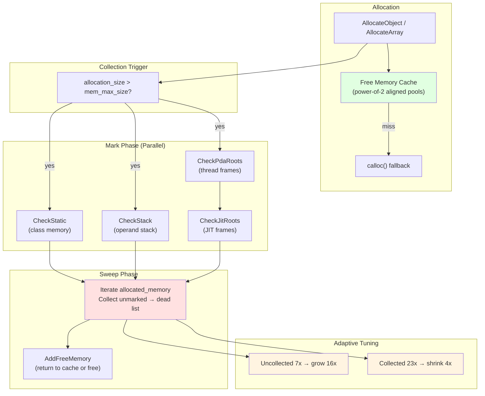
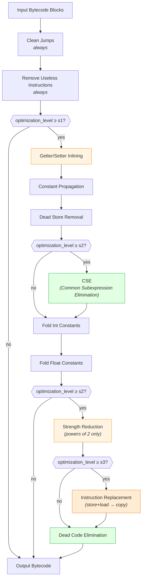
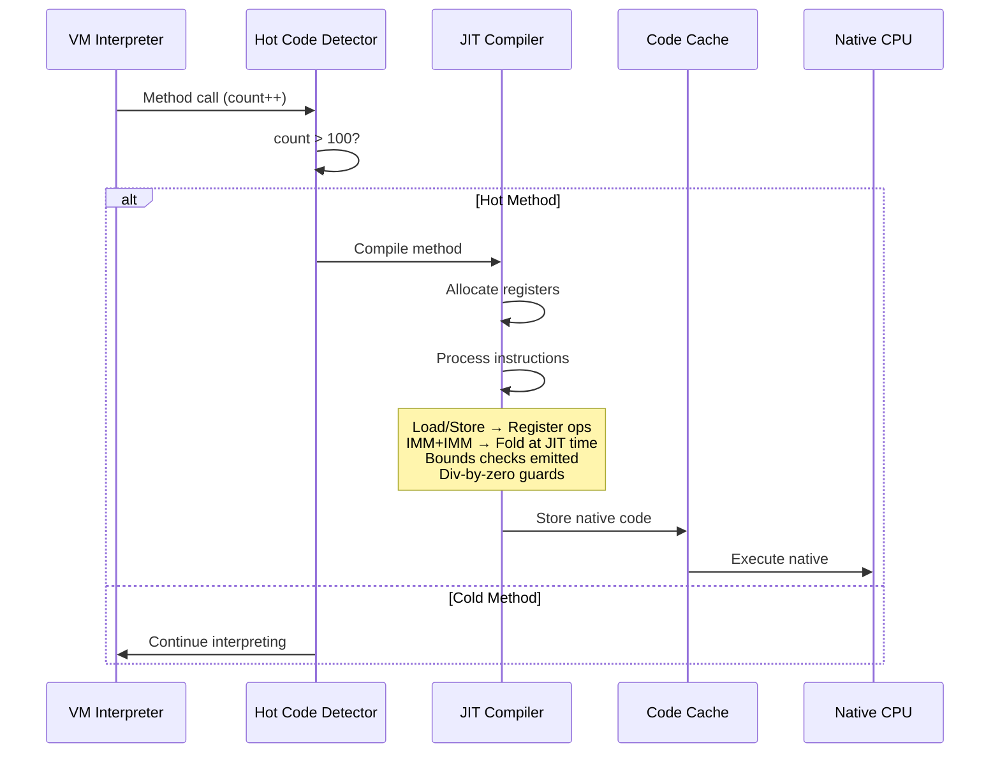

```mermaid
graph LR
    subgraph "Compiler (obc) — Bytecode Optimization"
        direction TB
        A0["s0: Jump Cleanup<br/>Remove Useless Instructions"]
        A1["s1+: Getter/Setter Inlining<br/>Constant Propagation<br/>Dead Store Removal<br/>Constant Folding (Int + Float)"]
        A2["s2+: CSE<br/>Dead Code Elimination<br/>Strength Reduction (powers of 2)"]
        A3["s3: Method Inlining<br/>Instruction Replacement<br/>(store+load → copy)"]
    end

    subgraph "Runtime (obr) — JIT Compilation"
        direction TB
        J1["Hot Code Detection<br/>(100+ calls)"]
        J2["Register Allocation"]
        J3["Constant Folding<br/>(IMM_INT + IMM_INT → IMM_INT)"]
        J4["Native Code Emission<br/>(ARM64 / x64)"]
        J5["Code Cache"]
    end

    A0 --> A1 --> A2 --> A3
    A3 -->|".obe bytecode"| J1
    J1 --> J2 --> J3 --> J4 --> J5

    style A0 fill:#f9f9f9
    style A1 fill:#fff4e1
    style A2 fill:#ffe8cc
    style A3 fill:#ffd9b3
    style J1 fill:#e1f5ff
    style J4 fill:#cceeff
```

# Objeck Performance Optimization History

> **Compiler, JIT, and GC optimization journey from v2024 to v2026**

This document traces the performance optimization work across the Objeck language implementation, covering the compiler bytecode optimizer, the ARM64/x64 JIT compilers, and the mark-and-sweep garbage collector.

---

## Table of Contents

1. [Design Philosophy](#1-design-philosophy)
2. [Optimization Pipeline](#2-optimization-pipeline)
3. [Timeline](#3-timeline)
4. [v2026.2.0 — Foundation Optimizations](#4-v202620--foundation-optimizations)
5. [v2026.2.1 — Compiler & JIT Enhancements](#5-v202621--compiler--jit-enhancements)
6. [Benchmark Results](#6-benchmark-results)
7. [What We Tried and Reverted](#7-what-we-tried-and-reverted)
8. [Architecture Diagrams](#8-architecture-diagrams)
9. [Future Work](#9-future-work)

---

## 1. Design Philosophy

The Objeck optimization strategy has been guided by a **utility vs. effort** principle:

- **Correctness first.** The compiler was never optimized for compile speed — it was optimized for producing correct output. Every new pass was validated against the full regression suite before being kept.
- **JIT as the primary lever.** Because Objeck uses a stack-based bytecode VM with method-level JIT compilation, the JIT compiler was targeted first for performance work. Hot methods (100+ calls) get compiled to native ARM64 or x64 machine code, so improvements there have outsized impact on real workloads.
- **Bytecode optimization came later.** The initial stack-based code generation was highly redundant (e.g., store-then-immediate-load of the same variable). An instruction rewrite framework was built to clean up these patterns, reducing the bytecode the JIT has to process.
- **GC: balance correctness and speed.** The garbage collector has been the trickiest subsystem — balancing finding all garbage (correctness) against collection pause time (speed). The move to O(1) memory lookups via `std::unordered_set` was a major stability-then-performance win.

---

## 2. Optimization Pipeline

The compiler's bytecode optimizer runs multiple passes at increasing optimization levels (s0–s3). The JIT then further optimizes hot methods at runtime.



### GC Pipeline



---

## 3. Timeline

| Version | Date | Key Optimization |
|---------|------|-----------------|
| Pre-2024 | — | Stack-based VM, interpreter-only execution |
| v2024.x | 2024 | JIT compilers (ARM64 + x64), basic bytecode optimizer (constant folding, strength reduction) |
| v2026.2.0 | Feb 2026 | O(1) GC lookups, ARM64 JIT multiply optimization, x64 instruction encoding, instruction rewrite framework |
| v2026.2.1 | Feb 2026 | CSE, dead code elimination, inline limit increase (128→256), JIT div-by-zero guards, ARM64 CI testing |

---

## 4. v2026.2.0 — Foundation Optimizations

### Memory Manager: O(1) Lookups

**Before:** The GC's `allocated_memory` used a data structure requiring O(log n) or O(n) lookups to verify pointer validity during marking. Every `CheckObject` call during GC needed to verify that a pointer was a valid allocated object.

**After:** Switched to `std::unordered_set<size_t*>` for O(1) average-case lookups. This was a significant improvement that became viable after the GC's correctness was well-established through testing.

### ARM64 JIT: 11 Critical Optimizations

The ARM64 JIT (targeting Apple Silicon M1/M2/M3/M4 and Linux ARM64) received 11 fixes and optimizations:
- **Multiply-by-constant optimization** — using shift+add sequences for power-of-2 multipliers
- **Register targeting** — better allocation of ARM64 general-purpose and FP registers
- **FP register pool management** — callee-saved D8-D15 properly saved/restored
- **Char array support** — correct memory access for wide character arrays
- **Large immediate handling** — proper encoding for constants that don't fit in 12-bit ARM64 immediates

### x64 JIT: Instruction Encoding

- **Dynamic backpatching** — forward jump targets resolved after code generation, eliminating multi-pass compilation
- **Instruction encoding optimizations** — shorter encodings where possible

---

## 5. v2026.2.1 — Compiler & JIT Enhancements

### Headline Result: 4.38x Speedup on nbody

The `nbody` benchmark (N-body gravitational simulation, 5M iterations) went from **9.28s to 2.12s** — a 4.38x improvement. The primary driver was the **inline limit increase** from 128 to 256 bytes, which allowed getter/setter methods on the `Body` class to be inlined at compile time. The JIT then optimized the inlined code into register operations, eliminating method call overhead in the inner loop.

### Changes Kept (Data-Validated)

| Optimization | Category | Impact | Evidence |
|-------------|----------|--------|----------|
| **Inline limit 128→256** | Compiler | 4.38x nbody | More getters/setters inlined, JIT optimizes further |
| **Common Subexpression Elimination** | Compiler | Neutral-positive | Eliminates redundant `LOAD+LOAD+OP` within basic blocks |
| **Dead Code Elimination** | Compiler | 1.02x dead_code bench | Removes redundant jumps to immediately-following labels |
| **Div-by-zero in constant folding** | Compiler | Bugfix | `DIV_INT`/`MOD_INT` folding crashed on divisor==0 |
| **Dead condition fix** | Compiler | Bugfix | `&&` → `\|\|` in `InstructionReplacement` (condition could never be true) |
| **JIT div-by-zero guards** | JIT (x64+ARM64) | Safety | `ProcessIntFold` returns nullptr on div-by-zero, graceful fallback |
| **ARM64 CI testing** | Infrastructure | — | Linux ARM64 + macOS ARM64 tests enabled in GitHub Actions |

### How CSE Works

Common Subexpression Elimination tracks `(opcode, left_slot, right_slot)` tuples within a basic block. When the same expression appears again and the result was stored to a local variable, the second computation is replaced with a load of the stored result:

```
# Before CSE                    # After CSE
LOAD_INT_VAR 0                  LOAD_INT_VAR 0
LOAD_INT_VAR 1                  LOAD_INT_VAR 1
ADD_INT                         ADD_INT
STOR_INT_VAR 2    ← tracked     STOR_INT_VAR 2
...                             ...
LOAD_INT_VAR 0    ← redundant   LOAD_INT_VAR 2    ← reused!
LOAD_INT_VAR 1    ← redundant
ADD_INT            ← redundant
```

Invalidation occurs on stores to involved variables, labels, jumps, and method calls.

---

## 6. Benchmark Results

Measured on AMD Ryzen 9 7950X3D (16C/32T, 128MB V-Cache), 128GB DDR5, WSL2 Ubuntu. Each benchmark run 3 times, mean reported.

### v2026.2.1 vs Baseline

| Benchmark | Baseline | Optimized | Speedup | Notes |
|-----------|----------|-----------|---------|-------|
| **nbody** (5M iter) | 9.28s | 2.12s | **4.38x** | Getter/setter inlining via increased limit |
| binarytrees (depth 17) | 21.25s | 21.80s | 0.97x | GC-bound, neutral |
| spectralnorm (n=2000) | 17.14s | 16.95s | 1.01x | Float-heavy, neutral |
| fannkuchredux (n=11) | 2.22s | 2.23s | 1.00x | Int array permutations, neutral |
| bench_strength_ext | 3.51s | 3.52s | 1.00x | Multiply-heavy, neutral |
| bench_dead_code | 2.80s | 2.76s | 1.02x | Dead assignment elimination |
| bench_gc_churn (5M allocs) | 1.53s | 1.60s | 0.96x | Rapid alloc/dealloc, neutral |
| bench_array_intensive | 3.71s | 3.71s | 1.00x | Sequential array access, neutral |

### Benchmark Suite

The performance benchmark suite (`programs/tests/perf/`) includes 10 programs targeting specific optimization patterns:

| Benchmark | Target |
|-----------|--------|
| `bench_cse.obs` | Common subexpression elimination |
| `bench_copy_prop.obs` | Variable copy chains |
| `bench_strength_ext.obs` | Non-power-of-2 multiply patterns |
| `bench_dead_code.obs` | Unreachable assignments |
| `bench_gc_churn.obs` | Rapid short-lived object allocation |
| `bench_gc_large_heap.obs` | Large live set, GC sweep time |
| `bench_array_intensive.obs` | Sequential array access patterns |
| `bench_matrix_multiply.obs` | Nested loop float computation |
| `bench_method_dispatch.obs` | Repeated method calls on objects |
| `bench_loop_invariant.obs` | Loop-invariant expressions |

Run benchmarks with: `bash perf-results/run_benchmarks.sh <deploy_dir> <output_dir> [num_runs]`

Generate charts with: `python3 perf-results/gen_charts.py --baseline <dir> --branch1 <dir>`

### Cross-Language Comparison

Measured on the same AMD 7950X3D machine. Python/Ruby/LuaJIT ran in Docker (Ubuntu 24.04), Objeck ran in WSL2 (Ubuntu). Same benchmark inputs across all languages.

| Benchmark | Objeck | Python 3.12 | Ruby 3.2 | LuaJIT 2.1 | Objeck vs Best |
|-----------|--------|-------------|----------|------------|---------------|
| **nbody** (5M) | **2.12s** | 14.05s | 20.81s | **0.43s** | 4.9x slower than LuaJIT |
| **binarytrees** (17) | 21.80s | **3.47s** | 3.54s | 3.56s | 6.3x slower than Python |
| **spectralnorm** (2000) | 16.95s | 16.84s | 11.40s | **0.15s** | 113x slower than LuaJIT |
| **fannkuchredux** (11) | **2.23s** | 31.51s | 86.32s | 9.17s | **FASTEST** (4.1x over LuaJIT) |

#### Analysis

**Where Objeck wins:**
- **fannkuchredux** — Objeck's JIT excels at tight integer loops with array permutations. 4.1x faster than LuaJIT, 14x faster than Python, 39x faster than Ruby.
- **nbody** — Objeck is 7x faster than Python and 10x faster than Ruby thanks to getter/setter inlining + JIT compilation.

**Where Objeck needs improvement:**
- **binarytrees (GC-bound)** — Objeck is 6.3x slower than Python/Ruby/LuaJIT. The mark-and-sweep GC with mutex-based locking is the bottleneck. Python's reference counting handles rapid allocation/deallocation efficiently. A generational GC or escape analysis would close this gap.
- **spectralnorm (float arrays)** — Objeck is on par with Python (~17s) but 113x slower than LuaJIT (0.15s). LuaJIT's tracing JIT aggressively optimizes the inner loop's float array access. Objeck's method-level JIT doesn't vectorize or unroll these loops. This is the largest opportunity for improvement.

#### Key Takeaways for Future Optimization

1. **GC is the #1 bottleneck.** binarytrees shows a 6.3x gap vs Python. Generational GC or arena allocation for short-lived objects would have the biggest overall impact.
2. **Float array loops need JIT attention.** spectralnorm's 113x gap vs LuaJIT suggests the JIT isn't generating efficient code for `LOAD_FLOAT_ARY_ELM` in tight loops. Loop-level JIT optimizations (unrolling, bounds check hoisting) would help.
3. **Integer JIT is already excellent.** fannkuchredux proves the integer path is highly competitive — faster than LuaJIT's tracing JIT for this workload.

---

## 7. What We Tried and Reverted

Not every optimization improved performance. Data-driven validation against the benchmark suite caught several regressions:

| Optimization | Category | Result | Why It Regressed |
|-------------|----------|--------|-----------------|
| **Extended strength reduction** (x\*3,5,7,9,15 → shift+add) | Compiler | 0.66x **slower** | Modern x64/ARM64 CPUs execute MUL in 3 cycles; the multi-instruction shift+add sequence has more dispatch overhead |
| **Copy propagation** | Compiler | 0.85x slower | Changed instruction patterns the JIT register allocator expected, causing suboptimal register usage |
| **Pass iteration** (2x at s3) | Compiler | Slight regression | Additional compile-time overhead not recovered by marginal optimization gains |
| **GC: Lock-free mark via snapshot** | GC | 0.64x **much slower** | Copying entire `allocated_memory` set before each mark phase was O(n) overhead that dominated GC-heavy workloads |
| **GC: Adaptive tuning** (live-set ratio) | GC | Regression on binarytrees | Slower growth (2x vs 16x) caused more frequent GC cycles for allocation-heavy programs |
| **GC: Fine-grained size classes** | GC | Reverted with above | Part of the GC change set that caused regression |
| **Inline limit 512** | Compiler | 0.91x on binarytrees | Too much inlining bloated method bodies, exceeding JIT's register allocator capacity |

**Key lesson:** On a modern out-of-order CPU, reducing instruction count at the bytecode level doesn't always translate to faster execution. The JIT's register allocation and the CPU's own optimizations (branch prediction, speculative execution) mean that simpler bytecode patterns can sometimes be faster than "optimized" ones.

---

## 8. Architecture Diagrams

### Bytecode Optimizer Pass Order (v2026.2.1)



### JIT Compilation Flow



---

## 9. Future Work

Opportunities identified during the v2026.2.1 optimization effort:

| Opportunity | Category | Expected Impact | Complexity |
|-------------|----------|----------------|------------|
| **Escape analysis** | Compiler/VM | HIGH | HIGH — stack-allocate non-escaping objects, eliminating GC pressure |
| **Loop-invariant code motion** | Compiler | MED-HIGH | MED — hoist invariant computations out of loops |
| **JIT register allocation improvements** | JIT | HIGH | HIGH — better spill/fill decisions for complex methods |
| **Atomic mark bits** | GC | MED-HIGH | MED — lock-free CAS instead of mutex for mark flags |
| **Generational GC** | GC | HIGH | HIGH — young/old generation split for faster minor collections |
| **Loop unrolling** | Compiler | MED | LOW — reduce branch overhead in tight loops |
| **SIMD vectorization** | JIT | MED | HIGH — NEON (ARM64) and SSE/AVX (x64) for array ops |
| **Profile-guided optimization** | JIT | MED | MED — runtime profiling to guide compilation decisions |

---

*Last updated: February 2026 — v2026.2.1*
