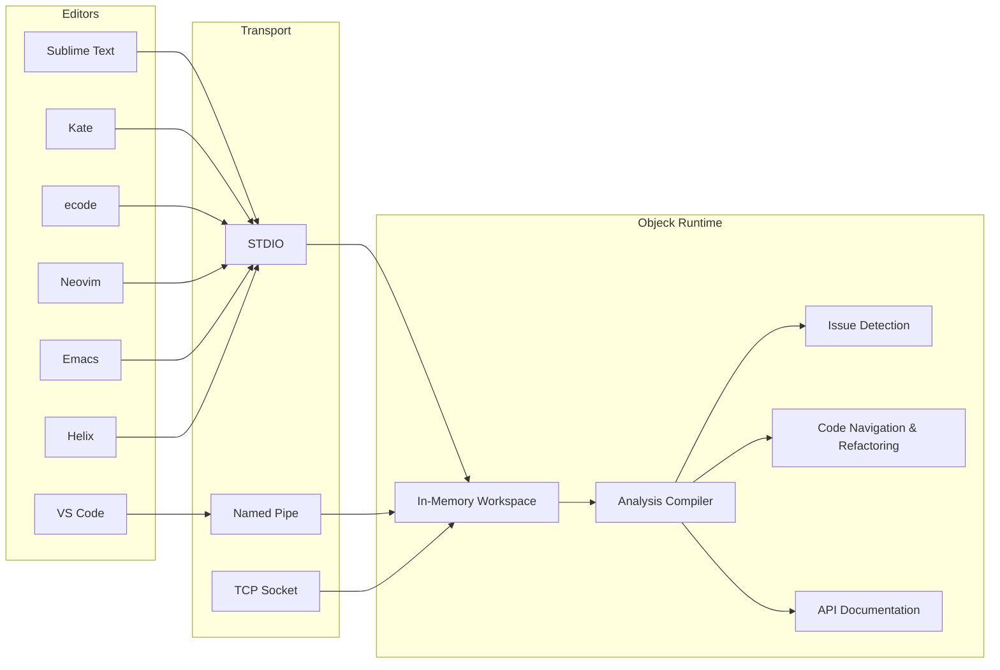

<p align="center">
<strong>Objeck LSP</strong><br>
Language Server Protocol support for <a href="https://github.com/objeck/objeck-lang">Objeck</a><br>
Code intelligence for 7 editors across Windows, Linux, and macOS
</p>

<hr/>

<p align="center">
  <a href="https://github.com/objeck/objeck-lsp/actions/workflows/ci-build.yml"></a>
  <a href="https://github.com/objeck/objeck-lsp/releases"></a>
</p>

The Objeck LSP server brings code intelligence to the [Objeck](https://github.com/objeck/objeck-lang) programming language &mdash; diagnostics, completion, hover docs, go-to-definition, rename, formatting, and more. It runs on **Windows**, **Linux**, and **macOS** (AMD64 and ARM64).

## Quick Start

**1. Install Objeck** from [github.com/objeck/objeck-lang](https://github.com/objeck/objeck-lang/releases/latest)

**2. Run the install script** from the extracted release directory:
```sh
# Windows - user install (no admin required)
scripts\install.cmd C:\Users\you\objeck vscode

# Windows - system-wide install
scripts\install.cmd "C:\Program Files\Objeck" vscode

# Linux / macOS - user install
./scripts/install.sh ~/objeck vscode

# Linux / macOS - system-wide install
./scripts/install.sh /usr/local/objeck vscode
```
This creates a self-contained deployment at `~/.objeck-lsp/` and configures your editor. Replace `vscode` with `sublime`, `neovim`, `emacs`, or `all`. The first argument is wherever you installed Objeck.

**3. Or configure manually** &mdash; pick your editor below, then see the [Install Guide](docs/install_guide.html) for step-by-step instructions. Set environment variables (required for STDIO transport):
```sh
export OBJECK_LIB_PATH=<objeck_install_dir>/lib
export OBJECK_STDIO=binary
```

**4. Create a workspace** &mdash; add a `build.json` to your project root for multi-file projects:
```json
{
  "files": ["main.obs", "helper.obs"],
  "libs": ["gen_collect.obl", "net.obl", "json.obl"],
  "flags": ""
}
```

Open the folder in your editor and the LSP server handles the rest.

## Supported Editors

| Editor | Transport | Setup |
|--------|-----------|-------|
| **VS Code** | Named pipe | Install the [`.vsix` extension](https://github.com/objeck/objeck-lsp/releases), set install path in settings |
| **Sublime Text** | STDIO | Add config from [`clients/sublime/`](clients/sublime/) to LSP settings |
| **Kate** | STDIO | Add server entry in LSP Client settings ([instructions](README.txt)) |
| **ecode** | STDIO | Add server to [`lspclient.json`](README.txt) |
| **Neovim** (0.11+) | STDIO | Copy [`objeck.lua`](clients/neovim/) + [`objeck.vim`](clients/neovim/) to nvim config |
| **Emacs** (29+) | STDIO | Copy [`objeck-mode.el`](clients/emacs/) to your load-path (includes syntax highlighting) |
| **Helix** | STDIO | Merge [`clients/helix/languages.toml`](clients/helix/) into your config |

Install scripts (`scripts/install.cmd` and `scripts/install.sh`) automate setup for VS Code, Sublime, Neovim, and Emacs. Use `scripts/update_lsp` to refresh the runtime after rebuilding Objeck.

## Features

- **Diagnostics** &mdash; Real-time error and warning reporting
- **Code Completion** &mdash; Variables, methods, and functions with trigger characters (`@`, `.`, `>`)
- **Signature Help** &mdash; Method/function parameter hints
- **Hover** &mdash; Bundle documentation on hover
- **Go to Definition / Declaration** &mdash; Navigate to variables, classes, and methods
- **Find References** &mdash; Locate all usages of a symbol
- **Rename** &mdash; Project-wide variable and method renaming
- **Document & Workspace Symbols** &mdash; Outline and cross-file search
- **Code Actions** &mdash; Quick fixes (add `use` statements, qualify references)
- **Formatting** &mdash; Document and range formatting
- **Multi-root Workspaces** &mdash; JSON-configured project support via `build.json`

## Architecture



<details>
<summary><strong>LSP Protocol Coverage</strong></summary>

### Notifications

| Event | Method |
|-------|--------|
| Initialized | `initialized` |
| Cancel Request | `$/cancelRequest` |
| File Open | `textDocument/didOpen` |
| File Changed | `textDocument/didChange` |
| File Save | `textDocument/didSave` |
| File Close | `textDocument/didClose` |
| Exit | `exit` |

### Requests

| Feature | Method |
|---------|--------|
| Initialize | `initialize` |
| Shutdown | `shutdown` |
| Completion | `textDocument/completion` |
| Document Symbol | `textDocument/documentSymbol` |
| Workspace Symbol | `workspace/symbol` |
| Signature Help | `textDocument/signatureHelp` |
| References | `textDocument/references` |
| Definition | `textDocument/definition` |
| Declaration | `textDocument/declaration` |
| Rename | `textDocument/rename` |
| Hover | `textDocument/hover` |
| Code Action | `textDocument/codeAction` |
| Format Document | `textDocument/formatting` |
| Format Selection | `textDocument/rangeFormatting` |

### Workspace

| Feature | Method |
|---------|--------|
| Watch File Changes | `workspace/didChangeWatchedFiles` |
| Workspace Folder Changes | `workspace/didChangeWorkspaceFolders` |
| Find Symbol | `workspace/symbol` |

</details>

## Development

**Building the VS Code extension:**
```sh
npm install -g yo generator-code typescript @vscode/vsce
cd clients/vscode && npm run compile
```

**Building the LSP server** (requires [Objeck](https://github.com/objeck/objeck-lang)):
```sh
cd server
obc -src frameworks.obs,proxy.obs,server.obs,format_code/scanner.obs,format_code/formatter.obs \
    -lib diags,net,json,regex,cipher -dest objeck_lsp.obe
```

## Resources

- [Install Guide](docs/install_guide.html) &mdash; detailed setup for all editors
- [README.txt](README.txt) &mdash; quick-reference setup instructions
- [Objeck Language](https://github.com/objeck/objeck-lang) &mdash; compiler, runtime, and documentation
- [Issues](https://github.com/objeck/objeck-lsp/issues) &mdash; bug reports and feature requests
